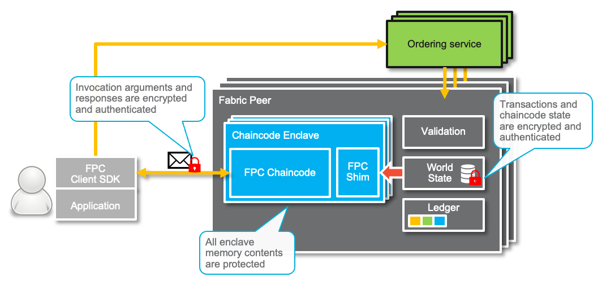
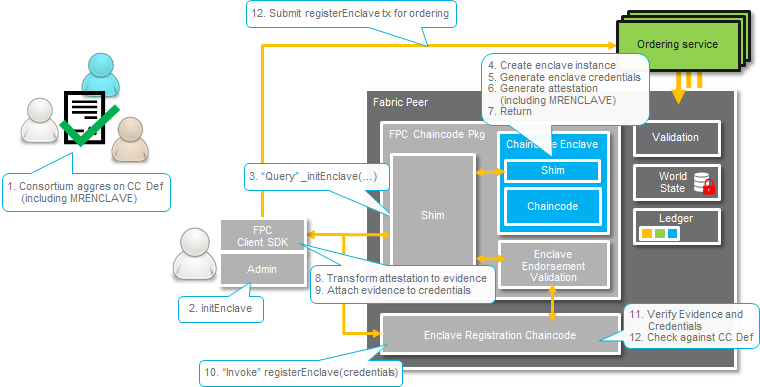
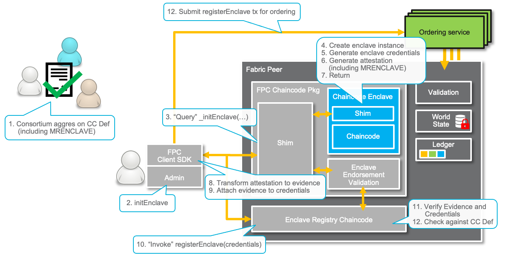
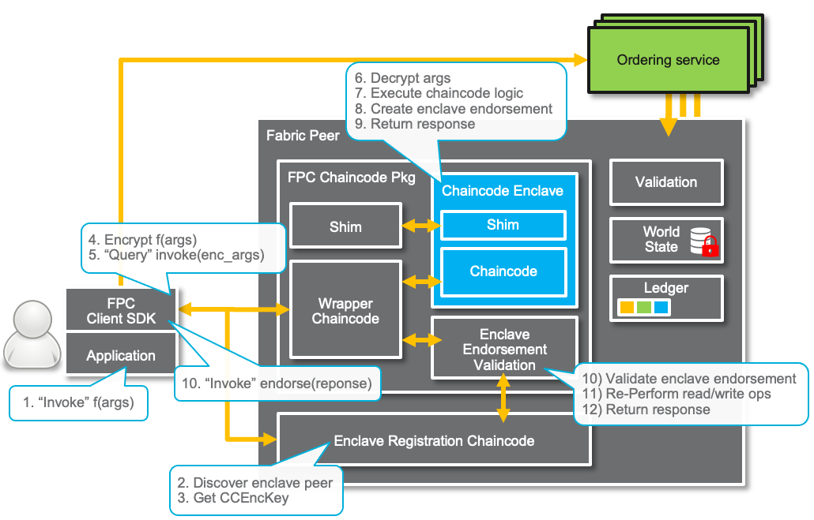

- Feature Name: Fabric Private Chaincode (FPC) - 1.0
- Start Date: 2020-01-28)
- RFC PR: (leave this empty)
- Fabric Component: Core (fill me in with underlined fabric component, core, orderer/consensus and etc.)
- Fabric Issue: (leave this empty)

# Summary
[summary]: #summary

This RFC introduces a new framework called Fabric Private Chaincode (FPC), built on Hyperledger Fabric.
FPC enhances data confidentiality for chaincodes by executing them in a Trusted Execution Environment (TEE), such as Intel&reg; SGX.
Most importantly, FPC protects transactional data while in use by the chaincode, in transit to/from a client, and stored on the ledger.
Hence, differently from typical chaincode applications, curious Fabric peers can only handle encrypted data related to FPC Chaincodes.
Ultimately, this mitigates the requirement for endorsing peers to be fully trusted for confidentiality.

The design of FPC thus extends the existing model of privacy in Fabric, enabling the secure implementation of additional use cases. An example of a new use-case enabled by the first end-to-end secure realization of that framework, called *FPC 1.0*, are privacy-preserving federated analytics over data owned by multiple mutually mistrusting organizations.

FPC is available open-source on Github (https://github.com/hyperledger-labs/fabric-private-chaincode) as patch-free runtime extension of Hyperledger Fabric v2.2.

**FPC in a nutshell.**
FPC operates by allowing a chaincode to process transaction arguments and state without exposing the contents to anybody, including the endorsing peers.
Also, the framework provides interested parties (clients and peers) with the capability to establish trust in an FPC Chaincode.
This is achieved by means of a hardware-based remote attestation, which parties use to verify that a genuine TEE protects the intended chaincode and its data.
Clients can thus establish a secure channel with the FPC Chaincode (as opposed to the peer hosting the chaincode) which preserves the confidentiality of transaction arguments and responses.
On the hosting peer, the TEE preserves the confidentiality of the data while the chaincode processes it.
Such data includes secret cryptographic keys, which the chaincode uses to secure any data that it stores on the public ledger.


# Motivation
[motivation]: #motivation
<!-- 
    Description of section: General motivation on why Fabric does not cover use-cases having strong privacy requirement and that TEE/FPC can close that gap.
    Note: At this level there is no distinction between full FPC and FPC 1.0 and hence use the term FPC through-out without qualification
    and also still mention all possible use-cases. 
    The distinction is done later in the architecture/design section
-->

## Enable new use-cases with strong privacy requirements

FPC is primarily motivated by the many use cases in which it is desirable to embody an application in a Blockchain architecture, but where in addition to the *existing integrity assurances*, the application *also requires privacy*. This may include privacy-preserving analytics on sensitive data such as regulated medical or genomic data, supply chain operations requiring contract secrecy, private voting or sealed bid auctions. With Fabric's current privacy mechanisms, these use cases are not possible as they still require the endorsement nodes to be fully trusted.
For example, the concept of channels and Private Data allows to restrict chaincode data sharing only within a group of authorized participants, still when the chaincode processes the data it is exposed to the endorsing peer in clear. In the example of a voting system, where a government may run an endorsing peer it is clear that this is not ideal.

## Enable performance improvements

A secondary motivation for FPC is its integrity model based on hardware-enabled remote cryptographic attestation; this model can provide similarly high confidence of integrity to the standard Fabric model of integrity through redundancy, but using less computation. With TEE-based endorsement and remote attestation, a new set of endorsement policies are made possible, which can reduce the number of required, and potentially expensive, chaincode executions and still provide sufficient assurance of integrity for many workloads. As usual for performance, there are trade-offs and only measurements can identify the optimal approach.

## Sound and low impact foundation

The architecture presented below is driven by two goals: 
(1) minimize the requirements on Fabric core, specifically no code changes,
(2) enable a clear roadmap beyond this first architecture to cover larger classes of use-cases, to provide a richer programming model and to gain additional performance benefits (besides computation also reduce communication costs over standard fabric) while providing a largely unchanged [User Experience](#user-experience).

Overall, FPC adds another line of defense around a chaincode, in addition to channels and private data.

# User Experience
[functional-view]: #functional-view
<!-- 
    Description of section: This section describes the functional view as experienced by developers of chaincode and applications interacting with it as well as admins deploying them.
    Note: At this level there is no distinction between full FPC and FPC 1.0 and hence use the term FPC through-out without qualification.
    The distinction is done later in the architecture/design section
-->

## Overview

Fabric Private Chaincode is best thought of as a way of running smart contract chaincode inside a Trusted Execution Environment (TEE), also called an _enclave_, for strong assurance of privacy and a more computation-efficient model of integrity.
Programs executed in the TEE are held in encrypted memory even while running, and this memory can't be read in the clear even by a root user or privileged system process. Chaincode state is encrypted with keys only known to the chaincode. Each chaincode runs in its own TEE to provide the best possible isolation among chaincodes on an endorsing peer. Because the execution is opaque, a modified set of integrity controls is also implemented in order to be certain that what's running is exactly what is intended, without tampering.
<!-- commented out as not provided by FPC 1.0 and anyway not crucial for this section:
With FPC’s hardware-rooted cryptographic integrity mechanisms, it requires less redundancy of computation than in the standard model of Fabric to get a high level of trust.
-->
With FPC, a chaincode can process sensitive data, such as cryptographic material, health-care data, financial data, and personal data; without revealing it to the endorsing peer on which it runs.

Overall, FPC can be considered an addition to Fabric wherein all chaincode computation relies only on the correctness of data provided by an authenticated Client or computed inside of and signed by a validated enclave.
The Endorsing Peer outside of the enclave is considered untrusted.
For this reason, all transaction data and chaincode state are encrypted by default in a way that only the FPC Chaincode can access them in clear.

Writing chaincode for FPC should come natural to developers familiar with Fabric as the programming model (e.g., chaincode lifecycle, chaincode invocations and state) is the same as for normal Fabric chaincode.
The main differences are a (for now at least) different programming language (C++) and a Shim API which implements a subset of the current Fabric API.
The Shim is responsible to provide access to the ledger state as maintained by the `untrusted` peer. In particular, the FPC Shim, under the cover and transparent to the developer, encrypts all state data that is written to the ledger and decrypts them when retrieved later. Similarly, it also encrypts and authenticates all interaction with the applications, see below. Lastly, it attests to the result and the state update based on the enclave's hardware identity to provide a hardware-trust rooted endorsement.

Applications can interact with a FPC Chaincode using an extension of the Fabric Client Go SDK.
This FPC extension exposes the Fabric `gateway` interface and transparently encrypts and authenticates all interactions with a FPC Chaincode.

Note that FPC hides all interactions with the TEE technology from the developers, i.e., they they do not have to understand the peculiarities of TEEs.  This largely also applies to the administrators deploying FPC Chaincode, although they will have to understand the general concepts of TEE to make informed decisions on security policies and to configure the attestation credentials.

To illustrate the interaction between an application and a FPC Chaincode see the following figure. In particular, this figure highlights the encrypted elements of the FPC architecture.



Encrypted elements of the FPC architecture (over and above those in Fabric, such as TLS tunnels from Client to Peer) include:

- The arguments of a transaction proposal.
- The results of execution in a proposal response message returned to the Client.
- All contents of memory in the Chaincode Enclave(s).
- All entries of the transaction writeset (by default).

Note that with the exception of the results, where also a legitimate requestor knows the secret keys, all secret/private keys are known only by to the enclaves or, for memory encryption, to the HW memory encryption engine (with the hardware also enforcing that only legitimate enclaves have access to the unencrypted memory).


## FPC Development

### Chaincode
<!-- this section should cover: platform (x86, sgx sdk, linux; but also via docker); cmake; shim.h -> hello world tutorial -->

As mentioned earlier, FPC Chaincode is executed in an enclave.
In the initial version, FPC supports Intel&reg; SGX as trusted execution technology.
For this reason, a FPC Chaincode must currently be written in C++ using our FPC SDK, which builds on top of the Intel [SGX SDK](https://github.com/intel/linux-sgx).
The current development platform is Linux (Ubuntu). However, we also do enable seamless development via docker. 
Hence, development is also easily possible with MacOS or Windows as host.

To ease the development process, FPC provides a `cmake` based build system which allows the developer to focus on the chaincode without having to understand SGX build details.
The programming interface against which a FPC Chaincode has to be programmed is encapsulated in the C header file [`shim.h`](https://github.com/hyperledger-labs/fabric-private-chaincode/blob/master/ecc_enclave/enclave/shim.h).
To get a more in-depth understanding of the chaincode development, consult the detailed [Hello World Tutorial](https://github.com/hyperledger-labs/fabric-private-chaincode/tree/master/examples) that guides new FPC developers through the process of writing their first FPC Chaincode.

The outcome of the build process are two deployment artifacts: 
(1) the enclave binary file (`enclave.signed.so`) containing both the FPC Chaincode as well as the FPC Shim, and 
(2) the SGX (code) identity of the chaincode, `MRENCLAVE`, which can be imagined as a form of cryptographic hash over the contents of the enclave binary and related SGX deployment metadata.
<!-- mrenclave described as simple hash is a gross over simplification but should be ok here to give some intuition without getting into the details.-->
Details of this process may vary in future versions supporting other TEE platforms.

Note: It is the goal for the project is to support additional chaincode languages in the future, e.g., there is an ongoing effort to add support for WebAssembly.

### Application

FPC extends the Fabric Client SDKs with extra functionality that allows users to write end-to-end secure FPC-based applications.
In particular, the FPC Client SDK provides these core functions.
First, FPC transaction proposal creation, including transparent encryption of arguments.
Second, FPC transaction proposal response validation and decryption of the result.
The encryption and decryption is performed by the Client SDK "under the covers" without requiring any special action by the users, i.e., users still use normal `invoke`/`query` functions to issue FPC transaction invocations.
Last, the Client SDK takes care of enclave discovery, that is, the Client SDK is responsible to fetch the corresponding chaincode encryption key and to determine the endorsing peers that host the FPC Chaincode enclave.
Extended support for other Fabric Client SDK, such as the  NodeSDK, will be future work.

An application can interact with the asset store chaincode from our [Hello World Tutorial](https://github.com/hyperledger-labs/fabric-private-chaincode/tree/master/examples) using the FPC Client SDK based on the gateway API of the Fabric Client Go SDK.
Here an example ***app.go***:
```go
// Get FPC Contract
contract := fpc.GetContract(network, "helloWorld")

result, err = contract.SubmitTransaction("storeAsset", "myDiamond", "100000")
if err != nil {
    log.Fatalf("Failed to Submit transaction: %v", err)
}
```

The FPC Client SDK API is documented [here](https://github.com/hyperledger-labs/fabric-private-chaincode/blob/master/client_sdk/go/fpc/contract.go) in detail.

## FPC Chaincode Deployment

### Peer Setup 
There are two preparation steps required before one can deploy FPC Chaincode:

- The chaincode administrator has to register with the [*Intel Attestation Service (IAS)*](https://software.intel.com/content/www/us/en/develop/topics/software-guard-extensions/attestation-services.html) to obtain attestation credentials and configure the local platform correspondingly.
- The peer operator has to add FPC in the `externalBuilders` section in `core.yaml` and restart the peer.
  <!-- See an example `core.yaml` [here](https://github.com/hyperledger-labs/fabric-private-chaincode/blob/master/integration/config/core.yaml#L569). -->
  FPC provides external builder and launcher scripts to run a FPC Chaincode on a peer or as an external service.
  ```yaml
  chaincode:
    externalBuilders:
      - path: /opt/gopath/src/github.com/hyperledger-labs/fabric-private-chaincode/fabric/externalBuilder/chaincode_server
        name: fpc-external-launcher
        propagateEnvironment:
          - CORE_PEER_ID
  ```


### Deployment
The chaincode deployment follows mostly the standard Fabric procedure:

- The deployer compiles an agreed-upon FPC Chaincode using the FPC build environment.
  This step creates a package with the main FPC deployment artifact, the `enclave.signed.so` enclave binary, and deployment metadata.
  FPC provides convenience scripts to facilitate this step.
- Subsequently, the deployer follows the standard Fabric 2.0 Lifecycle steps, i.e., `install`, `approveformyorg` and `commit`. 
  A noteworthy FPC specific aspect is that the version used *must* be the code identity (i.e., `MRENCLAVE`) of the FPC Chaincode.
  ```bash
  peer lifecycle chaincode approveformyorg --name ${CC_ID} --version ${MRENCLAVE} ...
  peer lifecycle chaincode commit --name ${CC_ID} --version ${MRENCLAVE} ...
  ```
- Lastly, once the chaincode definition for an FPC Chaincode has been approved by the consortium, 
  a Chaincode Enclave must be created via an `initEnclave` FPC-lifecycle command.
  FPC implements such command as a regular chaincode method invoked through the `peer chaincode` (query) command.
  Hence, supporting it does not require any modification to the Fabric framework.
  (See the [Enclave Initialization and Registration](#enclave-initialization-and-registration) section for more details.)

  <!-- commented out as not really user visible
    This command triggers the creation of an enclave and registers it at the FPC Registry.  
    The registration includes the attestation of the Chaincode Enclave.
  -->
  For more information on additional management commands, see the [FPC Management API document](https://github.com/hyperledger-labs/fabric-private-chaincode/blob/master/docs/design/fabric-v2%2B/fpc-management.md).

<!-- commented out as not really user visible
The FPC Registry stores all attestation reports, as signed by the TEE vendor. 
The attestation reports include information on what chaincode is running; what specific TEE is in use, including version number and hash of the chaincode (MRENCLAVE), and including the public keys of the enclave. 
Upon creation each chaincode enclave generates public/private key pairs for signing and for encryption. The public signing key also denotes the chaincode enclave identity.

In order to support the endorsement model of Fabric, chaincode enclaves executing the same FPC Chaincode need access to a set of shared secrets. In particular, these shared or common keys are used to encrypt and decrypt the transaction arguments and state.
That is, there is also a public/private key pair and a symmetric state encryption key per FPC Chaincode that are shared among all chaincode enclaves that run the same FPC Chaincode using the key distribution protocol.
-->

A detailed description (internal view) of the FPC deployment process is provided in the FPC 1.0 Architecture section below and can be found in the [Full Detail Diagrams](#full-detail-diagrams) section.


# Threat & Trust Model
<!-- note: put threat-model here as threat-model is crucial to understand when looking at architecture and the application classes covered, all of this only covered here.  
So putting it before User Experience would put it a bit in wrong context ...
Arguably, it might even be better to put it _after_ the architecture as there are essentially already some forward references to architecture features involved.
-->

- Organizations do not have to trust each other (i.e., users, admins and software such as peers of another organization or arbitrary collusions thereof) as far as confidentiality is concerned.
An organization can modify any software (including any hypervisor, operating system, or Fabric itself).
Yet, such an organization would not be able to extract private state from the chaincode,
or learn anything about the requests or responses of the victim organization (other than what the chaincode logic allows them to learn about it).

- Organizations do have to trust a quorum of other organizations as defined by the Fabric lifecycle and chaincode endorsement policies as far as integrity of chaincode metadata is concerned. E.g., they have to rely on quorums of admins to only create and modify chaincodes as appropriate; also, they have to rely on quorums of peers to properly execute transactions of the Enclave Registry and the Enclave Endorsement Validation (see more details [below](#architecture)).

- We also assume that normally users trust the peers of their own organization, e.g., when performing lifecycle operations or invoking chaincode execution. (This is primarily for simplicity and is relevant when retrieving public FPC encryption keys from the Enclave Registry. As for any Fabric chaincode, users outside of organizations could implement queries without trust in a single organization/peer by repeating queries with multiple peers/organizations until enough identical responses are received to satisfy the endorsement policy, similar to transaction validation at peers before applying them to the ledger.)

- We do assume that a code running inside a TEE cannot be tampered with or its memory inspected.
However, given above-mentioned trust assumptions on peers, a TEE (FPC Chaincode Enclave) cannot trust the (rest of the) hosting peer.
Hence all data received via transaction invocations (e.g., the transaction proposal) or via state access operations (e.g., `get_state`) must be considered untrusted.

- We additionally require that remote attestations provided by a TEE are authentic and prove that only the code referenced in the attestation could have issued it.
Therefore, all participants/organizations trust a TEE (in particular, the FPC Chaincode Enclave), which can provide such an attestation, regardless of at which peer/organization the TEE is hosted.
Such trust extends also to enclave signatures issued from attested cryptographic keys.
It is due to such trust that FPC *implicitly* defines a policy (see also the [FPC Management API](https://github.com/hyperledger-labs/fabric-private-chaincode/blob/master/docs/design/fabric-v2%2B/fpc-management.md#fpc-endorsement-policies) document) that governs the requirements for a successful [enclave endorsement validation](#enclave-endorsement-validation).
In particular, according to such policy, a single enclave signature (enclave endorsement) is required to validate an FPC transaction.


# FPC 1.0 Application Domain
[app-domain]: #app-domain
<!-- 
    Description of section: This section makes the FPC vs FPC 1.0 distinction (& related restrictions),
    i.e., Ale's lithums test,
    and then provides a concrete use-case and how FPC would solve it.
-->
## Characterization

FPC 1.0 enables a class of applications which require (chaincode-)private ledger state and private transaction requests and responses but do *not require release of sensitive data conditioned on private ledger state*.
This class includes smart contracts which perform privacy preserving analytics, e.g:

-	Fraud detection analytics between financial institutions that don’t want to share details of financial transactions
-	Cyber Security analytics between companies that don’t want to share details of attacks
-	Statistical analyses and AI on structured tabular medical or financial record data that cannot be shared between organizations

It also covers smart contracts to enforce confidential supply chain agreements.

Conversely, this class does not naturally cover use-case such as private sealed-bid auctions or secure voting.
These do have intrinsic requirements of release of sensitive data conditioned on private state.
For example, a sealed bid auction outcome should be private until the auction closure is committed on the ledger.
(Note, though, that as described in the [Rollback Protection Extension](#rollback-protection-extension) to FPC 1.0 and the road map, future releases will broadens support to this larger class of applications.)

More detailed information on the constraints and related programming model restrictions plus a corresponding security analysis can be found in a [separate document](https://docs.google.com/document/d/1jbiOY6Eq7OLpM_s3nb-4X4AJXROgfRHOrNLQDLxVnsc/).

To further illustrate why and how FPC 1.0 enables interesting use-case, we describe below a concrete real-world use case and outline a possible solution based on FPC 1.0.

## Example use case: Learn models to detect brain abnormalities

Machine learning techniques have wide-spread applications in the medical domain.
For example, consider the case of training a model, e.g, as a Convolutional Neural Network (CNN), for detecting brain abnormalities such as precancerous lesions or aneurysms.
To achieve the necessary high accuracy, we need training data of considerably larger size and of more diversity than any single entity (e.g., a hospital) usually possesses.
Hence, it is highly desirable to pool clinical data from as many entities as possible.
However, regulations like HIPAA make sharing brain CT scans or MRI studies, labeled by radiologists, hard if not impossible. Furthermore, to allow widest use of a derived model, it should be freely shareable without any privacy concerns, i.e, we cannot rely only on organizational trust. Lastly, to provide the necessary accountability and audit trail, such a federated application is ideally tied to a ledger.

There is a class of decentralized algorithms, called *Federated Learning*, in which training is performed simultaneously across multiple nodes without the need to share training data.
However, the cryptographic algorithms which perform federated learning without any trusted entity while still providing the necessary accountability and strong privacy, e.g., based on differential privacy, are very expensive in terms of computation and, in particular, communication complexity.
Furthermore, there is only limited tooling to facilitate building solutions based on these algorithms.

A sketch of an possible solution with FPC 1.0 for above problem would be as follows:

- The overall approach would be to follow the [“PATE, for Private Aggregation of Teacher Ensembles”](https://blog.acolyer.org/2017/05/09/semi-supervised-knowledge-transfer-for-deep-learning-from-private-training-data/) approach.
  This approach provides the necessary strong privacy guarantees, i.e., differential privacy, to allow use to release the learned model to the public without any remaining privacy concerns.
- However, this approach assumes that the learning of the privacy-preserving model is performed by a trusted entity.
  This is where FPC 1.0 comes in: It is perfectly matched to perform this role, ensuring the integrity of the computation as well as the confidentiality of the training data related information exchanged during training.
- More specifically, the participating hospitals would compute separate teacher models locally on their own data and send the resulting model encrypted and signed to the chaincode.
  The chaincode would authenticate and validate the teacher models based on parameters a priori agreed and built into the chaincode, accumulate and record the submission in the ledger and, once sufficient inputs are received, will perform privately inside the chaincode the final student model computation.
  Lastly, it will publish the resulting model, e.g., via `put_public_state`, on the ledger.
- Additionally, FPC 1.0 could be used to further strengthen the security by requiring also that the teacher-model computation at the hospitals are run as FPC chaincode, ensuring that only vetted and unmodified training programs can participate in the algorithm, and allowing also the inclusion of mechanisms to foil possible Adversarial Machine Learning attacks.

This solution allows to build an efficient solution and doing so in a natural way, based on a rich and familiar development environment.
Importantly, also note that above approach would not release any sensitive data conditioned on private state and hence meets our criteria for FPC 1.0 outlined [above](#characterization).

# FPC 1.0 Architecture
[architecture]: #architecture
<!-- 
    Description of section: This section provides an outline of the architecture of FPC 1.0.
-->

## Overview of Architecture

The FPC 1.0 architecture is constituted by a set of components which are designed to work atop of an unmodified Hyperledger Fabric framework: the FPC Chaincode package and the Enclave registry chaincode, which run on the Fabric Peer; the FPC Client, which builds on top of the Fabric Client SDK. The architecture is agnostic to other Fabric components such as the ordering, gossip or membership services.
 


### Chaincode Enclave

Within the peer, the TEE (i.e., the Chaincode Enclave) determines the trust boundary that separates the sensitive FPC Chaincode (and shim) from the rest of system.
The FPC Chaincode implements the smart contract logic (recall the FPC Chaincode development section) using C/C++.
In particular, the TEE enhances confidentiality and integrity for code and data inside the enclave against external threats from untrusted space.
In other words, a FPC Chaincode and its data are isolated from the peer.
Also, the code inside the enclave uses cryptographic mechanisms to securely store (resp. retrieve) any data (i.e., chaincode state) to (resp. from) the ledger in untrusted space.
The Chaincode Enclave is embedded in a Go-based chaincode using `cgo` to communicate with the C code inside the Chaincode Enclave, we refer to this as FPC Chaincode package.


### FPC Shim

Similar, to standard Fabric programming model, the FPC Chaincode can access
ledger state (world state) from the (untrusted) peer through the FPC Shim interface.
It consists of two components: the FPC Shim residing within the Chaincode Enclave, and its counterpart outside the enclave.
Most importantly, the FPC Shim implements the security features to protect any sensitive data (e.g., authenticated encryption/decryption of ledger data, digital signatures over responses, etc.).
Notably, none of these features (or relative cryptographic keys) are exposed to the FPC Chaincode.
See [Appendix](#appendix) for more details.
During an FPC transaction invocation, the FPC Shim inside the enclave represents the endpoint of the secure channel between the FPC Client and the FPC Chaincode.
Hence, at the lower level of the protocol stack, the Fabric client and the peer only handle encrypted and integrity protected transactional information.
Inside the Chaincode Enclave, a C++ based FPC Shim is available to FPC Chaincode developers.
This shim follows the programming model of the Fabric Go shim, though using a different language.
Initially, the FPC Shim comprises a subset of the standard Fabric Shim and is complemented in the future.
These details are documented separately in the Shim header file itself: **[ecc_enclave/enclave/shim.h](https://github.com/hyperledger-labs/fabric-private-chaincode/blob/master/ecc_enclave/enclave/shim.h)**

### Enclave Registry

The Enclave Registry helps to establish trust in the enclave and the secure channel.
It is implemented as a chaincode which maintains a list of all Chaincode Enclaves deployed on the peers in a channel.
The registry associates with each enclave their identity, associated public keys and an attestation linking them.
In detail, after an FPC Chaincode definition is committed on the channel, the chaincode's hosting enclave must be registered by invoking the Enclave Registry, in order to become operational.
When registering a new enclave, the enclave registry verifies the provided enclave attestation (signed by the trusted hardware manufacturer) and checks it against the chaincode definition. In particular, the enclave attestation contains the code identity (`MRENCLAVE`) that must match the `version` field of the chaincode definition (recall deployment section earlier).
If the verification succeeds, the enclave registry stores the attested data (including the public keys) on the ledger and thereby make it available for members of the channel.
<!--  -->
This enables any channel member to inspect an enclave attestation to verify the genuinity of the enclave in order to establish trust in its public keys.

Additionally, the registry manages chaincode specific keys, including a chaincode public encryption key, and facilitates corresponding key-management among authorized chaincode enclaves.
The registry is particularly relevant for clients, for retrieving the encryption key to protect the transaction arguments and set up a direct secure channel.
Note that clients can access the enclave registry using "strong queries" where multiple peers are queried in order to get a correct response and not relying on a single peer.
This prevents a malicious peer from responding with a wrong transaction encryption key.


### Enclave Endorsement Validation

FPC uses a two-step execution process where first the FPC chaincode executes, and then the Enclave Endorsement Validation executes, with the latter serving as the traditional Fabric transaction.
The Enclave Endorsement Validation component implements the second step of an FPC chaincode invocation.
It verifies the correctness of a result of a single FPC Chaincode execution and produces the FPC chaincode state updates as a read/writeset of a traditional Fabric transaction.
In particular, the Validation Logic receives the output of a FPC Chaincode invocation, which is encrypted and signed by the enclave.
The validation logic verifies the signature (or enclave endorsement) over the enclave execution response and that the response was produced by an enclave registered at the Enclave Registry.
FPC defines an implicit enclave endorsement policy -- richer policies will be supported in [future releases](#feature-roadmap) -- by requiring a single enclave endorsement for validation.
Once the verification succeeds, the Enclave Endorsement Validation component applies any state updates issued by the FPC Chaincode using `get_state` and `put_state` operations.
As the Validation logic is bundled together with the FPC Chaincode in a single Fabric chaincode package,
these updates are eventually committed within the same namespace during the validation-and-commit phase of a Fabric transaction. 
Hence, they will be visible to the FPC Chaincode in subsequent invocations.
We provide more details in the [FPC Transaction Flow](#transaction-flow) Section below.


## Deployment Process

This section details the turn-up process for a FPC Chaincode.
The normal Fabric chaincode deployment is extended with the creation and registration of a chaincode enclave as illustrated in the figure below.



### Channel Setup and Enclave Registry

We assume the following Fabric setup.
The participants that like to collaborate using a FPC Chaincode have created and joined a Fabric channel.
The peers of that channel are configured to use FPC, that is, have set External Builder configuration for FPC in the `core.yaml`.
The peer administrators/operators have registered with the Intel&reg; Attestation Service (IAS).

As described in the architecture section above, FPC uses a Enclave Registry Chaincode (ERCC) to
maintain FPC Chaincode Enclave identities.
Therefore, ERCC must be installed on the channel.
The organizations follow the usual procedures the install ERCC, approve it and commit it.
It is recommended to specify a strong endorsement policy (e.g., majority), since the Enclave Registry operations are integrity-sensitive.

### Deploy a FPC Chaincode Package

A FPC Chaincode package is no different than a regular Fabric package.
Hence, the deployment follows the standard Fabric 2.0 lifecycle process using `install`, `approveformyorg`, and `commit` commands.
For the successful completion of the deployment process, it is crucial that all organizations agree on the FPC Chaincode code identity that is being deployed.
For this reason, with FPC, it is necessary that all organizations use the *same* package by specifying `MRENCLAVE` as the chaincode version (recall previous compilation step) when invoking `approveformyorg`. 
This code identity plays an important role to establish trust in an FPC Chaincode and is used with the Enclave Registry as we describe in the next subsection.
The agreement is illustrated in Step 1 in the figure above.

In contrast to a normal Fabric chaincode, the endorsement policy defined in the chaincode definition is used for the Enclave Endorsement Validation rather than the actual execution of the FPC Chaincode inside an enclave.
Therefore, it is recommended to specify a strong endorsement policy (e.g., majority) for the FPC Chaincode, since the Enclave Endorsement Validation operations are integrity-sensitive.

Following this deployment step, from a Fabric perspective, the FPC Chaincode is ready to process transactions.
However, any FPC Chaincode invocation will return an error because the FPC Chaincode Enclave is still uninitialized. 

### Enclave Initialization and Registration

The administrator of the peer hosting the FPC Chaincode Enclave is responsible for the initialization and registration of the enclave.
The operation is performed by executing the `initEnclave` admin command (see Step 2 above).

FPC implements this command as a regular chaincode method, and uses Fabric's `peer chaincode` command to call it.
Hence, its implementation does not modify, nor requires any modifications, to the Fabric framework.
Also, conveniently, the command can be triggered through the FPC Client SDK (see [Deployment](#deployment) section and [FPC Management API](https://github.com/hyperledger-labs/fabric-private-chaincode/blob/master/docs/design/fabric-v2%2B/fpc-management.md) document) which is in turn built on the Fabric Client SDK for Go.

A successful initialization and registration will result in a new entry in the enclave registry namespace on the ledger. In particular, each entry contains enclave credentials, which cryptographically bind the enclave to the chaincode as defined in the chaincode definition.

Internally, the initialization command operates as follows:

1. The FPC Client SDK issues an `initEnclave` query which reaches the FPC Shim.
The shim initializes (creates) the enclave (which will process FPC Chaincode invocations) with the chaincode parameters received from the peer, namely: the chaincode definition and the channel identifier.
Then, the enclave generates public/private key-pairs for signing and encryption.
The public signature key is used as enclave identifier. See an overview of the cryptographic components in the [appendix](#appendix).
The enclave initialization completes by returning the `credentials` of the FPC Chaincode.
The credentials contain all public chaincode parameters, including the enclave public signature key.
In particular, these information are protected through the process of an attestation protocol.
The enclave produces attested data that allows to verify that a legitimate TEE is running the expected code.
Importantly, the code identity (`MRENCLAVE`) of the FPC Chaincode executed inside the enclave is part of the attested data.
The enclave initialization/creation is illustrated in Step 3 - 7 in the figure above.

1. Next, the attestations must be converted into a publicly-verifiable evidence by contacting the Intel Attestation Service (IAS).
The FPC Client SDK performs this step using the admin's IAS subscription (see Step 8 - 9).
At this point the root CA certificate of the trusted hardware manufacturer represents the root of trust for the publicly-verifiable credentials. 
Note that this attestation conversion step may change with the attestation protocol and trusted execution technology used. Here we describe the EPID-based Intel SGX attestation protocol.

1. The initialization command continues with the enclave registration.
In particular, it invokes a `registerEnclave` transaction of Enclave Registry chaincode, supplying the publicly-verifiable FPC Chaincode credentials as argument.
The enclave registry validates the enclave credentials with the help of the attestation evidence.
That is, the publicly-verifiable evidence is verified against the root of trust of the hardware manufacturer, and the the public chaincode parameters (including the chaincode version) must matches the chaincode definition of the FPC Chaincode. 
If the validation succeeds, the enclave credentials are stored on the ledger and thus available to channel members. 
Note that the recommended FPC Enclave Registry endorsement policy is meant to protect the integrity of these checks and the credentials stored on the ledger.
<!--  -->
The enclave registration is illustrated in Step 10 - 12. in the figure above.
This completes the deployment of a FPC Chaincode.

Note that the deployment described here focuses on the first realization of FPC where a single enclave per FPC Chaincode is deployed. For future releases we intend to enhance FPC with multi-enclave support as also described in the roadmap section.
In a multi-enclave deployment, the key material to encrypt/decrypt the chaincode state and the chaincode arguments must be shared among the FPC Chaincode enclaves.
We already propose a key generation and distribution protocol as part of our [FPC specification](../images/fpc/full-detail/fpc-key-dist.png).

## FPC Transaction Flow
[transaction-flow]: #transaction-flow

Now we describe the FPC transaction flow comprising client invocation, chaincode execution, and enclave endorsement validation as illustrated in the figure below. 



### Client Invocation

The client application performs an FPC Chaincode invocation through the FPC Client SDK.
If not cached locally, the SDK will query first the Enclave Registry chaincode (at multiple peers) to retrieve the FPC chaincode's public encryption key.
The public encryption key is used to encrypt the contents of the transaction proposal (i.e., the invocation arguments) before it is then sent as a query to the FPC Chaincode on the peer hosting the Enclave.
In addition to the invocation arguments, the encrypted message contains a symmetric key generated by the SDK that is used later for the encryption of the transaction response.
Moreover, with the help of the enclave registry, the SDK discovers the endpoints of the peers that host the FPC Chaincode.
All these steps are fully transparent to the applications layer.

The query is forwarded via the peer and some glue code to the FPC Shim inside the Enclave.
Inside the Enclave, the FPC Shim decrypts the arguments of the proposal and saves the client's response encryption key.
After that, it invokes the FPC Chaincode with the plaintext arguments.
In the figure above, the invocation is illustrated with Step 1 - 5.

### Chaincode Execution

The FPC Chaincode processes the invocation according to the implemented chaincode logic.
While executing, the chaincode can access the World State through `getState` and `putState` operations provided by the FPC Shim. From the chaincode perspective, the arguments of the former, and the output the latter, are plaintext data.

The FPC Shim fetches the state data from the peer and loads it into the enclave.
Most importantly, the shim maintains the read/writeset, and uses the State Encryption Key to
(a) authenticate and encrypt data with AES-GCM during store operations, and
(b) to decrypt and check the integrity of data during fetch operations.
From the peer perspective, store and fetch operations have encrypted arguments and outputs.
Note, though, that while values are encrypted, the keys are maintained in cleartext and visible to the peer.

An FPC Chaincode invocation completes its execution by returning a (plaintext) result to the FPC Shim.
The FPC encrypts the result with the client's response encryption key.
Then, it produces a cryptographic signature over the input arguments, the read-write set, and the (encrypted) result.
This is conceptually similar to the endorsement signature produced by the endorsing peer.

The FPC Shim completes its execution by returning the signature, the read/writeset and the result to the peer.
Finally, the peer packages the received data in transaction response and signs it.
This is a regular Fabric endorsement, which is sent back to the client.
In the figure above, the chaincode execution is illustrated with Step 6 - 10.

### Enclave Endorsement Validation

The FPC Client SDK receives the proposal response (to the FPC Chaincode execution) and continues with the enclave endorsement validation.
Recall that the response produced by the enclave contains the enclave signature, the read/writeset and the (encrypted) result.
The FPC Client SDK invokes a `enclave-endorsement-validation` transaction providing the enclave response as an argument.
Recall that the enclave endorsement validation is part of the FPC Chaincode package residing outside the enclave.

The enclave endorsement validation logic processes the response as follows.
It makes a chaincode-to-chaincode call to the Enclave Registry to get the attested enclave credentials including signature verification key.
With the key, it verifies the enclave signature over the proposal response.
Then, the validation logic fetches the chaincode definition of the FPC Chaincode from `lifecycle` and checks that it matches the chaincode version as part of the enclave credentials.

If checks pass, the enclave endorsement validation continues with rebuilding the changes of the FPC Chaincode state updates.
The validation logic performs a series of `getState` and `putState` operations according to the read/writeset of the proposal responses as created by the FPC Chaincode.
In particular, for every `getState` operation, the returned value must match the value on the readset as signed by the enclave.
This (early MVCC check)  ensures that the "original" read/writeset endorsed by the enclave is retained.
Since enclave endorsement validation and the FPC Chaincode belong to the same chaincode package they share the namespace.
The enclave endorsement validation completes its execution by returning a `success` (or `error`) result to the peer.
In turn, the peer endorses the result (and the read/writeset based on the execution of the FPC Chaincode) and returns it to the client.

At this point, we emphasize the importance of the endorsement policy related to the enclave endorsement validation.
As the validation is integrity-sensitive and designed as a regular chaincode, it is recommended the use of a strong policy (e.g., majority).

The Fabric client will therefore wait for enough peer endorsements (related to the execution of the enclave endorsement validation).
Then, it will package the responses in a transaction, which is sent to the orderers.
As the transaction commits (or returns an error), the Fabric client returns the outcome to the FPC Client.

Finally, the FPC Client decrypts any successful encrypted response, coming directly from the FPC Chaincode.
Then, it delivers the plaintext response to the application layer.
In the figure above, the enclave endorsement validation is illustrated with Step 11 - 13.

## TEE Platform Support

Currently, the FPC Runtime and the SDK focuses on [Intel&reg; SGX SDK](https://github.com/intel/linux-sgx).
However, components such as the FPC Registry are already designed to support attestations by other TEE platforms as they mature and gain remote attestation capabilities.
Also, other components such as the Go part of the FPC Chaincode package don't have an Intel&reg; SGX dependency.
Hence, they can easily be reused.
We plan to explore other TEE platforms such as AMD SEV in the future.

## Fabric Touchpoints

FPC 1.0 does ***not*** require any changes/modifications to Fabric (Peer).
We recommend reading the chaincode development and deployment sections to know more about the private chaincode coding language and the use of Fabric's external builder and launcher capabilities.

## Requirements

- FPC Chaincode must be written in C/C++ using our FPC SDK. More language support is planned.
- FPC relies on the External Builder and Launcher feature of Fabric.
  <!-- comment out below as we haven't introduced registry yet and, at least so far, we have put the registration under the cover of cli
   FPC's attestation infrastructure requires the installation of an FPC Registry chaincode per channel.
  -->
- FPC requires that the Endorsing Peers run on an Intel&reg; x86 machine with the SGX feature enabled. We plan to add support for other Trusted Execution Environments in future releases.

## Fabric Features Not (Yet) Supported

In order to focus the development resources on the core components of FPC, the FPC 1.0 initially excludes certain Fabric features, which will be added in the future.

- Multiple implementations for a single chaincode.
This feature is supported in Fabric v2 and gives organizations the freedom to implement and package their own chaincode.
It allows for different chaincode implementations as long as changes to the ledger state implement the same agreed upon state machine, i.e., the application integrity is ensured.

    FPC Chaincodes have a stronger requirement: Not only must we be assured of the application integrity but we also require that all information flows be controlled to meet our confidentiality requirements.   As the execution during endorsement is unobservable by other organizations, they will require the assurance that any chaincode getting access to the state decryption keys, and hence sensitive information, will never leak unintended information.  Therefore, the implementation of a chaincode must allow for public examination for (lack of) potential leaks of confidential data.
    Only then clients can establish trust in how the chaincode executable treats their sensitive data.

    For a given chaincode, the FPC 1.0 currently supports only a single active implementation.
    Most importantly, the version field of the chaincode definition precisely identifies the chaincode's binary executable.

- Multiple key/value pairs and composite keys as well as secure access to MSP identities via `getCreator` will be supported once below [Rollback-Protection Extension](#rollback-protection-extension) is added.
- Arbitrary (enclave) endorsement policies
- State-based endorsement
- Chaincode-to-chaincode invocations (cc2cc)
- Private Collections
- Range queries
- Complex (CouchDB) queries
- Endorsement and validation plugins as well as decorators

## Rollback-Protection Extension

FPC 1.0 is not designed for chaincodes which are implemented to release confidential data once some conditions are met on the ledger.
In fact, although chaincodes can protect the confidentiality and integrity of any data that they store on the ledger, they have no means to verify whether such data has been committed.
Hence, their hosting peer might provide them with legitimate yet stale, or non-committed, ledger data.

FPC 1.0 does therefore not support for the class of applications that require a proof of committed ledger data.
This includes, for example, smart contracts implementing sealed auctions, or e-voting mechanisms.
Arguably, these applications require checking whether a condition is met (e.g., "if the auction is closed") in order to release confidential data (e.g., "then the highest bid is X").

Even though the lack of proof-of-committed ledger data appears to limit the use of FPC, additional means could be integrated on the application level to enable coverage of this larger class of private applications.
Alternatively, an extension to the FPC 1.0 Architecture can address this limitation.
In particular, the FPC framework can provide chaincodes with a verifiable proof of committed ledger data by implementing a trusted ledger enclave.
The design documents referenced in [Design Documents](#design-documents) already outline the path to realize such architecture extension.
We refer to this as the Full FPC specification.

## References

The full detailed protocol specification of FPC 1.0 is documented in a series of UML Sequence Diagrams. Note that in addition to the FPC 1.0 specification (referenced in below documents as *FPC Lite*), we already provide a proposal to extend FPC 1.0 to the Full FPC specification that addresses the limitations addressed in the previous section.

- The [fpc-lifecycle-v2](../images/fpc/full-detail/fpc-lifecycle-v2.png) diagram describes the lifecycle of a FPC Chaincode, focusing in particular on those elements that change in FPC vs. regular Fabric.
- The [fpc-registration](../images/fpc/full-detail/fpc-registration.png) diagram describes how an FPC Chaincode Enclave is created on a Peer and registered at the FPC Registry, including the Remote Attestation process.
- The [fpc-key-dist](../images/fpc/full-detail/fpc-key-dist.png) diagram describes the process by which chaincode-unique cryptographic keys are created and distributed among enclaves running identical chaincodes. Note that in the current version of FPC, key generation is performed, but the key distribution protocol has not yet been implemented.
- The [fpc-cc-invocation](../images/fpc/full-detail/fpc-cc-invocation.png) diagram illustrates the the chaincode invocation part of an FPC transaction flow, focusing on the cryptographic operations between the Client and Peer leading up to submission of an FPC transaction for Ordering.
- The [fpc-cc-execution](../images/fpc/full-detail/fpc-cc-execution.png) diagram provides further detail of the execution phase of an FPC Chaincode, focusing in particular on the `getState` and `putState` interactions with the Ledger and verification of state with the Ledger Enclave.
- The [fpc-validation](../images/fpc/full-detail/fpc-validation.png) diagram describes the FPC-specific process of validation and establishing a trusted view of the ledger using the Ledger Enclave.
- The [fpc-components](../images/fpc/full-detail/fpc-components.png) diagram shows the important data structures of FPC components and messages exchanged between components.
- The detailed message definitions can be find as [protobufs](https://github.com/hyperledger-labs/fabric-private-chaincode/blob/master/protos/fpc)
- The [interfaces](https://github.com/hyperledger-labs/fabric-private-chaincode/blob/master/docs/design/fabric-v2%2B/interfaces.md) document defines the interfaces exposed by the FPC components and their internal state.

Note: The source of the UML Sequence Diagrams are also available on the [FPC Github repository](https://github.com/hyperledger-labs/fabric-private-chaincode/tree/master/docs/design/fabric-v2%2B).

Additional google documents provide details on FPC 1.0:

- The [FPC for Health use case](https://docs.google.com/document/d/1jbiOY6Eq7OLpM_s3nb-4X4AJXROgfRHOrNLQDLxVnsc/) describes how FPC 1.0 enables a health care use case.
  The document also gives more details on the FPC 1.0-enabled application domains and related constraints. Lastly, it provides a security analysis why these constraints are sufficient for security.
- The [FPC externalized endorsement validation](https://docs.google.com/document/d/1RSrOfI9nh3d_DxT5CydvCg9lVNsZ9a30XcgC07in1BY/) describes the FPC 1.0 enclave endorsement validation mechanism.

# Repositories and Deliverables

It is anticipated that the following github repo will be created:<br/>

**`github.com/hyperledger/fabric-private-chaincode`**

This will include the core infrastructure for FPC including the C/C++ Chaincode and Go client-side SDK, sample application with deployment based on `first-network` and related documentation.

<!--  Potentially we might want to split into additonal repos liks below, maybe also splitting Go and C from `fabric-private-chaincode`
- `fabric-private-chaincode-sdk-go`
    - Client side SDK in Go, including management API extensions
- `fabric-private-chaincode-wamr`
	- FPC Chaincode WASM runtime via WAMR
-->

# Feature Roadmap

- Support for multiple enclaves and correspondingly richer (enclave) endorsement policies, performance improvements and fairness/progress guarantees.

- Design and implementation of the [Rollback-Protection Extension](#rollback-protection-extension).

- Support for WebAssembly Chaincode: A primary goal for FPC moving forward is to support WebAssembly chaincode, and by extension all languages that compile to WASM.
There has already been extensive development of a high-performance open source WASM Interpreter / Compiler for Intel&reg; SGX Enclaves in the [Private Data Objects](https://github.com/hyperledger-labs/private-data-objects) project, and our current plan is to adopt that capability in the next major phase of FPC.
FPC's modular architecture has been designed from the beginning to enable this drop-in capability.

- Support for other TEEs: The FPC team is also participating in early discussions in the [Confidential Computing Consortium](https://confidentialcomputing.io/), which aims to provide a standardized way of deploying WASM across multiple TEE technologies.

- Rich endorsement policies supporting multiple enclaves per FPC Chaincode.

- Risk Management and Deployment Policies: We intend to support deployment policies which allow the users to define where a FPC Chaincode is allowed to be deployed.  For instance, the user could define that a certain FPC Chaincode can only executed by an endorsing peer on a on-premise node of a certain organization.  This allows enhanced risk management.

- Support for private data collections for FPC Chaincodes.

- Support for chaincode-to-chaincode invocations: The initial version of FPC does not support
to call other chaincodes from a FPC Chaincode; as this is a useful feature often used by chaincode applications, we intend to support this functionality in a future release.

# Rationale and Alternatives
[alternatives]: #alternatives

The non-adoption of the FPC design in Hyperledger Fabric has the following impact:
to miss the opportunity to expand the application domain with privacy-sensitive use cases, which Fabric is not designed for.
The execution of chaincodes at the endorsing peers requires in fact to expose their information to the peer platforms and their respective organizations.

Some alternative approaches to FPC are:

- Support a different hardware-based TEEs (e.g., AMD SEV).
The FPC architecture can be extended to run chaincodes in other TEEs, which have support for publicly-verifiable hardware-based remote attestation.
- Use Secure Multi Party Computation, Fully Homomorphic Encryption, or other pure software-based cryptographic solution.
These technologies have been proved effective to deliver confidentiality for execution and data, albeit with a high computational overhead.
- Run the entire peer inside a TEE.
This approach is viable, and tools like Graphene SGX might be starting point towards the objective.
However, this design would result in a bloated Trusted Computing Base (TCB). Hence, the security issues of a component may affect the others within the TCB.

# Prior art
[prior-art]: #prior-art

The initial architecture of FPC is based on the work in the paper:

* Marcus Brandenburger, Christian Cachin, Rüdiger Kapitza, Alessandro
Sorniotti: Blockchain and Trusted Computing: Problems, Pitfalls, and a
Solution for Hyperledger Fabric. https://arxiv.org/abs/1805.08541

FPC is closely related to the Private Data Objects (PDO) project (https://github.com/hyperledger-labs/private-data-objects) and Hyperledger Avalon (https://github.com/hyperledger/avalon).
A distinctive aspect is that FPC is tighly integrated with Hyperledger Fabric, while PDO and Avalon are ledger-agnostic and might require additional components as well as an extended trust model.
Note that the PDO team is also involved in the design and development of FPC.

Additionally, Corda (https://docs.corda.net/design/sgx-integration/design.html) proposes the use of Intel&reg; SGX to protect privacy and integrity of smart-contracts.

# Development and Testing
[testing]: #testing

FPC relies on the presence of Trusted Execution Environment (TEE) hardware which is not available to all developers; in the initial releases the TEE is Intel&reg; SGX, which is not available on Mac, for example. Therefore, FPC provides a Docker-based development environment containing a preconfigured SGX Simulator in a Linux container.
This environment can also be used in hardware mode if the underlying platform includes SGX support.
Beyond SGX software, the containerized development environment includes also all other dependencies needed for a new developer to start the container and immediately begin working on their first FPC Chaincode.
It is setup in a way which still also you to easily edit files on the host using your normal development environment.

The FPC team’s current practices include both unit and integration testing, using above docker environment to automate end-to-end tests. 
CI/CD is enabled on Github via Travis.
This includes also linter checks for both C and Go as well as checking for appropriate license headers.
<!-- Comment out auction demo as intrinsically not FPC 1.0 enabled, will have to wait for Full FPC ..
With the Auction Demo scenario, we also include a representative example which illustrates end-to-end how to design, build and deploy a secure FPC application across the complete lifecycle.  In addition, this demo serves as an additional comprehensive integration test for our CI/CD pipeline. 
-->

Once FPC becomes maintained as an official Fabric project, we will explore publishing our (existing) FPC-specific docker images in a registry.

# Terminology

* Trusted Execution Environment (TEE): The isolated secure environment in which programs run in encrypted memory, unreadable even by privileged users or system processes. FPC Chaincodes run in TEEs.

* Hardware-based Attestation: An important cryptographic feature of Trusted Execution Environments by which the hardware produces a verifiable signed statement about the software that it is running.
The signature verification allows to establish trust in the genuiness of the TEE,
while the statement verification allows to establish trust in the executed software.
Typical signature verifications involve a PKI where the ultimate root of trust it the hardware manufacturer.

* Enclave: The TEE technology used for the initial release of FPC will be Intel&reg; SGX.  In SGX terminology a TEE is called an _enclave_.  In this document and in general, the terms TEE and Enclave are considered interchangeable.  Intel&reg; SGX is the first TEE technology supported as, to date, it is the only TEE with mature support for remote attestation as required by the FPC integrity architecture.  However, our architecture is generic enough to also allow other implementations based on AMD SEV-SNP, ARM TrustZone, or other TEEs.

Note on Terminology: The current feature naming scheme includes several elements that originated in Intel&reg; SGX.
Today, terms like "Enclave" are widely accepted and used to refer to a generic TEE, rather than a specific technology.
The project team currently participates in the new Confidential Computing Consortium which aims to promote standards for deployment of workloads across TEEs/Enclaves, and we intend to align with their terminology as it evolves.

# Appendix
[appendix]: #appendix

## Cryptography

Below we summarize the different cryptographic mechanims used (beyond what Fabric already does), the corresponding algorithm, key sizes and usages.

- Public key signatures:
  - Algorithm: ECDSA secp256k1
  - Usage and key-lifetime:
    - `enclave_sk`/`enclave_vk` - Enclave signing and verification key pair,
      used for authentication of FPC Chaincode endorsements and ERCC registration
      <!-- & key distribution messages -->
      messages.
      There is one key pair per <chaincode, platform> combination.
      The private key is generated and kept inside the FPC Chaincode Enclave.
      The public key is made available to all participants through the Enclave Registry.
      A hash of it also serves as enclave identifier.
- Public key encryption:
  - Algorithm: RSA-OAEP 3072
  - Usage and key-lifetime:
    <!-- - `enclave_ek`/`enclave_dk` - Enclave encryption key pair, used for key distribution among enclaves.
      The private key is generated and kept inside the FPC Chaincode Enclave.
      There is one key pair per <chaincode, platform> combination.
      The public key is made available through the Enclave Registry. -->
    - `chaincode_ek`/ `chaincode_dk` - Chaincode encryption & decryption key pair,
      used to protect transaction arguments sent from client to the chaincode.
      There is one key pair per chaincode.
      The private key is generated and kept inside the FPC Chaincode Enclave
      <!--, shared only among all _registered_ enclaves of the same chaincode-->.
      The public key is made available to all participants through the Enclave Registry.
- Symmetric encryption:
  - Algorithm: AES-GCM 128
  - Usage and key-lifetime: 
    - `sek` - State encryption key, used to encrypt/decrypt and authenticate the contents of chaincode state stored on the ledger. 
       This key is generated and kept inside the FPC Chaincode Enclave.
       There is one per chaincode
      <!--, shared only among all _registered_ enclaves of the same chaincode-->.
    - `essk` -- Enclave state key, used to encrypt/decrypt and authenticate the enclave state such as enclave and chaincode secrets. This key is derived from SGX fuse keys via `EGETKEY` instruction. There is one key per <chaincode, platform> combination.
    - `return_encryption_key` - Chaincode Response Encryption Key, generated and sent -- encrypted with `chaincode_ek` as part of the encrypted request -- by the client to the FPC Chaincode Enclave for response encryption. A fresh key is used for every invocation.
- Cryptographic digests:
  - Algorithm: SHA-256
  - Usage:
    - Signatures,
      attestation,
      summarization of read and write set and
      derivation of fixed-size identifier of PK

Details on the encrypted, signed or hashed messages can be found in our [protobuf definitions](https://github.com/hyperledger-labs/fabric-private-chaincode/blob/master/protos/fpc), primarily in [fpc.proto](https://github.com/hyperledger-labs/fabric-private-chaincode/blob/master/protos/fpc/fpc.proto).
