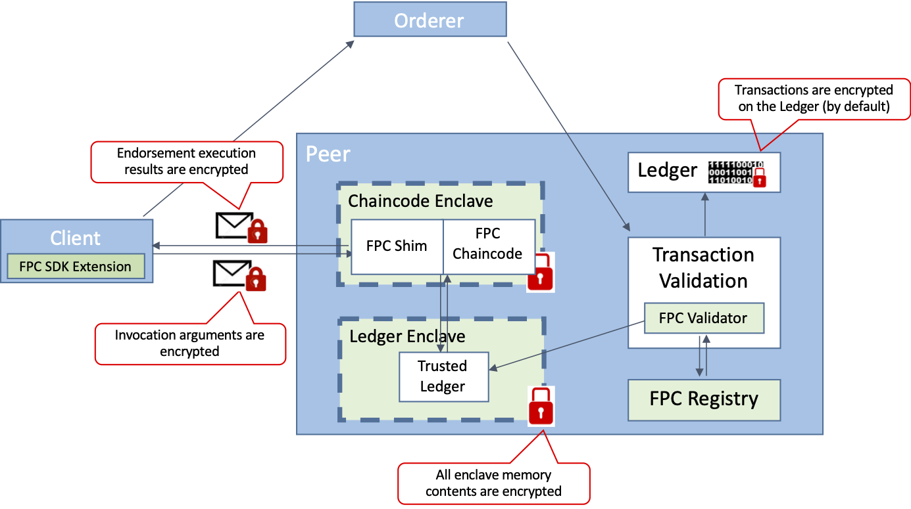

<!--
	Notes:
	- The PNGs are generated from 	https://github.com/hyperledger-labs/fabric-private-chaincode/docs/images/FPC arch and lifecycle stages v1.3.pptx

-->


- Feature Name: Fabric Private Chaincode (FPC) - Lite
- Start Date: 2020-01-28)
- RFC PR: (leave this empty)
- Fabric Component: Core (fill me in with underlined fabric component, core, orderer/consensus and etc.)
- Fabric Issue: (leave this empty)


***TODO (Begin): Document wide***

- *currently our github links point to `master`, should we change to `flow-refactoring`?*

***TODO (end)***


# Summary
[summary]: #summary

This RFC aims to introduce a new security feature for Hyperledger Fabric called Fabric Private Chaincode (FPC) that enhances data confidentiality for chaincodes by executing them in a Trusted Execution Environment (TEE), such as Intel SGX.

FPC is a framework to develop and run chaincodes with strong privacy guarantees.
With FPC, a chaincode can process transaction arguments and state without revealing/exposing the contents to anybody, including the endorsing peers.
That is, the contents of a FPC transaction is encrypted in a way that only the FPC chaincode can decrypt and then process it. The resulting state updates are encrypted by default by the FPC chaincode with keys only known to the chaincode.

As a result, other parties (both clients and peers) cannot examine the state of the transactions either in the chaincode or on the ledger. Hence, FPC helps to protects sensitive data even from compromised endorsing peers and other unauthorised parties.
FPC provides the capabilities to verify that a chaincode and the data are protected, that is, Fabric peers and clients can receive cryptographic assurance that the correct chaincode is being run without tampering inside the TEE by means of a hardware-based remote attestation.

This new model of trust for Fabric smart contracts makes possible high-stakes markets such as private voting systems and sealed-bid auctions; which aren’t supported by the existing model of privacy in Fabric because of the requirement for endorsing peers to be fully trusted for confidentiality.

A prototype implementation of FPC is available as Hyperledger Lab on github (https://github.com/hyperledger-labs/fabric-private-chaincode).

# Motivation
[motivation]: #motivation
<!-- 
    Description of section: General motivation on why Fabric does not cover use-cases having strong privacy requirement and that TEE/FPC can close that gap.
    Note: At this level there is no distinction between full FPC and FPC Lite and hence use the term FPC through-out without qualification 
    and also still mention all possible use-cases. 
    The distinction is done later in the architecture/design section
-->
FPC is motivated by the many use cases in which it is desirable to embody an application in a Blockchain architecture, but where in addition to the *existing integrity assurances*, the application *also requires privacy*. This may include private voting, sealed bid auctions, operations on sensitive data such as regulated medical or genomic data, and supply chain operations requiring contract secrecy. With Fabric's current privacy mechanisms, these use cases are not possible as they still require the endorsement nodes to be fully trusted.
For example, the concept of channels and Private Data allows to restrict chaincode data sharing only within a group of authorized participants, still when the chaincode processes the data it is exposed to the endorsing peer in clear. In the example of a voting system, where a government may run an endorsing peer it is clear that this is not ideal.

<!-- Below section does not apply to FPC Lite but as we haven't introduced that and this motivation can be address in a later extentions we still mention it here -->
A second motivation for FPC is its integrity model based on hardware-enabled remote cryptographic attestation; this model can provide similarly high confidence of integrity to the standard Fabric model of integrity through redundancy, but using less computation and communication. With TEE-based endorsement and remote attestation, a new set of endorsement policies are made possible, which can reduce the number of required endorsements and still provide sufficient assurance of integrity for many workloads.

FPC adds another line of defense around a chaincode. Over time and with continued development of support for other languages and Trusted Execution Environments, we intend FPC to become the standard way to execute many or even most chaincodes in Fabric, similar to what HTTPS has become for the Web.


# User Experience
[functional-view]: #functional-view
<!-- 
    Description of section: This section describes the functional view as experienced by developers of chaincode and applications interacting with it as well as admins deploying them.
    Note: At this level there is no distinction between full FPC and FPC Lite and hence use the term FPC through-out without qualification. 
    The distinction is done later in the architecture/design section
-->

## Overview

Fabric Private Chaincode is best thought of as a way of running smart contract chaincode inside a Trusted Execution Environment (TEE), also called an _enclave_, for strong assurance of privacy and a more computation-efficient model of integrity.
Programs executed in the TEE are held in encrypted memory even while running, and this memory can't be read in the clear even by a root user or privileged system process. Chaincode state is encrypted with keys only known to the chaincode. Each chaincode runs in its own TEE to provide the best possible isolation among chaincodes on an endorsing peer. Because the execution is opaque, a modified set of integrity controls is also implemented in order to be certain that what's running is exactly what is intended, without tampering.
<!-- commented out as not provided by FPC Lite and anyway not crucial for this section:
With FPC’s hardware-rooted cryptographic integrity mechanisms, it requires less redundancy of computation than in the standard model of Fabric to get a high level of trust.
-->
With FPC, a chaincode can process sensitive data, such as cryptographic material, health-care data, financial data, and personal data; without revealing it to the endorsing peer on which it runs.

Overall, FPC can be considered an addition to Fabric wherein all chaincode computation relies only on the correctness of data provided by an authenticated Client or computed inside of and signed by a validated enclave.
The Endorsing Peer outside of the enclave is considered untrusted.
For this reason, all transaction data and chaincode state are encrypted by default in a way that only the FPC chaincode can access them in clear.

Writing chaincode for FPC should come natural to developers familiar with Fabric as the programming model (e.g., chaincode lifecycle, chaincode invocations and state) is the same as for normal Fabric chaincode.
The main differences are a (for now at least) different programming language (C++) and a Shim API which implements a subset of the current Fabric API.
The Shim is responsible to provide access to the ledger state as maintained by the `untrusted` peer. In particular, the FPC Shim, under the cover and transparent to the developer, encrypts all state data that is written to the ledger and decrypts them when retrieved later. Similarly, it also encrypts and authenticates all interaction with the applications, see below. Lastly, it attests to the result and the state update based on the enclave's hardware identity to provide a hardware-trust rooted endorsement.

Applications can interaction with a FPC chaincode using an extension of the Fabric Client Go SDK.
This FPC extension exposes the Fabric `gateway` interface and transparently encrypts and authenticates all interactions with a FPC chaincode.

Note that FPC hides all interactions with the TEE technology from the developers, i.e., they they do not have to understand the pecularities of TEEs.  This largely also applies to the adminstrators deploying FPC chaincode, although they will have to understand the general concepts of TEE to make informed decisions on security policies and to configure the attestation credentials.

To illustrate the interaction between an application and a FPC chaincode see the following figure. In particular, this figure highlights the encrypted elements of the FPC architecture.

***TODO fix this image by removing the Ledger Enclave and the FPC registry box, both of which a normal user does not see (see comment on top for .ppt source of original images)***


Encrypted elements of the FPC architecture (over and above those in Fabric, such as TLS tunnels from Client to Peer) include:

- The arguments of a transaction proposal.
- The results of execution in a proposal response message returned to the Client.
- All contents of memory in both the Chaincode Enclave(s).
- All entries of the transaction writeset (by default).

Note that with the exception of the results, where also a legitimate requestor knows the secret keys, all secret/private keys are known only by to the enclaves or, for memory encryption, to the HW memory encryption engine (with the hardware also enforcing that only legitimate enclaves have access to the unencrypted memory).


## FPC Development

### FPC Chaincode
<!-- this section should cover: platform (x86, sgx sdk, linux; but also via docker); cmake; shim.h -> hello world tutorial -->

As mentioned earlier, FPC chaincode is executed in an enclave.
In the initial version, FPC will supports Intel SGX as trusted execution technology.
For this reason, a FPC chaincode must currently be written in C++ using our FPC SDK, which builds on top of the Intel [SGX SDK](https://github.com/intel/linux-sgx).
The current development platform is Linux (Ubuntu). However, we also do enable seamless development via docker. 
Hence, development is also easily possible with MacOS or Windows as host.

To ease the development process, FPC provides a `cmake` based build system which allows the developer to focus on the chaincode without having to understand SGX build details.
The programming interface against which a FPC chaincode has to be programmed is encapsulated in the C header file [`shim.h`](https://github.com/hyperledger-labs/fabric-private-chaincode/blob/master/ecc_enclave/enclave/shim.h).
To get a more in-depth understanding of the chaincode development, consult the detailed `HelloWorld` [Tutorial](https://github.com/hyperledger-labs/fabric-private-chaincode/tree/master/examples) that guides new FPC developers through the process of writing their first FPC chaincode.

Note: It is the goal for the project is to support additional languages in the future, e.g., there is an ongoing effort to add support for WebAssembly.

### FPC Application

***TODO add reference to .go files in our repo (or .md if we decide to do the equivalent of `fpc-management.md` for this)***

This extends the Fabric Client SDKs with extra functionality that allows users to write end-to-end secure FPC-based applications.
In particular, the FPC Client SDK extension will provide these core functions: 1) FPC transaction proposal creation (including transparent encryption of arguments) 2) FPC transaction proposal response validation and decryption of the result.
The encryption and decryption is performed by the Client SDK "under the covers" without requiring any special action by the users, i.e.,
the users still use normal `invoke`/`query` functions to issue FPC transaction invocations.
For the MVP, we intend to support the peer CLI only. Extended support for the NodeSDK (or Go SDK) will be future work.

An application can interact with the asset store chaincode using the FPC extension for the Fabric Client Go SDK.
The extension takes care of enclave discovery and encryption of the transaction arguments and the response.

Here an example:
***app.go***:
```go
// Get FPC Contract
contract := fpc.GetContract(network, "hellloWorld")

result, err = contract.SubmitTransaction("storeAsset", "myDiamond", "100000")
if err != nil {
    log.Fatalf("Failed to Submit transaction: %v", err)
}
```

## FPC chaincode deployment

There are two preparation steps required before one can deploy FPC Chaincode:

- The chaincode administrator has to register with the [*Intel Attestation Service (IAS)*](https://software.intel.com/content/www/us/en/develop/topics/software-guard-extensions/attestation-services.html) to obtain attestation credentials
  and configure the local platform correspondingly.
  (This is not necessary if running Intel SGX in simulation mode)
- The peer adminstrator has to add the FPC external builder and launcher scripts have to the `externalBuilders` section in `core.yaml` and restart the peer.

The actual chaincode deployment follows mostly the standard Fabric pattern:

- the deployer creates a package with the main FPC deployment artificat, the `enclave.signed.so` enclave binary, and deployment metadata.
  FPC provides convenience scripts to facilitate this step.
- subsequently, the deployer follows the standard Fabric 2.0 Lifecycle steps, i.e., `install`, `approveformyorg` and `commit`. 
  A noteworthy FPC specific aspect is that the version used *must* be the code identity of the FPC chaincode,
  i.e., a cryptographic hash corresponding to `enclave.so` called the `MRENCLAVE` for SGX.
  <!-- 
    Two notes:
    - mrenclave described as simple hash is a gross over simplification but should be ok here to give some intuition without getting into the details.
    - We might want also to explain why requireing `version=MRENCLAVE` is necessary, 
      i.e., to get agreement among all participants on the functionality.  
      This thought then also requires explaining that due to the privacy requirements and contrary to what Fabric enabled in v2.0,
      different peers *must* run the same code and cannot provide their own implementation. 
      (see related discussion on this on old "full FPC RFC".)
      As this moot in FPC Lite which supports only a single enclave, i omit the corresponding discussion for now.
  -->
- lastly, once the chaincode definition for an FPC chaincode has been approved by the consortium, 
  a Chaincode Enclave is created via a new `initEnclave` lifecycle management command. 
  <!-- commented out as not really user visible
    This command triggers the creation of an enclave and registers it at the FPC Registry.  
    The registration includes the attestation of the Chaincode Enclave.
  -->
  For more information on additional management commands, see the [FPC Management API document](https://github.com/hyperledger-labs/fabric-private-chaincode/blob/master/docs/design/fabric-v2%2B/fpc-management.md).

<!-- commented out as not really user visible
The FPC Registry stores all attestation reports, as signed by the TEE vendor. 
The attestation reports include information on what chaincode is running; what specific TEE is in use, including version number and hash of the chaincode (MRENCLAVE), and including the public keys of the enclave. 
Upon creation each chaincode enclave generates public/private key pairs for signing and for encryption. The public signing key also denotes the chaincode enclave identity.

In order to support the endorsement model of Fabric, chaincode enclaves executing the same FPC chaincode need access to a set of shared secrets. In particular, these shared or common keys are used to encrypt and decrypt the transaction arguments and state.
That is, there is also a public/private key pair and a symmetric state encryption key per FPC chaincode that are shared among all chaincode enclaves that run the same FPC chaincode using the key distribution protocol.
-->

The deployment is described in detail below and can be found in the [Full Detail Diagrams](#full-detail-diagrams) section.

## Requirements

***TODO with vanilla fabric this is reduced***

- In the initial version of FPC, chaincode must be written in C/C++ using our FPC SDK. More language support is planned.
- FPC currently is installed on a Peer, and Endorsing Peers must use the FPC chaincode runtime based on externalBuilders.
- FPC currently requires that the Endorsing Peers run on an Intel x86 machine with the SGX feature enabled. We plan to add support for other Trusted Execution Environments in future releases.
- To simplify the development as much as possible and provide chaincode developers the same experience as with "traditional" chaincode development, FPC requires developers to use a chaincode SDK that abstracts the TEE specific implementation details as much as possible.
- FPC’s runtime relies on the external builder/launcher feature of Fabric, and the attestation infrastructure requires the installation of an FPC Registry chaincode in the channel.


## Fabric Features Not (Yet) Supported

***TODO: revisit for FPC Lite (and its constraints). Might be best moved to after architecture?***

In order to focus the development resources on the core components of FPC, the MVP excludes certain Fabric features, which will be added in the future.

- Multiple Implementations for a Single Chaincode -- a feature added in Fabric 2.0 -- is fundamentally incompatible for private chaincode like FPC where _all_ information flows have to be controlled: for FPC chaincodes to be considered equivalent they must be bit-for-bit identical in order to generate matching identities (i.e. MRENCLAVE).
- Arbitrary endorsement policies
- State-based endorsement
- Chaincode-to-chaincode invocations (cc2cc)
- Private Collections
- Complex (CouchDB) queries like range queries and the like


# Architecture
[architecture]: #architecture
<!-- 
    Description of section: This section makes the FPC vs FPC Lite distinction (& related restrictions)
    and then provides an outline of the architecture of FPC Lite.
    Note: we should use here preferably the term FPC Lite rather than FPC.
-->


***TODO describe components in detail***
- *Chaincode Enclave; split in trusted and untrusted component*
- *Internal Transaction Flow*
	- *Enclave Creation / Registration*
	- *Invocations and Validation*
- *Enclave Registry Details*


## FPC Lite

The first realization of FPC is called *FPC Lite* and will support a subset of the features mentioned in [Motivation](#motivation) Section.  
The focus of FPC Lite is on confidentialty and the class of application which do not require release of sensitive data conditioned on private ledger state.  Coverage of the larger class of private applications and potential performance improvement over fabric are left for a future extension.  
(Note that the design documents referenced in [Design Documents](#design-documents) already outline the path for such extensions.)

The reason for supporting only a sub-class of applications is that FPC Lite will not provide rollback protection,
a feature which would require too invasive changes in Fabric for an initial version.
However, these applications still cover very interesting use-cases currently not covered by Fabric.
***TODO: @Jeb can you please make pass on below and replace this section as appropriate with info from HBP, UMBC or alike***
For example, a large and important use-case covered is federated learning on private sensitive information. In particular in the domain of health data it could unleash a huge potential which is currently untapped.

To illustrate this, consider the case of training a model, e.g, Convolutional Neural Network (CNN), for detecting brain abnormalities such as precancerous lesions or aneurysms. To achieve high accuracy we need considerably more data than single entities (e.g., a hospital) usually has. Yet regulations like HIPAA make sharing brain CT scans or MRI studies, labeled by radiologists, hard if not impossible. Furthermore, to allow widest use of a derived model, it should be freely shareable without any privacy concerns. Lastly, to provide the necessary accountability and audit trail, such a federated application is ideally tied to a ledger. While there are cryptographic solutions to perform federated learning in a strongly private manner, e.g., based on differential privacy, for such a setting, they are very expensive in terms of computation and, in particular, communication complexity.

A sketch on how this could be solved as follows:
- The overall approach would be to follow the [“PATE, for Private Aggregation of Teacher Ensembles”](https://blog.acolyer.org/2017/05/09/semi-supervised-knowledge-transfer-for-deep-learning-from-private-training-data/) approach to achieve the necessary strong privacy, i.e., differentially private, guarantees on the learned model to be released to the public.
- Above papers assume that the learning of the privacy-preserving model is performed by a trusted entity. In our example, an FPC Lite chaincode will perform this role, ensuring the integrity of the computation as well as the confidentiality of the training data.
- More specifically, the participating hospitals would compute separate teacher models on their own data and send the resulting model encrypted and signed to the chaincode. The chaincode would authenticate and validate the teacher models based on parameters apriori agreed and built into the chaincode, accumulate and record the submission in the ledger and, once sufficient inputs are received, will perform privately inside the chaincode the final student model computation. It will then publish the resulting model, e.g., via put_public_state,on the ledger.

Note such an application would not release any sensitive data conditioned on private state and hence meets our criteria.

***TODO: we should also mention the other limitations (i.e., single and no composite key and no getCreator/MSP identities). Maybe best done by moving the [Fabric Features Note (yet) Supported](#fabric-features-not-yet-supported) section after the [Architecture](#architecture) Section and adding it there?***

## Overview of Architecture

- TODO Add the detailed picture here


## FPC Shim

For MVP, the FPC Shim comprises a subset of the standard Fabric Shim and is complemented in the future.
These details are documented separately in the Shim header file itself: **[ecc_enclave/enclave/shim.h](https://github.com/hyperledger-labs/fabric-private-chaincode/blob/master/ecc_enclave/enclave/shim.h)**
As described above, FPC follows the programming model used in the standard Fabric Go shim and offers a C++ based FPC Shim to FPC chaincode developers.

## FPC Transaction Validation

FPC transactions are validated using the FPC Validator that is implemented as a custom validation plugin and is attached to the standard Fabric validation pipeline.
When the peer receives a transaction produced by an FPC chaincode, FPC Validator fetches the corresponding validation data from the FPC Registry - specifically, the attestation for the Chaincode Enclave(s) that executed that transaction. It verifies that the attestation is correct by verifying a signature produced by the TEE vendor, and checks that the attestation contains the chaincode hash (MRENCLAVE) that is referenced in the chaincode definition. If this check succeeds, the public key attached to the attestation is used to verify the FPC endorsement signature.
In other words, using the FPC Validator, a peer checks that a transaction (i.e., the read/writeset and the result) was indeed produced by a proper FPC Chaincode.

Once the validation and commit process completes, the transaction is appended to the local ledger of the Peer.  The Ledger Enclave implements a block listener and therefore receives all committed blocks from the Peer.
The Ledger Enclave then establishes a trusted view of the ledger by repeating the validation algorithm inside the enclave to assure against a corrupted Peer.  In particular, even though the transaction has already been validated by the Peer (using the FPC Validator), from the enclaves perspective, the validation result is untrusted.
Note that in order reduce this redundant validation, the Peer could delegate the validation entirely to the Ledger Enclave. 

In addition to the peer-side validation, clients must also be able to verify FPC transactions.
This process is similar to the validation step as described above; the FPC Client SDK extension implements this functionality and make this process thereby transparent to the users. A low level FPC Client SDK API may also provide the functionality to the end user directly.


## FPC Registry

Also referred to as the Enclave Registry Chaincode (ERCC), this is a component which maintains a list of all Chaincode Enclaves deployed on the peers in a channel.
The registry associates with each enclave their identity, associated public keys and an attestation linking them. Additionally, the registry manages chaincode specific keys, including a chaincode public encryption key, and facilitates corresponding key-management among authorized Chaincode Enclaves. Lastly, the registry also records information required to bootstrap the validation of attestation. All of this information is committed firmly on the ledger. This enables any Peer in the Channel (even those without SGX) to inspect the Attestation results before taking actions such as connecting to that chaincode or committing transactions produced by an FPC chaincode. Moreover, clients can query the registry to retrieve the chaincode public encryption keys of a particular FPC chaincode so they can send privately transaction proposals for endorsement.


## Deployment Process (in detail)

- TODO what is the difference to the deployment in the previous section? 

This section details the turn-up process for all elements of FPC, including an explanation of the trust architecture.

* Step 1: Channel and Peers

	Initially it is assumed that a standard Fabric network is in place. A new Channel is created according to the existing standard process for Fabric. One or more Peers join the channel according to the standard process.
	Using the `peer channel join` command, an FPC-enabled endorsing peer attaches a Ledger Enclave to the Channel, imprinting itself with a content-addressable Channel Identifier and a hash of the Channel's Genesis Block contents.
	Note that FPC currently does not support cross-channel interaction; however, this can be addressed in future work.

* Step 2: Create the FPC Chaincode deployment artifact

	One or more of the participants compiles an agreed-upon chaincode using the FPC compiler configuration.
	This links in the FPC Shim, including its shim in the compiled package and creating a unique chaincode identifier called the MRENCLAVE.
	Details of this process will vary in future versions supporting other TEEs. Participants must be careful to use the same compiler configuration and version numbers of all included software. As long as they do, the MRENCLAVE will be the same for each compiled Chaincode Package.

* Step 3: Install and Approve an FPC Chaincode

	Administrators in each organization that will participate in the channel install the agreed-upon chaincode package on their FPC-enabled Peers following the standard Fabric 2.0 lifecycle process.
	They perform the installation of the chaincode tarball onto their Peers and invoke an `approveformyorg` transaction specifying MRENCLAVE (recall Step 1) as the chaincode version.
	Thereby, the organization approves a particular FPC Chaincode by defining the corresponding chaincode identity (MRENCLAVE).
	Once enough Approvals have been committed in order to fulfill the Lifecycle Endorsement Policy, an admin commits the Chaincode Definition by invoking `peer lifecycle chaincode commit`.
	Note that by defining the MRENCLAVE inside the Chaincode Definition, FPC enforces that only enclaves matching the defined MRENCLAVE can produce valid transactions of the given chaincode.

* Step 4: Enclave Creation and Attestation Generation

	Once the FPC chaincode installation and approval is complete, the admin invokes `peer lifecycle chaincode createenclave` at an endorsing peer.
    Thereby, the FPC Shim creates an new Chaincode Enclave running the FPC Chaincode.
    In particular, when creating the enclave, the FPC Shim also fetches the MRENCLAVE and Channel ID of the Ledger Enclave and passes them with the create command.
	Now, having all necessary information, the new Enclave proceeds with the key generation protocol.
	It creates public/private key-pairs for signing and encryption. The public signing key is also used as enclave identifier.
	Moreover, the new Chaincode Enclave binds to the Ledger Enclave using the information as received during its creation performing local attestation.

	Next, the Chaincode enclave participates in an attestation protocol.
	This protocol may be different depending on the TEE technology used.
	In the case of Intel SGX, the enclave produces a quote that allows to verify that a legitimate TEE is running a correct version of software and a particular FPC Chaincode (identified through MRENCLAVE).
	This quote is then sent to the Intel Attestation Service (IAS) for validation.
	The IAS returns an attestation report (evidence) that is used to proof that the enclave runs a particular chaincode.

	To complete the enclave creation, the attestation evidence and the enclave state including all the names, versions, cryptographic keys are encrypted using the enclave's sealing mechanism. 
	The enclave returns the public keys, sealed state, and the attestation evidence to the FPC Shim (outside the enclave).
	
    The FPC Shim then stores the sealed state in its local storage provided by the external launcher.
    This sealed state enables recreating the FPC Chaincode enclave and reprovisioning it with the private keys and correct state,
    e.g., during restart of the Peer or because the external builder restarts the chaincode previously stopped due to idleness.
    Note that the properties of the seal operation guarantee that only an enclave running the correct FPC Chaincode will be able to unseal that information.

	The Peer signs the enclave public keys for its organization, thereby taking ownership of the new Enclave for that organization. 

	Once the enclave is up and running, the `peer lifecycle chaincode createenclave` command invokes a register transaction for the newly created Chaincode Enclave.
	The public parameters of the Chaincode Enclave along with the attestation evidence is sent to the FPC Registry, which validates them internally by checking consistency and signatures, and then stores the new entry.
	The register invocation is invoked at a sufficient set of endorsing peers to satisfy the FPC Registry endorsement policy.
	Finally, a Register transaction is submitted to the Ordering Service.
	By committing a Register transactions, the FPC Chaincode Attestation is now visible proof of validity of the FPC Chaincode to all participants in the Channel.

## FPC Transaction Flow

- TODO check again

- TODO add a single figure illustrating the flow

To illustrate how the FPC architecture works and how it ensures robust end-to-end trust, we describe the process of an FPC transaction. This assumes that all of the above described elements are already in place.

* Step 1: Client Invocation of the FPC Chaincode

	<!--  -->

	The Client prepares the Invocation of an FPC Chaincode by first encrypting the arguments of the Chaincode Invocation using the public key specific to a particular Chaincode. This encryption happens completely transparently using our FPC Client SDK extension. This Transaction Proposal is then sent to the Endorsing Peer where a corresponding Chaincode Enclave resides. Depending on the Endorsement Policy the client may perform this step with one or more Endorsing Peers and their respective Chaincode Enclaves. (For simplicity we will continue describing the process for a single Endorsing Peer.) The Peer forwards the Transaction Proposal to its FPC Chaincode running inside the Chaincode Enclave. Inside the Enclave, the FPC Shim decrypts the Proposal and invokes the FPC Chaincode.

* Step 2: Chaincode Execution

	<!--  -->

	Having received and decrypted the Transaction Proposal, the FPC Chaincode processes the invocation according to the implemented chaincode logic.
While executing, the chaincode can access the World State through `getState` and `putState` operations provided by the FPC Shim.
The FPC Shim fetches the state data from the peer and loads it into the Chaincode Enclave; then the FPC Shim verifies that the received data is correct (e.g. is actual committed data) with the help of the Ledger Enclave. This protects the Chaincode from various attacks that might be possible in the case of a compromised Peer. (An example and explanation is included below.) We refer to our paper (see prior art section) for more details on this type of attack.

	When the particular chaincode function invocation finishes, the FPC Shim produces a cryptographic signature over the input arguments, the read-write set, and the result.
	This is conceptually similar to the endorsement signature produced by the endorsing peer but instead of being rooted in an organizational entity like the peer it is based on the hardware and code entity and rooted in the attestation. Note that for this reason the FPC Shim keeps track of the read/writeset during the invocation inside the Chaincode Enclave. Then the FPC Shim returns the result along with the signature back to the Peer. The Peer then uses the FPC signature as endorsement signature for the proposal response and sends it back to the Client.

* Step 3: Enclave Endorsement Validation

	<!--  -->

	The Client receives the Proposal Response (and collects enough Proposal Responses from other endorsing peers to satisfy the chaincode’s Endorsement Policy). Moreover, the FPC Client SDK extension verifies that the proposal response signature has been produced by a "valid" Chaincode Enclave. If this verification step fails, there is no need for the client to proceed and the transaction invocation is aborted. Otherwise, the client continues and builds a transaction and submits it for ordering.

* Step 4: Ordering

	<!--  -->

	With FPC we follow the normal Ordering service. While the Orderer is unmodified in FPC, the ordered transactions broadcast to the Peers in the Channel for validation now include attested endorsements. Note that we encourage the use of a BFT-based ordering service as FPC requires the Ordering service to be trusted.

* Step 5: Validation and Commitment

	<!--  -->

	As the Peers in the Channel receive the block of transactions, they perform the standard Fabric validation process.
	If these validation processes succeed, the FPC transaction is marked valid.
	The Peer continues with committing the transactions to the local ledger and applies all valid transactions (i.e. the write set) to the World State. This completes the transaction.


## Explanation of Trust Architecture

As described in the FPC Deployment Process and FPC Transaction Flow above, FPC is designed to provide an assurance of confidentiality and integrity even when the chaincode executes on a thoroughly compromised Peer.
All elements of the Peer outside the Trusted Execution Environment are considered untrusted. All sensitive data and program operations are confined to the Chaincode Enclave, which provides confidentiality. 
The Ledger Enclave does not perform operations on sensitive information requiring confidentiality, but it is also crucial to the FPC architecture in order to assure integrity; it is also considered a trusted element.
All communication is secured by means of standard PKI cryptographic means, and private keys for both signing and encryption are confined to the TEEs with no means provided for them to be read out.

The Attestation enabled by hardware and verified by means of a privacy-preserving group signature scheme provides an assurance of Integrity: the code in the Enclave is the desired code and hasn't been tampered with. And finally, the Ledger Enclave makes it possible for FPC Chaincodes to access a trusted copy of the World State, thus foiling attempts to compromise privacy or integrity by feeding the Chaincode false information from outside the TEE. In the initial implementation, the Ledger Enclave also serves as the repository for certain security-critical metadata as described in the next section.

When clients connect to an FPC chaincode, they can gain an assurance that it is the correct chaincode and has not been tampered with by looking it up by its Public Key in the FPC Registry, where they can validate the measurement of and signature on that chaincode as registered by the TEE and signed by the TEE vendor as being correct and valid.

The Ordering Service is treated as a trusted element in FPC networks, but securing it is outside the scope of FPC. Likewise, FPC does not directly address problems of Clients attempting to manipulate the Chaincode's output by providing bad input; this must always be a matter of application-specific code discipline, and relying on the existing features native to Fabric which provide resilience and integrity through redundancy and distribution. Ultimately, FPC is complementary to these existing features of Fabric.

## TEE platform support

Currently, our FPC Runtime and the SDK focuses on [Intel SGX SDK](https://github.com/intel/linux-sgx).
However, components such as the FPC Registry are already designed to support attestations by other TEE platforms as they mature and gain remote attestation capabilities. Also, other components such as the Go part of the FPC Shim don't have an Intel SGX depency and can easily be reused. We plan to explore other TEE platforms such as AMD SEV in the future.

## Fabric Touchpoints

- TODO with FPC lite no Fabric Touchpoints anymore; however, this only works for the chaincode-as-a-service model; 

- explain that we can also support FPC using externalBuilder but this requires FPC peer image aware of SGX;

- Additional Metadata in the Channel and Chaincode Definitions: In order to insure agreement on security-critical data across all Orgs on a Channel, we recommend that FPC introduce new metadata into the Channel Definition: for example, the TEE vendor’s Certificates, and into the Chaincode Definition (possibly using the “version” field): for example, the MRENCLAVE chaincode enclave identifier. In the initial implementation these are Intel SGX-specific and hardcoded, recording these metadata in the FPC Registry, but this makes runtime upgrades impossible. We hope to explore the possible use of Configtxgen and approveForMyOrg in future releases to address this issue.

- New Runtime Environment: In order to create a TEE-enabled runtime for FPC chaincode, the initial FPC implementation uses a Go wrapper around a C++ Shim to enable interaction between the Peer and the Enclave, which didn’t support Go code when the project started. We also use a Peer CLI wrapper to hide Enclave-specific operations. This wrapper approach might not be ideal for compatibility with Fabric build and lifecycle management. As described above, we want to use the new External Builder feature of Fabric 2.0 to address these issues, and hope to work out the details through the RFC process.

- Attestation-Based Endorsements: In order to integrate cryptographic Attestation of the TEE with Fabric endorsements, we created custom endorsement and validation plugins and include the enclave signature as part of the response payload. This added payload and the need for every Peer to run a custom validation plugin seem undesirable in the long term. Our current plan is to create a custom Membership Service Provider to replace the original mechanism. The new TEE MSP type would treat TEEs as members of an Org, replacing the Peer’s endorsing signature with a TEE Signature. We believe this approach would be more elegant and flexible, and would lay the ground for easier enablement of new TEE types.


The FPC team welcomes the community’s advice on how each of these touch-points to Fabric should be handled going forward, and hope to solidify our plans for each element through the RFC process.

## Design Documents

***TODO: Also reference the two google design docs for FPC Lite (e.g., because of the security analysis in the TL-less doc): [FPC without Trusted Ledger](https://docs.google.com/document/d/1jbiOY6Eq7OLpM_s3nb-4X4AJXROgfRHOrNLQDLxVnsc/), [FPC externalized endorsement validation](https://docs.google.com/document/d/1RSrOfI9nh3d_DxT5CydvCg9lVNsZ9a30XcgC07in1BY)***

***TODO: Also reference the [interfaces.md](https://github.com/hyperledger-labs/fabric-private-chaincode/blob/master/docs/design/fabric-v2%2B/interfaces.md)?***

The full detailed protocol specification of FPC is documented in a series of UML Sequence Diagrams. Specifically:

- The [fpc-lifecycle-v2](../images/fpc/full-detail/fpc-lifecycle-v2.png) diagram describes the lifecycle of a FPC chaincode, focusing in particular on those elements that change in FPC vs. regular Fabric.
- The [fpc-registration](../images/fpc/full-detail/fpc-registration.png) diagram describes how an FPC Chaincode Enclave is created on a Peer and registered at the FPC Registry, including the Remote Attestation process.
- The [fpc-key-dist](../images/fpc/full-detail/fpc-key-dist.png) diagram describes the process by which chaincode-unique cryptographic keys are created and distributed among enclaves running identical chaincodes. Note that in the current version of FPC, key generation is performed, but the key distribution protocol has not yet been implemented.
- The [fpc-cc-invocation](../images/fpc/full-detail/fpc-cc-invocation.png) diagram illustrates the the chaincode invocation part of an FPC transaction flow, focusing on the cryptographic operations between the Client and Peer leading up to submission of an FPC transaction for Ordering.
- The [fpc-cc-execution](../images/fpc/full-detail/fpc-cc-execution.png) diagram provides further detail of the execution phase of an FPC chaincode, focusing in particular on the `getState` and `putState` interactions with the Ledger and verification of state with the Ledger Enclave.
- The [fpc-validation](../images/fpc/full-detail/fpc-validation.png) diagram describes the FPC-specific process of validation and establishing a trusted view of the ledger using the Ledger Enclave.
- The [fpc-components](../images/fpc/full-detail/fpc-components.png) diagram shows the important data structures of FPC components and messages exchanged between components.

Note: The source of the UML Sequence Diagrams are also available on the [FPC Github repository](https://github.com/hyperledger-labs/fabric-private-chaincode/tree/master/docs/design/fabric-v2%2B).

# Roadmap Features

- TODO add full FPC

- WebAssembly Chaincode: A primary goal for FPC moving forward is to support WebAssembly chaincode, and by extension all languages that compile to WASM.
There has already been extensive development of a high-performance open source WASM Interpreter / Compiler for Intel SGX Enclaves in the [Private Data Objects](https://github.com/hyperledger-labs/private-data-objects) project, and our current plan is to adopt that capability in the next major phase of FPC.
FPC's modular architecture has been designed from the beginning to enable this drop-in capability.

- Other TEEs: The FPC team is also participating in early discussions in the [Confidential Computing Consortium](https://confidentialcomputing.io/), which aims to provide a standardized way of deploying WASM across multiple TEE technologies.
We hope to leverage this work when extending FPC to support these other TEEs.

- Endorsing Policies: The current version supports only a single designated FPC Endorsing Peer; it is our intention to support multiple FPC Endorsing Peers in the upcoming MVP release.
In future releases this would enable rich Endorsement Policies as described above.

- Risk Management and Deployment Policies: We intend to support deployment policies which allow the users to define where a FPC chaincode is allowed to be deployed.  For instance, the user could define that a certain FPC chaincode can only executed by an endorsing peer on a on-premise node of a certain organization.  This allows enhanced risk management.

- Private Data Collections: We have not tested the combination of FPC with Private Collections in Fabric 2.0, but intend to support this combination of features in a future release.

- Chaincode2Chaincode Invocations: The initial version of FPC does not support
to call other chaincodes from a FPC chaincode; as this is a useful feature often used by chaincode applications, we intend to support this functionality in a future release.

- Multiple FPC Channels: The current version only supports a single FPC Channel; it is our intention to support arbitrary numbers of Channels of both FPC and regular Fabric in future releases.

- Trusted Ledger State Snapshot:
  Currently, the Trusted Ledger keeps the ledger meta-data state in secure memory only, i.e., it does not persist it.
  This means that on restart of the peer, the complete transaction-log has to be re-read and also limits how large the ledger meta state can be.
  In a future release, we will add secure storage of the meta-data state which will address both of these concerns and will provide better restart performance and better scalability.


# Drawbacks
[drawbacks]: #drawbacks

Why should we *not* do this? Are there any risks that must be considered along with this rfc.

This isn't a reason *not* to do this, but a statement that security risks will still exist even with FPC. No hardware TEE is considered perfectly safe by itself. Exotic side-channel attacks have been demonstrated in research settings to cause TEEs to leak information. No single security measure is sufficient alone, and all architectures should still keep this design principle in mind even when using a TEE. FPC makes it vastly more difficult to examine the contents of a chaincode as it executes, and perhaps impossible to compromise its integrity if used correctly - for example by using a robust endorsement policy to leverage the existing resilience through redundancy in Fabric.  Simply using FPC may suffice for most sensitive workloads. However, for the most sensitive workloads, additional design guidelines should be followed to minimize the risk of exposure to very sophisticated attacks.


# Rationale and Alternatives
[alternatives]: #alternatives

Considering that the key goal of FPC is to provide a way to execute smart contracts privately with assured integrity, there are some possible alternate approaches:

- Choose AMD SEV or some other TEE as the initial hardware platform. IBM already has Intel SGX TEE-enabled machines on their Cloud, and the effort can leverage considerable work already done under the Private Data Objects project. Perhaps more importantly, the FPC architecture requires cryptographic remote attestation, and this feature is not yet supported in other TEEs. We have designed its modular architecture to be extended to support AMD SEV and other TEEs as they mature and gain remote attestation features.
- Use Secure Multi Party Computation, Fully Homomorphic Encryption, or other pure software-based cryptographic solution. This is also a viable solution though limited to very small chaincodes because of the extremely high computational overhead. Also, compilers for these environments are generally not yet considered mature enough for general use, and there is a high learning curve imposed on programmers that use these technologies.
- Run the entire Peer inside a TEE. This is seen as philosophically undesirable because of the importance of minimizing the Trusted Code Base. The less complex the core security elements of the system are, the better.
- Run only the chaincode itself in the TEE - leave off the extra complexity of the Ledger Enclave. This would simplify the design too much, because the Ledger Enclave is necessary to make certain a compromised Peer can't subvert a chaincode by misrepresenting the current World State. Methods such as a rollback attack could fool a chaincode into revealing sensitive data under certain circumstances without this element.

# Prior art
[prior-art]: #prior-art

The initial architecture of FPC is based on the work in the paper:

* Marcus Brandenburger, Christian Cachin, Rüdiger Kapitza, Alessandro
Sorniotti: Blockchain and Trusted Computing: Problems, Pitfalls, and a
Solution for Hyperledger Fabric. https://arxiv.org/abs/1805.08541

From a Hyperledger Perspective, FPC is closely related to Private Data Objects (PDO) (https://github.com/hyperledger-labs/private-data-objects) and Avalon (https://github.com/hyperledger/avalon).
FPC is for Fabric what PDO is for Sawtooth: TEE-based smart contracts which extend the respective ledger technology with strong confidentiality in addition to the pre-existing strong integrity. Note that the PDO team is also involved in the design and development of FPC.
Avalon on the other hand focuses on efficient off-chain confidential and (initially) state-less computation, e.g., it does not give any guarantee of rollback-resilient encrypted state or alike.

Moreover, Corda (https://docs.corda.net/design/sgx-integration/design.html) proposes the use of Intel SGX to protect privacy and integrity of smart-contracts.

# Development and Testing
[testing]: #testing

- TODO double check with azure CI pipeline and sgx hardware

FPC relies on the presence of Trusted Execution Environment (TEE) hardware which is not available to all developers; in the initial releases the TEE is Intel SGX, which is not available on Mac, for example. Therefore, FPC provides a Docker-based development environment containing a preconfigured SGX Simulator in a Linux container.
This environment can also be used in hardware mode if the underlying platform includes SGX support.
This development environment is also used for Continuous Integration (CI) testing of the current FPC version on Github.

The containerized development environment includes all dependencies needed for a new developer to start the container and immediately begin working on their first FPC Chaincode;
this includes in particular the Intel SGX SDK and a Fabric installation for testing.
It is setup in a way which still also you to easily edit files on the host using your normal development environment.

The FPC team’s current practices include both unit and integration testing, using Docker to automate and Travis for CI/CD. With the Auction Demo scenario, we also include a representative example which illustrates end-to-end how to design, build and deploy a secure FPC application across the complete lifecycle.  In addition, this demo serves as an additional comprehensive integration test for our CI/CD pipeline. Once FPC becomes maintained as an official Fabric project, we will explore publishing our (existing) FPC-specific docker images in a registry.

# Terminology:

* Attestation: An important cryptographic feature of Trusted Execution Environments by which the hardware can reliably state exactly what software it is running. This statement is signed by the hardware so that anyone reading it can verify that the statement came from an actual valid and up-to-date TEE. The Attestation can cover both the software portion of the TEE itself as well as any program to be run in it. This attestation takes the form of a "quote" containing (among other things) a measurement of the code and data in the TEE and its software version number, which is signed by the TEE and can be verified by anyone using well known Public Key Infrastructure technology.

* Trusted Execution Environment (TEE): The isolated secure environment in which programs run in encrypted memory, unreadable even by privileged users or system processes. FPC chaincodes run in TEEs.

* Enclave: The TEE technology used for the initial release of FPC will be Intel SGX.  In SGX terminology a TEE is called an _enclave_.  In this document and in general, the terms TEE and Enclave are considered interchangeable.  Intel SGX is the first TEE technology supported as, to date, it is the only TEE with mature support for remote attestation as required by the FPC integrity architecture.  However, our architecture is generic enough to also allow other implementations based on AMD SEV-SNP, ARM TrustZone, or other TEEs.

Note on Terminology: The current feature naming scheme includes several elements that originated in Intel SGX and therefore use the formerly proprietary term Enclave rather than TEE. Earlier versions of this RFC stated an aim to replace the term Enclave with TEE, but since then the two terms have come to be accepted as interchangeable. We therefore decided not to try to expunge the term, but to use it as the industry has begun to do, to refer to various TEEs. The project team currently participates in the new Confidential Computing Consortium which aims to promote standards for deployment of workloads across TEEs/Enclaves, and we intend to align with their terminology as it evolves.