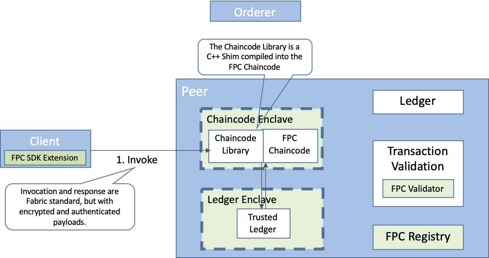
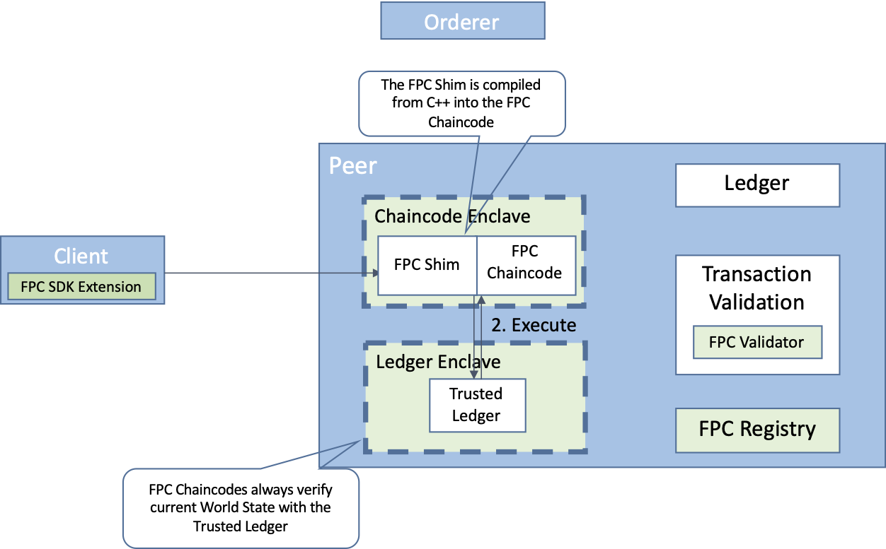
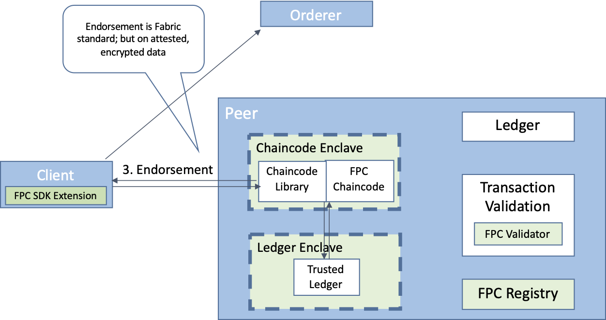
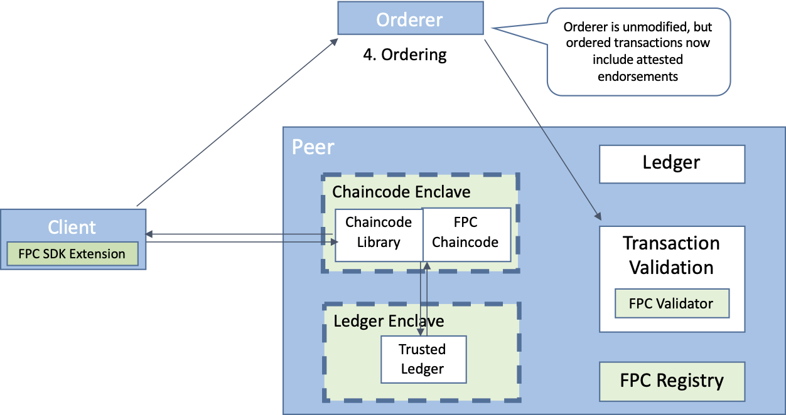
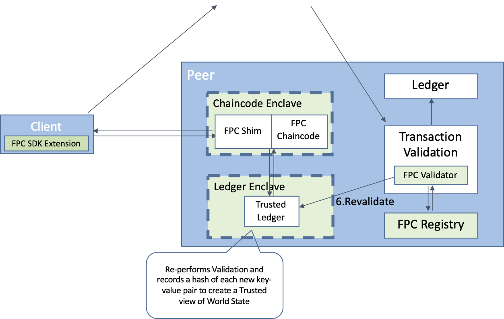
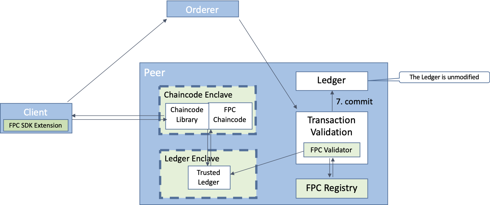

- Feature Name: Fabric Private Chaincode (FPC)
- Start Date: 2020-01-28)
- RFC PR: (leave this empty)
- Fabric Component: Core (fill me in with underlined fabric component, core, orderer/consensus and etc.)
- Fabric Issue: (leave this empty)

# Summary
[summary]: #summary

This RFC aims to introduce a new security feature for Hyperledger Fabric called Fabric Private Chaincode (FPC) that enhances data confidentiality for chaincodes by executing them in a Trusted Execution Environment (TEE). The first supported TEE platform is Intel SGX, which protects the confidentiality and the integrity of the chaincode execution.

FPC is a framework to develop and run chaincodes with strong privacy guarantees.
With FPC, a chaincode can process transaction arguments and state without revealing/exposing the contents to anybody, including the endorsing peers. That is, clients can encrypt the content of a transaction in a way only the FPC chaincode can decrypt and then process it. The resulting state updates are encrypted by default by the FPC chaincode with keys only known to the chaincode. 

As a result, other parties (both clients and peers) cannot examine the state of the transactions either in the chaincode or on the ledger. Hence, FPC helps to protects sensitive data even from compromised endorsing peers and other unauthorised parties.
FPC provides the capabilities to verify that a chaincode and the data are protected, that is, Fabric peers and clients can receive cryptographic assurance that the correct chaincode is being run without tampering inside the TEE by means of a hardware-based remote attestation. 

This new model of trust for Fabric smart contracts makes possible high-stakes markets such as private voting systems and sealed-bid auctions; which aren’t supported by the existing model of privacy in Fabric because of the requirement for endorsing peers to be fully trusted for confidentiality.

A prototype implementation of FPC is available as Hyperledger Lab on github (https://github.com/hyperledger-labs/fabric-private-chaincode).

# Motivation
[motivation]: #motivation

FPC is motivated by the many use cases in which it is desirable to embody an application in a Blockchain architecture, but where in addition to the existing Integrity assurances, the application also requires privacy. This may include private voting, sealed bid auctions, operations on sensitive data such as regulated medical or genomic data, and supply chain operations requiring contract secrecy. With Fabric's current privacy mechanisms, these use cases are not possible as they still require the endorsement nodes to be fully trusted.
For example, the concept of channels and Private Data allows to restrict chaincode data sharing only within a group of authorized participants, still when the chaincode processes the data it is exposed to the endorsing peer in clear. In the example of a voting system, where a government may run an endorsing peer it is clear that this is not ideal. 

A second motivation for FPC is its integrity model based on hardware-enabled remote cryptographic attestation; this model can provide similarly high confidence of integrity to the standard Fabric model of integrity through redundancy, but using less computation and communication. With TEE-based endorsement and remote attestation, a new set of endorsement policies are made possible, which can reduce the number of required endorsements and still provide sufficient assurance of integrity for many workloads.

FPC adds another line of defense around a chaincode. Over time and with continued development of support for other languages and Trusted Execution Environments, we intend FPC to become the standard way to execute many or even most chaincodes in Fabric, similar to what HTTPS has become for the Web.

# Guide-level explanation
[guide-level-explanation]: #guide-level-explanation

Fabric Private Chaincode is best thought of as a way of running smart contract chaincode inside a Trusted Execution Environment (TEE), for strong assurance of privacy and a more computation-efficient model of integrity. Programs executed in the TEE are held in encrypted memory even while running, and this memory can't be read in the clear even by a root user or privileged system process. Chaincode state is encrypted with keys only known to the chaincode. Each chaincode runs in its own TEE to provide the best possible isolation among chaincodes on an endorsing peer. Because the execution is opaque, a modified set of integrity controls is also implemented in order to be certain that what's running is exactly what is intended, without tampering. With FPC’s hardware-rooted cryptographic integrity mechanisms, it requires less redundancy of computation than in the standard model of Fabric to get a high level of trust. With FPC a chaincode can process sensitive data, such as cryptographic material, health-care data, financial data, and personal data; without revealing it to the endorsing peer on which it runs.

Overall, FPC can be considered an addition to Fabric wherein all chaincode computation relies only on the correctness of data provided by an authenticated Client or computed inside of and signed by a validated Trusted Execution Environment. It assumes that the Ordering Service is a trusted system element. The Endorsing Peer outside of the Trusted Execution Environment, however, is considered untrusted.

Writing chaincode for FPC should come natural to developers familiar with Fabric as the programming model (e.g., chaincode lifecycle, chaincode invocations and state) is the same as for normal Fabric chaincode.  The main differences are a (for now at least) different programming language (C++) and a shim API which, on the one hand, is somewhat simplified but, on the other hand, also contains FPC-specific extensions such as allowing for private as well as public ledger state as well as a secure (yet “replicable”) random-number generator. 
A link is provided below in the [FPC Shim](#fpc-shim) section to detailed documentation. 

In general, a developer can write chaincode largely without having to be aware that the code executes within a Trusted Execution Environment (TEE), often referred to as an Enclave. However, to understand the architecture and security underpinning it we introduce in the following several new concepts and terms. Except where noted otherwise, all elements of the architecture described below reside on a Fabric Peer.

Terminology:

* Attestation: An important cryptographic feature of Trusted Execution Environments by which the hardware can reliably state exactly what software it is running. This statement is signed by the hardware so that anyone reading it can verify that the statement came from an actual valid and up-to-date TEE. The Attestation can cover both the software portion of the TEE itself as well as any program to be run in it. This attestation takes the form of a "quote" containing (among other things) a measurement of the code and data in the TEE and its software version number, which is signed by the TEE and can be verified by anyone using well known Public Key Infrastructure technology. 

* Trusted Execution Environment (TEE): The isolated secure environment in which programs run in encrypted memory, unreadable even by privileged users or system processes. FPC chaincodes run in TEEs. 

* Enclave: The TEE technology used for the initial release of FPC will be Intel SGX.  In SGX terminology a TEE is called an _enclave_.  In this document and in general, the terms TEE and Enclave are considered interchangeable.  Intel SGX is the first TEE technology supported as, to date, it is the only TEE with mature support for remote attestation as required by the FPC integrity architecture.  However, our architecture is generic enough to also allow other implementations based on AMD SEV-SNP, ARM TrustZone, or other TEEs.

Note on Terminology: The current feature naming scheme includes several elements that originated in Intel SGX and therefore use the formerly proprietary term Enclave rather than TEE. Earlier versions of this RFP stated an aim to replace the term Enclave with TEE, but since then the two terms have come to be accepted as interchangeable. We therefore decided not to try to expunge the term, but to use it as the inductry has begun to do, to refer to various TEEs. The project team currently participates in the new Confidential Computing Consortium which aims to promote standards for deployment of workloads across TEEs/Enclaves, and we intend to align with their terminology as it evolves.

## Principal Components of FPC:

 

FPC Chaincode: A chaincode created by a developer to run in a Chaincode Enclave. Unlike regular Fabric chaincode, an FPC Chaincode must currently be written in C++ using our FPC SDK. A future goal for the project is to support additional languages, e.g., by the use of WebAssembly.

Chaincode Enclave: An enclave in which a single particular chaincode executes.  The Chaincode Enclave contains the chaincode (called an FPC Chaincode) to be executed, with its linked FPC Shim. The FPC runtime is responsible for creating the Chaincode Enclave when the FPC chaincode is installed on the endorsing peers.

FPC Shim (also known as the Chaincode Library): This is the externally exposed shim interface to an FPC Chaincode.  The FPC Shim is composed of two parts called "stubs", one residing inside the enclave (Referred to in our diagrams as "FPC_stub_enclave") and another one outside the enclave (Referred to as "FPC_stub"). The portion of the shim interface exposed to the FPC chaincode inside the enclave is written primarily in C++, whereas the external counterpart is written in Go and mainly responsible for communication between the Peer and the FPC chaincode. The FPC Shim enables an FPC Chaincode to talk to the Peer, in particular to invoke the chaincode and provide "normal" shim operations such as getState and putState. The FPC SDK provides the FPC Shim to enable FPC chaincode developers to easily link to this library when compiling their FPC Chaincode and building a deployment artifact. It implements the interface from the Peer to the FPC Chaincode, encrypts and decrypts state and arguments, and implements Attestation. 
A link is provided below in the [FPC Shim](#fpc-shim) section to detailed documentation.

Ledger Enclave: The Ledger Enclave is a crucial component to protect the execution of a FPC chaincode. In particular, it is responsible to ensure that a FPC chaincode processes committed world state data, i.e. only state data that comes from valid and committed transactions. The Ledger Enclave is also called the TLCC, Trusted Ledger Enclave or the Validation Enclave. The Ledger Enclave is a separate enclave which locally stores integrity metadata for validating information on the blockchain ledger. Like the Peer, it performs standard validation logic when a new block arrives, but it also creates and stores a cryptographic hash of each new key-value pair of the blockchain state. This makes it possible to verify that the data coming from the Peer is correct -- remember that in the FPC setting we do not necessarily trust a (single) peer. The Chaincode Enclave uses the Ledger Enclave as its tamperproof source of information on the blockchain world state. The Ledger Enclave and a Chaincode Enclave interact by through a secure channel that is initially established when the Chaincode Enclave is deployed. There is one Ledger Enclave per Channel on any given Peer. When a peer receives a new block from the ordering service, it forwards it to the Ledger Enclave. The Ledger Enclave is part of the FPC runtime.

FPC Registry: Also referred to as the ERCC (Enclave Registry Chaincode), this is a component which maintains a list of all Chaincode Enclaves deployed on the peers in a channel. The registry associates with each enclave their identity, associated public keys and an attestation linking them. Additionally, the registry manages chaincode specific keys, including a chaincode public encryption key, and facilitates corresponding key-management among authorized Chaincode Enclaves. Lastly, the registry also records information required to bootstrap the validation of attestation. All of this information is committed firmly on the ledger. This enables any Peer in the Channel (even those without SGX) to inspect the Attestation results before taking actions such as connecting to that chaincode or committing transactions produced by an FPC chaincode. Moreover, clients can query the registry to retrieve the chaincode public encryption keys of a particular FPC chaincode so they can send privately transaction proposals for endorsement.

FPC Validator: This validation complements the Peer validation logic by validating transactions produced by an FPC Chaincode. It does this by checking that each transaction has been cryptographically signed (endorsed) by a Chaincode Enclave that is listed in the FPC Registry and is authorized for that chaincode. 

FPC Client SDK extension: This extends the Fabric Client SDKs with extra functionality that allows users to write end-to-end secure FPC-based applications. 
In particular, the client SDK extension will provide these core functions: 1) FPC transaction proposal creation (including transparent encryption of arguments) 2) FPC transaction proposal response validation and decryption of the result.
The encryption and decryption is performed by the Client SDK "under the covers" without requiring any special action by the users, i.e.,
the users still use normal invoke/query functions to issue FPC transaction invocations.
For the MVP, we intend to support the peer CLI only. Extended support for the NodeSDK (or Go SDK) will be future work.

FPC SDK: The FPC SDK contains a set of tools to write and build chaincodes. In particular, the SDK contains a build-chain to link a chaincode against our FPC Shim and produce a deployment artifact that can be executed by the FPC runtime.

FPC Runtime: The FPC runtime comprises all components that are required to deploy and run an FPC chaincode.

## FPC chaincode deployment

The deployment of a FPC chaincode consists of multiple steps; it begins with the standard Fabric 2.0 Lifecycle mechanism to produce a chaincode definition that all participants agree upon. FPC requires adding some additional metadata to the chaincode definition, in particular a cryptographic hash (called the MRENCLAVE in the initial version of FPC) that identifies the code running inside the Chaincode Enclave. The FPC framework provides tools to generate this MRENCLAVE in a way that enables all parties to screen the code upfront and produce this hash. Note that this is crucial for the security provided by the TEE and is part of the attestation capabilities.

In order to support the endorsement model of Fabric, chaincode enclaves executing the same FPC chaincode need access to a set of shared secrets. In particular, these shared or common keys are used to encrypt and decrypt the transaction arguments and state. A key generation and distribution protocol will be part of the FPC deployment process. Note that our current prototype code base does not yet implement the key distribution protocol.  However, the protocol is described in detail and can be found in the FPC repository on github.

The Ledger Enclave stores all attestation reports, as signed by the TEE vendor. Reports include information on what chaincode is running; what specific TEE is in use, including version number and hash of the chaincode, and including the public keys of the enclave. With the planned new key management scheme to support multiple endorsing peers, there may be many public keys instead of one. Upon creation each chaincode enclave generates public/private key pairs for signing and for encryption. The public signing key also denotes the chaincode enclave identity. In the new scheme, there will also be a public/private key pair and a symmetric state encryption key per FPC chaincode that are shared among all chaincode enclaves that run the same FPC chaincode using the key distribution protocol above.

## FPC Transaction Flow

To illustrate how the FPC architecture works and how it ensures robust end-to-end trust, we describe the process of an FPC transaction. This assumes that all of the above described elements are already in place. Detailed explanations of that process are included below in the Reference-Level Explanation.

* Step 1: Client Invocation of the FPC Chaincode

	

	The Client prepares the Invocation of an FPC Chaincode by first encrypting the arguments of the Chaincode Invocation using the public key specific to a particular Chaincode. This encryption happens completely transparently using our FPC Client SDK extension. This Transaction Proposal is then sent to the Endorsing Peer where a corresponding Chaincode Enclave resides. Depending on the Endorsement Policy the client may perform this step with one or more Endorsing Peers and their respective Chaincode Enclaves. (For simplicity we will continue describing the process for a single Endorsing Peer.) The Peer forwards the Transaction Proposal to its FPC Chaincode running inside the Chaincode Enclave. Inside the Enclave, the FPC shim decrypts the Proposal and invokes the FPC Chaincode.

* Step 2: Chaincode Execution

	

	Having received and decrypted the Transaction Proposal, the FPC Chaincode processes the invocation according to the implemented chaincode logic. While executing, the chaincode can access the World State through getState and putState operations provided by the FPC Shim. The FPC Shim fetches the state data from the peer and loads it into the Chaincode Enclave; then the FPC Shim verifies that the received data is correct (e.g. is actual committed data) with the help of the Ledger Enclave. This protects the Chaincode from various attacks that might be possible in the case of a compromised Peer. (An example and explanation is included below.) We refer to our paper (see prior art section) for more details on this type of attack.

	When the particular chaincode function invoked finishes executing, the FPC Shim produces a cryptographic signature over the input arguments, the read-write set, and the result. This is conceptually similar to the endorsement signature produced by the endorsing peer but instead of being rooted in an organizational entity like the peer it is based on the hardware and code entity and rooted in the attestation. Note that for this reason the FPC Shim keeps track of the read/writeset during the invocation inside the Chaincode Enclave. Then the FPC Shim returns the result along with the signature back to the Peer. The Peer then uses the FPC signature as endorsement signature for the proposal response and sends it back to the Client.

* Step 3: Endorsement

	

	The Client receives the Proposal Response (and collects enough Proposal Responses from other endorsing peers to satisfy the chaincode’s Endorsement Policy). Moreover, the FPC Client SDK extension verifies that the proposal response signature has been produced by a "valid" Chaincode Enclave. If this verification step fails, there is no need for the client to proceed and the transaction invocation is aborted. Otherwise, the client continues and builds a transaction and submits it for ordering.

* Step 4: Ordering

	

	With FPC we follow the normal Ordering service. While the Orderer is unmodified in FPC, the ordered transactions broadcast to the Peers in the Channel for validation now include attested endorsements. Note that we encourage the use of a BFT-based ordering service as FPC requires the Ordering service to be trusted. 

* Step 5: Validation

	

	As the Peers in the Channel receive the block, they perform the standard Fabric validation process. In addition, a custom validation plugin in the Peer is responsible to verify FPC transactions. In particular, the FPC Validator queries its local FPC Registry to retrieve the enclave signature verification key and check that the signature was produced in an actual and correct Chaincode Enclave. This query retrieves the stored Attestation report associated with the Public Key of the Chaincode Enclave that produced and signed the transaction. The Attestation report is checked to verify the details of the Chaincode Enclave, affirming the validity of the Enclave. 

* Step 6: Trusted Ledger Revalidation

	

	In addition to the standard commitment process, the Peer also forwards all validated blocks to the Ledger Enclave in order to establish a full and current trusted view of the ledger. The same validation steps described above are repeated inside the Enclave, and then the transaction is committed to the trusted version of the Ledger inside this Enclave. This constitutes an update to the World State Integrity Metadata: for each Key Value Pair of World State, a second Key Value Pair is stored in the Trusted Ledger containing Integrity Metadata (a cryptographic hash value) along with channel-specific details needed to verify that the transaction was produced by a valid authorized participant in the channel.

* Step 7: Commitment

	

	If these validation processes succeed,the transaction is marked valid and is committed to the local ledger of the Peer. The Write Set is committed to the World State. This completes the transaction.

## Subsequent Query and Validation of World State Data by FPC Chaincodes

Subsequent to the transaction described above: When any FPC Chaincode accesses the World State, the FPC Shim is responsible not only for passing the query to the Peer but also querying the Ledger Enclave for the Integrity Metadata for the Key in question. It performs a cryptographic hash of the Key Value Pair of World State returned by the Peer and checks it against the Integrity Metadata from the Ledger Enclave for that key. If the hashes do not match, it detects an integrity violation.

## Encrypted Elements

Encrypted elements of the FPC architecture (over and above those in Fabric, such as TLS tunnels from Client to Peer) include:
- The Arguments in a proposal message
- The results of execution in a proposal response message returned to the Client
- All contents of memory in both the Chaincode Enclave(s) and the Ledger Enclave
- All FPC transaction read/writesets are written to the Ledger (by default).
Note that with the exception of the results, where also a legitimate requestor knows the secret keys, all secret/private keys are known only by to the enclaves or, for memory encryption, to the HW memory encryption engine (with the hardware also enforcing that only legitimate enclaves have access to the unencrypted memory).

## Requirements

- In the initial version of FPC, chaincode must be written in C/C++ using our FPC SDK. More language support is planned.
- FPC currently is installed on a Peer, and Endorsing Peers must use the FPC chaincode runtime. 
- FPC currently requires that the Endorsing Peers run on an Intel x86 machine with the SGX feature enabled. We plan to add support for other Trusted Execution Environments in future releases. 
- To simplify the development as much as possible and provide chaincode developers the same experience as with "traditional" chaincode development, FPC requires developers to use a chaincode SDK that abstracts the TEE specific implementation details as much as possible.
- FPC’s runtime relies on a external chaincode launcher, and its attestation infrastructure requires the installation of an FPC Registry chaincode in the channel
- FPC components running inside the enclave are implemented in C++; whereas components running outside are implemented in Go following Fabric programming standards/guidelines

## Fabric Features Not Yet Supported

In order to focus the development resources on the core components of FPC, the MVP excludes certain Fabric features, which will be added in the future.

- Multiple Implementations for a Single Chaincode -- a feature added in Fabric 2.0 -- is fundamentally incompatible for private chaincode like FPC where _all_ information flows have to be controlled: for FPC chaincodes to be considered equivalent they must be bit-for-bit identical in order to generate matching identities (i.e. MRENCLAVE)
- Arbitrary endorsement policies
- State-based endorsement
- Custom endorsement / validation plugins for FPC
- Chaincode-to-chaincode invocations (cc2cc)
- Private Collections

## Example FPC Chaincode

Example of Designing an Auction System using Fabric Private Chaincode

Even with the inherent integrity and privacy features in Fabric and FPC, chaincodes must be designed thoughtfully to defeat possible leaks of information through manipulation of a Peer. For example, we examine the use case of a simple auction, where one of the participants is running an FPC peer and wants to execute a rollback attack to expose the private bid information of another participant. For more details on this attack we also refer to our paper (see prior art section). For a more real-world application and comprehensive end-to-end code we refer to our Spectrum Auction Demo, see [Application Overview](https://github.com/hyperledger-labs/fabric-private-chaincode/tree/master/demo), the [Specification](https://docs.google.com/document/d/1YUF4mzzuybzWk3fbXbTANWO8-tr757BP85qcwE7gQdk/edit) and the [Chaincode](https://github.com/hyperledger-labs/fabric-private-chaincode/tree/master/demo/chaincode/fpc).

In our use case, the bad Peer leverages the fact that transactions are executed in chaincode before ordering, and changes to the world state are only committed to the blockchain afterward. In a naive implementation of the auction chaincode in a TEE, after bids have been submitted by other participants, a malicious Peer can roll back its own version of world state to a time when fewer bids were committed and perform an Evaluate transaction without submitting it to the Orderer. This could reveal private information about the earlier bids. In other words, the adversary may use the Chaincode Enclave as a decryption oracle. In order to thwart these rollback attacks, it is necessary to create a barrier in the form of a “close auction” (or equivalent) transaction which commits all bids to the world state, such that only after this commitment can an Evaluate transaction be executed. With FPC, the Evaluate transaction can check the barrier through the use of the Trusted Ledger Enclave; ensuring that the barrier is committed to the ledger and the auction has been closed before performing its evaluation logic.

# Reference-level explanation
[reference-level-explanation]: #reference-level-explanation

## FPC Validation

When the peer receives a transaction produced by an FPC chaincode, the FPC Validator fetches the corresponding validation data from the FPC Registry - specifically, the attestation for the Chaincode Enclave(s) that executed that transaction. It verifies that the attestation is correct by verifying a signature produced by the TEE vendor, and checks that the attestation contains the chaincode hash (MRENCLAVE) that is referenced in the chaincode definition. If this check succeeds, the public key attached to the attestation is used to verify the FPC endorsement signature. Using the FPC Validator, a peer can check that the read/writeset of a transaction was indeed produced by a proper FPC Chaincode.

Once the FPC Validator completes this initial check, it forwards the validated blocks to the Ledger Enclave, which repeats the validation algorithm inside the enclave to assure against an FPC Validator that has been tampered with. Only once this second validation successfully completes does it commit the transaction results to the Trusted Ledger.

In addition to the peer-side validation, clients must also be able to verify FPC transactions.
This process is similar to the validation step as described above; the FPC client SDK extension will implement this functionality and make this process thereby transparent to the users. A low level FPC client SDK API may also provide the functionality to the end user directly.

## Management API Changes

While the management API for Fabric is mostly unchanged, some modifications are needed for FPC to work. 
In particular, FPC extends the Fabric's lifecycle API with additional commands to create an FPC enclave and handle the key provisioning.
These are detailed separately in the [FPC Management API document](https://github.com/hyperledger-labs/fabric-private-chaincode/blob/master/docs/design/fabric-v2%2B/fpc-management.md)

## FPC Shim

For MVP, the FPC Shim comprises a subset of the standard Fabric Shim and is complemented in the future.
These details are documented separately in the Shim header file itself: **[ecc_enclave/enclave/shim.h](https://github.com/hyperledger-labs/fabric-private-chaincode/blob/master/ecc_enclave/enclave/shim.h)**
As described above, FPC follows the programming model used in the standard Fabric Go shim and offers a C++ based FPC Shim to FPC chaincode developers. 

## TEE platform support

Currently, our FPC Runtime and the SDK focuses on Intel SGX SDK. However, components such as the FPC Registry are already designed to support attestations by other TEE platforms as they mature and gain remote attestation capabilities. Also, other components such as the Go part of the FPC Shim don't have an Intel SGX depency and can easily be reused. We plan to explore other TEE platforms such as AMD SEV in the future.

## An Opportunity for richer Endorsement Policies

Using FPC enables a new way to write Endorsement Policies. In particular, it enables one to create policies which take into account that a chaincode is executed in a protected environment (i.e., TEE). Depending on the workload, this can reduce the number of required endorsements and still protect the integrity of the execution result.

Other intended future work includes new possible endorsement policies that can incorporate TEE policies across multiple TEE vendors. For instance, FPC developer could write endorsement policy to express the following: two SGX endorsements OR a single IBM Z endorsement; OR 2 AMD SEV endorsements OR 5 XXX TEE endorsements;

## Deployment Process (in detail)

This section details the turn-up process for all elements of FPC, including an explanation of the trust architecture.

* Step 1: Channel and Peers

	Initially it is assumed that a standard Fabric network is in place. A new Channel is created according to the existing standard process for Fabric. One or more Peers join the channel according to the standard process. Next, each endorsing peer initiates a Ledger Enclave for the Channel, imprinting itself with a content-addressable Channel Identifier and a hash of the Channel's Genesis Block contents. Note that FPC currently does not support cross-channel interaction; however, this can be addressed in future work.

* Step 2: Create the FPC Chaincode deployment artifact

	One or more of the participants compiles an agreed-upon chaincode using the FPC compiler configuration. This links in the FPC Shim, including its shim in the compiled package and creating a chaincode identifier called the MRENCLAVE. Details of this process will vary in future versions supporting other TEEs. Participants must be careful to use the same compiler configuration and version numbers of all included software. As long as they do, the MRENCLAVE will be the same for each compiled Chaincode Package.

* Step 3: Install and Approve an FPC Chaincode

	Administrators in each Org that will participate in the channel install the agreed-upon chaincode package on their FPC-enabled Peers following the standard Fabric 2.0 lifecycle process. They perform the installation of the chaincode tarball onto their Peers, receiving back a Package ID which includes a hash of the installed chaincode package. Each admin then sends a Chaincode Definition / Approve message containing the Package ID to the Orderer. This is an otherwise standard Chaincode Definition but is extended to include the MRENCLAVE identifier.

	At this point, the originating admin waits until enough Approvals have been sent to the Orderer to fulfil the Endorsement Policy, then sends Commit Proposals to the Peers, and receiving their endorsements according to the standard Fabric process, submits them back in a final Chaincode Definition (extended to include the MRENCLAVE Identifier) with all the necessary Endorsements to the Orderer. The Peers receive back the endorsements from the Orderer and when they see that the endorsement policy is met, it is considered fully validated.

* Step 4: Enclave Creation and Attestation Generation

	Once their Peer has a fully validated chaincode, the admin performs a Setup transaction to the Library Chaincode's Go wrapper and thereby creates an new Chaincode Enclave on the endorsing peer and loaded the chaincode. In particular, when creating the enclave, the wrapper also fetches the MRENCLAVE and Channel ID of the Ledger Enclave and passes them with the create command. 
	Now, having all necessary information, the new Enclave creates public and private signing and encryption key pairs and an FPC Chaincode ID which is a hash of the Public Signing Key. Moreover, the new Chaincode Enclave binds to the trusted Ledger Enclave using the information as received during its creation.

	Next, the new Enclave returns its newly created Public keys (both signing and encryption) to the FPC Chaincode, which signs them for its Org and returns the signature to the enclave, thereby taking ownership of the new Enclave for that Org. The Enclave now generates a quote and seals its state including all the names, versions, keys, and IDs just created. It returns the public keys and sealed state and quote to the Chaincode, which returns them to the FPC Shim's Go wrapper. This then stores the sealed state parameters in its local storage.

	Finally, the FPC Shim's Go wrapper sends the Quote to the Attestation Service online. This service verifies that it was signed by a valid TEE and returns the Attestation. This is, essentially, the TEE vendor’s signature on all the parameters of the TEE and the FPC Chaincode proving that that it is a legitimate TEE running a correct version of software and a particular chaincode. The wrapper marks the Chaincode ID as 'installed' and returns the Attestation and the Public Signing Key to the Admin.

* Step 5: Registering the Attestation

	The Admin now sends all the public parameters of the newly created Chaincode Enclave along with the Attestation to the FPC Registry, which validates them internally by checking consistency and signatures, and then stores the new entry and returns its endorsement. This step may be repeated with other Enclave Registries run by other Orgs participating in the Channel.

	Finally, having obtained sufficient Endorsements from the Enclave Registries, the Admin submits them in a Register transaction to the Ordering Service. The Peers receive back the endorsements from the Orderer and when they see that the endorsement policy is met, it is considered fully validated; the Attestation is now visible proof of validity of the FPC Chaincode to all participants in the Channel.

## Full Detail Diagrams

The full detailed operation of FPC is documented in a series of UML Sequence Diagrams. Specifically:

- The [fpc-lifecycle-v2.puml](../images/fpc-lifecycle-v2.puml) digram describes the normal lifecycle of a chaincode in FPC, focusing in particular on those elements that change in FPC vs. regular Fabric.
- The [fpc-registration.puml](../images/fpc-registration.puml) diagram describes how an FPC Chaincode Enclave is created on a Peer and registered in the FPC Registry, including the Remote Attestation process.
- The [fpc-key-dist.puml](../images/fpc-key-dist.puml) diagram describes the process by which chaincode-unique cryptographic keys are created and disributed among enclaves running identical chaincodes. Note that in the current version of FPC, key generation is performed, but the key distribution protocol has not yet been implemented.
- The [fpc-cc-invocation.puml](../images/fpc-cc-invocation.puml) diagram illustrates the invocation process at the beginning of the chaincode lifecycle in detail, focusing on the cryptographic operations between the Client and Peer leading up to submission of a transaction for Ordering.
- The [fpc-cc-execution.puml](../images/fpc-cc-execution.puml) diagram provides further detail of the execution phase of an FPC chaincode, focusing in particular on the getstate and putstate interactions with the Ledger and verification of state with the Ledger Enclave.
- The [fpc-validation.puml](../images/fpc-validation.puml) diagram describes the FPC-specific process of validation and revalidation using the Ledger Enclave.
- The [fpc-components.puml](../images/fpc-components.puml) diagram shows in detail the components for FPC and the points of interconnection between them.

## Explanation of Trust Architecture

As described in the Deployment Process and Transaction Lifecycle processes above, FPC is designed to provide an assurance of confidentiality and integrity even when the chaincode executes on a thoroughly compromised Peer. All elements of the Peer outside the Trusted Execution Environment are considered untrusted. All sensitive data and program operations are confined to the Chaincode Enclave, which provides confidentiality. All communication is secured by means of standard PKI cryptographic means, and private keys for both signing and encryption are confined to the TEEs with no means provided for them to be read out.

The Attestation enabled by hardware and verified by means of a privacy-preserving group signature scheme provides an assurance of Integrity: the code in the Enclave is the desired code and hasn't been tampered with. And finally, the Ledger Enclave makes it possible for FPC Chaincodes to access a trusted copy of the World State, thus foiling attempts to compromise privacy or integrity by feeding the Chaincode false information from outside the TEE. In the initial implementation, the Ledger Enclave also serves as the repository for certain security-critical metadata as described in the next section.

When clients connect to an FPC chaincode, they can gain an assurance that it is the correct chaincode and has not been tampered with by looking it up by its Public Key in the FPC Registry, where they can validate the measurement of and signature on that chaincode as registered by the TEE and signed by the TEE vendor as being correct and valid.

The Ordering Service is treated as a trusted element in FPC networks, but securing it is outside the scope of FPC. Likewise, FPC does not directly address problems of Clients attempting to manipulate the Chaincode's output by providing bad input; this must always be a matter of application-specific code discipline, and relying on the existing features native to Fabric which provide resilience and integrity through redundancy and distribution. Ultimately, FPC is complementary to these existing features of Fabric.

## Fabric Touchpoints

- Additional Metadata in the Channel and Chaincode Definitions: In order to insure agreement on security-critical data across all Orgs on a Channel, we recommend that FPC introduce new metadata into the Channel Definition: for example, the TEE vendor’s Certificates, and into the Chaincode Definition (possibly using the “version” field): for example, the MRENCLAVE chaincode enclave identifier. In the initial implementation these are Intel SGX-specific and hardcoded, recording these metadata in the Enclave Registry, but this makes runtime upgrades impossible. We hope to explore the possible use of Configtxgen and approveForMyOrg in future releases to address this issue.

- New Runtime Environment: In order to create a TEE-enabled runtime for FPC chaincode, the initial FPC implementation uses a Go wrapper around a C++ shim to enable interaction between the Peer and the Enclave, which didn’t support Go code when the project started. We also use a Peer CLI wrapper to hide Enclave-specific operations. This wrapper approach might not be ideal for compatibility with Fabric build and lifecycle management. As described above, we want to use the new External Launcher feature of Fabric 2.0 to address these issues, and hope to work out the details through the RFC process.

- Trusted Ledger Validation: In order to make a trusted "oracle" of information on the current world state, we’ve essentially had to replicate the Peer’s existing validation mechanism inside an Enclave, in C++ - an inefficient duplication of functionality that could lead to version synchronization problems. 
We hope to explore a path toward a modular validation mechanism that would eliminate this redundancy; possibly enabled by recent work on supporting Go inside the TEE.
Moreover, the Trusted Ledger is integrated using a system chaincode that
requires to recompile the Peer.  Integrating the Trusted Ledger as a
systemchaincode has several advantages, such as, the Peer ensures that there exists only a single instance of the Trusted Ledger; and a FPC chaincode can
access the Trusted Ledger using the chaincode interface.

- Attestation-Based Endorsements: In order to integrate cryptographic Attestation of the TEE with Fabric endorsements, we created custom endorsement and validation plugins and include the enclave signature as part of the response payload. This added payload and the need for every Peer to run a custom validation plugin seem undesirable in the long term. Our current plan is to create a custom Membership Service Provider to replace the original mechanism. The new TEE MSP type would treat TEEs as members of an Org, replacing the Peer’s endorsing signature with a TEE Signature. We believe this approach would be more elegant and flexible, and would lay the ground for easier enablement of new TEE types.

- Go plugins for FPC Validation: In order to verify FPC transaction signatures, additional checks during transaction validation are needed. 
In particular, for a FPC transaction, the validation has to check that the signature verification key belongs to a registered FPC enclave.
Fortunately, Fabric provides support for custom validation plugins that allow to implement the FPC validation without changing and recompiling the Peer.  
We understand that Go plugins may not be viable long-term; if they were no longer to be supported, we would need to use another transaction point to inject the FPC validation code into the peer.
If recompiling the Peer is acceptable, this would be an alternative to go plugins.

The FPC team welcomes the community’s advice on how each of these touch-points to Fabric should be handled going forward, and hope to solidify our plans for each element through the RFC process.

## Roadmap Features

- WebAssembly Chaincode: A primary goal for FPC moving forward is to support WebAssembly chaincode, and by extension all languages that compile to WASM.
There has already been extensive development of a high-performance open source WASM Interpreter / Compiler for Intel SGX Enclaves in the Private Data Objects project, and our current plan is to adopt that capability in the next major phase of FPC.
FPC's modular architecture has been designed from the beginning to enable this drop-in capability.

- Other TEEs: The FPC team is also participating in early discussions in the Confidential Computing Consortium, which aims to provide a standardized way of deploying WASM across multiple TEE technologies.
We hope to leverage this work when extending FPC to support these other TEEs.

- Endorsing Policies: The current version supports only a single designated FPC Endorsing Peer; it is our intention to support multiple FPC Endorsing Peers in the upcoming MVP release.
In future releases this would enable rich Endorsement Policies as described above.

- Risk Management and Deployment Policies: We intend to support deployment policies which allow the users to define where a FPC chaincode is allowed to be deployed.  For instance, the user could define that a certain FPC chaincode can only executed by an endorsing peer on a on-premise node of a certain organization.  This allows enhanced risk management.

- Private Data Collections: We have not tested the combination of FPC with Private Collections in Fabric 2.0, but intend to support this combination of features in a future release.

- Chaincode2Chaincode Invocations: The initial version of FPC does not support
to call other chaincodes from a FPC chaincode; as this is a useful feature often used by chaincode applications, we intend to support this functionality in a future release.

- Multiple FPC Channels: The current version only supports a single FPC Channel; it is our intention to support arbitrary numbers of Channels of both FPC and regular Fabric in future releases.

# Drawbacks
[drawbacks]: #drawbacks

Why should we *not* do this? Are there any risks that must be considered along with this rfc.

This isn't a reason *not* to do this, but a statement that security risks will still exist even with FPC. No hardware TEE is considered perfectly safe by itself. Exotic side-channel attacks have been demonstrated in research settings to cause TEEs to leak information. No single security measure is sufficient alone, and all architectures should still keep this design principle in mind even when using a TEE. FPC makes it vastly more difficult to examine the contents of a chaincode as it executes, and perhaps impossible to compromise its integrity if used correctly - for example by using a robust endorsement policy to leverage the existing resilience through redundancy in Fabric.  Simply using FPC may suffice for most sensitive workloads. However, for the most sensitive workloads, additional design guidelines should be followed to minimize the risk of exposure to very sophisticated attacks.

# Rationale and Alternatives
[alternatives]: #alternatives

Considering that the key goal of FPC is to provide a way to execute smart contracts privately with assured integrity, there are some possible alternate approaches:

- Choose AMD SEV or some other TEE as the initial hardware platform. IBM already has Intel SGX TEE-enabled machines on their Cloud, and the effort can leverage considerable work already done under the Private Data Objects project. Perhaps more importantly, the FPC architecture requires cryptographic remote attestation, and this feature is not yet supported in other TEEs. We have designed its modular architecture to be extended to support AMD SEV and other TEEs as they mature and gain remote attestation features.
- Use Secure Multi Party Computation, Fully Homomorphic Encryption, or other pure software-based cryptographic solution. This is also a viable solution though limited to very small chaincodes because of the extremely high computational overhead. Also, compilers for these environments are generally not yet considered mature enough for general use, and there is a high learning curve imposed on programmers that use these technologies.
- Run the entire Peer inside a TEE. This is seen as philosophically undesirable because of the importance of minimizing the Trusted Code Base. The less complex the core security elements of the system are, the better.
- Run only the chaincode itself in the TEE - leave off the extra complexity of the Ledger Enclave. This would simplify the design too much, because the Ledger Enclave is necessary to make certain a compromised Peer can't subvert a chaincode by misrepresenting the current World State. Methods such as a rollback attack could fool a chaincode into revealing sensitive data under certain circumstances without this element.

# Prior art
[prior-art]: #prior-art

The initial architecture of FPC is based on the work in the paper:

* Marcus Brandenburger, Christian Cachin, Rüdiger Kapitza, Alessandro
Sorniotti: Blockchain and Trusted Computing: Problems, Pitfalls, and a
Solution for Hyperledger Fabric. https://arxiv.org/abs/1805.08541

From a Hyperledger Perspective, FPC is closely related to Private Data Objects (PDO) (https://github.com/hyperledger-labs/private-data-objects) and Avalon (https://github.com/hyperledger/avalon).
FPC is for Fabric what PDO is for Sawtooth: TEE-based smart contracts which extend the respective ledger technology with strong confidentiality in addition to the pre-existing strong integrity. Note that the PDO team is also involved in the design and development of FPC.
Avalon on the other hand focuses on efficient off-chain confidential and (initially) state-less computation, e.g., it does not give any guarantee of rollback-resilient encrypted state or alike. 

Moreover, Corda (https://docs.corda.net/design/sgx-integration/design.html) proposes the use of Intel SGX to protect privacy and intgrity of smart-contracts. There 

# Development and Testing
[testing]: #testing

FPC relies on the presence of Trusted Execution Environment (TEE) hardware which is not available to all developers; in the initial releases the TEE is Intel SGX, which is not available on Mac, for example. Therefore, FPC provides a Docker-based development environment containing a preconfigured SGX TEE Simulator in a Linux container. This environment can also be used in hardware mode if the underlying platform includes SGX support. 

The containerized development environment includes all dependencies needed for a new developer to start the container and immediately begin working on their first FPC Chaincode; this includes in particular the Intel SGX SDK and a Fabric installation for testing. This development environment is also used for Continuous Integration (CI) testing of the current FPC version on Github.

The FPC team’s current practices include both unit and integration testing, using Docker to automate and Travis for CI/CD. With the Auction Demo scenario, we also include a representative example which illustrates end-to-end how to design, build and deploy a secure FPC application across the complete lifecycle.  In addition, this demo serves as an additional comprehensive integration test for our CI/CD pipeline. Once FPC becomes maintained as an official Fabric project, we will explore publishing our (existing) FPC-specific docker images in a registry.

# Dependencies
[dependencies]: #dependencies

FPC has no dependency on any Jiras or other RFCs, and no other RFCs are dependent on FPC.

# Unresolved questions
[unresolved]: #unresolved-questions

The primary unresolved questions in FPC relate to the “Fabric Touchpoints” and are detailed in that section of the Reference Level Explanation, above. To recount briefly:

- The FPC POC is currently dependent on system chaincodes as well as user chaincode to system chaincode calls; as these have gone away, we would likely need certain components in the peer proper which allow interaction with the external builders as well as additional management logic regarding FPC metadata. How to best do that has yet to be resolved.

- FPC requires to store security-critical metadata (e.g., MRENCLAVE and TEE provider information) in the channel and chaincode definition. What is the best way to add this custom data to a genesis block?

- Is there a way to modularize the Validation logic to run in both the standard peer and the Ledger Enclave to remove redundancy?

- A custom MSP is one way to replace the custom validation and endorsement plugins in the current implementation. However, from previous discussion we learned that custom MSPs are sometimes cumbersome. Is there a better way?

- With removing go-plugin support, FPC integration requires to be compiled with a peer. Is there a better alternative?  
