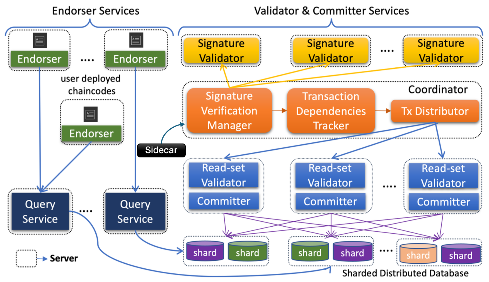
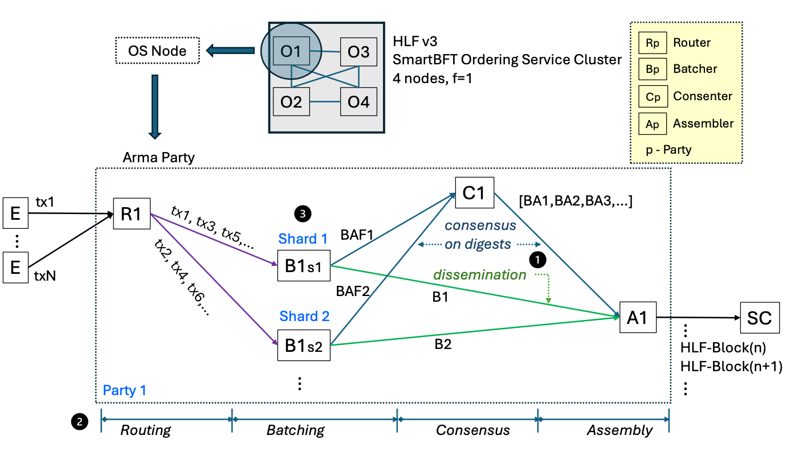
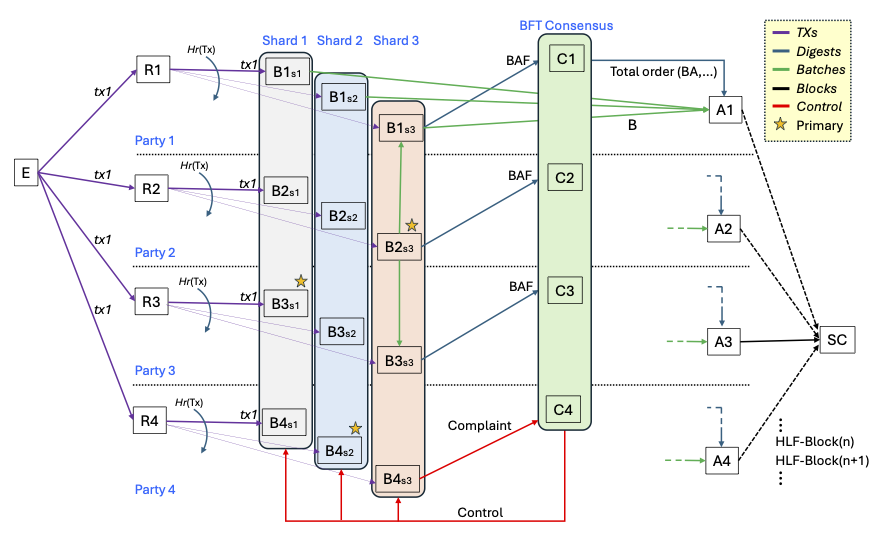

- Feature Name: Fabric-X -- Next generation Fabric
- Start Date: 2025-05-14
- RFC PR: (leave this empty)
- Fabric Component: <u>peer (decomposed)</u>, <u>orderer (decomposed)</u>
- Fabric Issue: (leave this empty)

# Summary
[summary]: #summary

This RFC proposes "Fabric-X," a fundamental re-architecture of Hyperledger Fabric designed to achieve significant performance gains, targeting over 100,000 transactions per second (TPS). Fabric-X adheres to Hyperledger Fabric's established **execute-order-validate** transaction flow paradigm. The primary innovations lie in the architectural changes to implement this flow via a highly distributed and scalable microservice-based system. This is a strategic evolution in response to the limitations of the current Hyperledger Fabric (HLF), which, with a throughput of around 2,000 TPS, falls short for demanding use cases in financial services such as Central Bank Digital Currency (CBDC) systems, managing digital assets, etc.

Fabric-X introduces a microservice-based peer and orderer architecture, a sharded distributed database per organization, threshold-based signatures for reduced transaction overhead (alongside traditional endorsement policies with pre-stored identities), an enhanced programming model centered around 'Flows' using tools like the Fabric Smart Client (FSC), parallel transaction validation with a dependency graph, and a highly scalable BFT ordering service named Arma.

To avoid breaking backward compatibility with existing Fabric deployments, to allow for focused development on these new paradigms, and to accommodate substantial changes like a flattened transaction structure, Fabric-X will be developed in separate repositories (e.g., `fabric-x-endorser`, `fabric-x-orderer`, `fabric-x-committer`, `fabric-x-common`) under the Hyperledger Fabric project umbrella. This RFC asserts that such an approach aligns with Fabric's guidelines for proposing significant architectural and backward-incompatible changes. Fabric-X will initially focus on core performance and will not support all features of the original Fabric (e.g., Private Data Collections (PDC), Channels), with a plan to incorporate essential features in future iterations.

# Motivation
[motivation]: #motivation

The primary motivation for Fabric-X is the critical need for significantly higher transaction throughput and scalability in Hyperledger Fabric to support emerging large-scale applications in digital assets and next-generation use cases like CBDCs. The current monolithic architecture of HLF, while robust for many scenarios, faces several limitations when pushed to extreme performance demands:
1. **CPU Resource Contention:** Peers act as both endorsers and validators/committers on a single node, leading to CPU contention.
2. **Exclusive Ledger Access:** Endorsers and committers compete for exclusive access to the ledger state due to limited concurrency control in the state database.
3. **Disk Write Bandwidth Constraint:** Committer performance is bottlenecked by single-node disk write bandwidth and storage capacity.
4. **Large Transaction Size:** Transactions with multiple signatures and X.509 certificates create network and storage overhead, impacting ordering service performance and increasing storage consumption.
5. **Endorsement Policy Verification Overhead:** Verifying multiple signatures against complex policies is computationally intensive.
6. **Non-pipelined and Sequential Execution:** Sequential execution of all the phases (verification, validation, and commit), limits resource utilization and increases latency.
7. **Low Consensus Throughput:** Traditional BFT protocols and leader-based consensus in HLF have inherent throughput limitations.
8. **Inflexible Programming Model:** The traditional chaincode model can be restrictive for complex orchestrations, querying external systems, or allowing diverse logic among endorsers for regulatory purposes.

Previous research and incremental optimizations (e.g., FastFabric, transactional perspectives) have provided valuable insights but have not achieved the order-of-magnitude performance leap (>20,000 TPS, let alone >100,000 TPS) required for these new domains. This necessitates a more fundamental architectural redesign. Fabric-X aims to systematically address these performance bottlenecks.

A core consideration is **backward compatibility and ecosystem evolution**. The proposed changes, such as splitting the `peer` binary into microservices (endorser, sidecar, coordinator, signature-verifier, vcservice, query-service) and the `orderer` binary into (router, batcher, consenter, assembler), along with a shift from a nested to a flat transaction structure and an evolved programming model (e.g., Flows with FSC), are substantial. Implementing these directly in the existing Fabric repository would introduce significant breaking changes, disrupting current deployments and operational scripts. Therefore, Fabric-X will be developed in new, dedicated repositories. This strategy allows for focused innovation and prevents destabilization of the existing Fabric ecosystem, which serves numerous production deployments. This approach is presented as an evolution, enabling Fabric to address future demands while preserving the stability of current versions. The long-term vision may include pathways for users to transition or integrate, such as leveraging snapshot features to import state into Fabric-X from Fabric, once Fabric-X reaches sufficient feature parity and stability.

Hyperledger Fabric has been a cornerstone of enterprise DLT. However, in recent years, its core development has focused more on maintenance and incremental optimizations. To ensure Fabric's continued leadership and relevance, especially for next-generation, high-throughput digital asset platforms, a significant evolutionary step like Fabric-X is crucial. This initiative is driven by individuals with deep, long-standing experience with Fabric, aiming to empower the ecosystem for these future demands.

# Foundational Alignment with Hyperledger Fabric
[foundational-alignment]: #foundational-alignment

Despite the significant architectural re-design aimed at performance, Fabric-X intentionally preserves and builds upon the substantial foundational elements and core principles of Hyperledger Fabric. This underpins the proposal of Fabric-X as an evolution within the Fabric ecosystem, rather than a completely new and unrelated project. The key areas of conceptual and code reuse include:

1.  **Execute-Order-Validate Model:** This core transaction lifecycle, a defining characteristic of Hyperledger Fabric, is the fundamental architectural pattern adopted and implemented by Fabric-X.
2.  **Configuration Management:** Fabric-X utilizes the **same configuration block format** as Hyperledger Fabric. Tools like `configtxgen` (or an equivalent adapted for Fabric-X) will be used for generating genesis configurations. Extensions to the config block will include:
    * Additional fields for the new Arma ordering service.
    * Enhanced MSP configurations to include additional TLS certificates for the various microservices composing the peer and orderer.
    * A "known-identities" feature within the MSP folder, allowing pre-registration of identities to reduce transaction size by obviating the need to send full certificates with every signature.
3.  **Identity Management (MSP):** Fabric-X leverages the **very same Membership Service Provider (MSP) framework**. This is fundamental to Fabric's identity management, permissioning model, and certificate handling.
4.  **Policy Framework:** The proposal retains Fabric's existing **endorsement model and relies on the Fabric policy Domain Specific Language (DSL) and its associated code**. This ensures that the crucial aspects of transaction validation, policy definition (e.g., for namespaces), and Access Control Lists (ACLs) remain consistent.
5.  **Data Model:** Fabric-X uses the **identical Key-Value-Version data model** that is central to Fabric's ledger state representation. This includes support for both binary and JSON values, ensuring conceptual continuity for application data. While the underlying persistence layer is a distributed database for performance and scalability, the data model presented to applications and used for validation remains the same.
6.  **Read-Write Set & MVCC:** The concept of **read-write sets** for transactions and the use of **Multi-Version Concurrency Control (MVCC)** for validation are core to Fabric-X, mirroring current Fabric's approach to concurrency control and state validation.

**Evolution of Application Development and Features:**

* **Programming Model (Flows vs. Chaincode):** The most significant shift in the application development paradigm is the adoption of 'Flows', typically developed using tools like the Fabric Smart Client (FSC), instead of traditional chaincode (shim interface). This is a deliberate evolutionary step designed to offer enhanced developer productivity, enable more sophisticated off-chain and on-chain orchestrations, and better align with modern distributed application architectures.
* **Future Support for Chaincode:** If there is a strong community need and preference for utilizing existing chaincode, Fabric-X could, in a future iteration, incorporate support for traditional chaincode execution. This could potentially be achieved by leveraging Fabric's "chaincode as a service" (CCaaS) builder to support remote chaincodes, allowing them to interact with the Fabric-X endorser services.
* **Private Data Collections (PDC) and Channels:** Given that each Fabric-X endorser service can have a local database, a version of Private Data Collections could be implemented leveraging this local storage for private data, with hashes committed to the main ledger. Currently, Fabric-X operates with a single logical ledger (conceptually a single channel) to maximize performance for its initial target use cases. However, supporting multiple channels or equivalent data partitioning mechanisms is architecturally feasible.
* **Roadmap for Advanced Features:** The introduction of support for traditional chaincode, refined PDCs, and multiple channels would be subject to separate, future RFCs once the new governance model for coexisting Fabric implementations is established and the core Fabric-X platform has stabilized.

This substantial retention and consistent application of Fabric's core identity management, trust model, transaction processing architecture, data model, and validation mechanisms firmly position Fabric-X as a significant evolution of Hyperledger Fabric, building upon its proven strengths to achieve necessary advancements for next-generation DLT applications.

# Guide-level explanation
[guide-level-explanation]: #guide-level-explanation

Fabric-X represents a paradigm shift in how Fabric's **execute-order-validate** protocol is implemented, moving from a monolithic structure to a collection of specialized, independently scalable microservices. **We** have an implementation of Fabric-X that has demonstrated over 150,000 TPS **in benchmark scenarios (details in "Testing" section).** While the core transaction flow remains familiar (transactions are first executed by endorsers, then ordered, then validated and committed), the underlying architecture that facilitates this flow is significantly different, enabling higher performance. For a Fabric developer, this means understanding a more distributed system and an evolved programming model.

**Key Concepts:**

* **Decomposed Peer:** Instead of a single `peer` process, you'll interact with distinct services that collectively handle the `execute` and `validate` phase:
    * **Endorser Service:** Solely focuses on the `execute` phase of transaction proposals.
    * **Sidecar Service:** Acts as a dedicated communication bridge. It sits between the ordering service (Arma) and the Coordinator Service. Its responsibilities include fetching blocks from Arma, forwarding them to the Coordinator, managing the local block store (append-only 64MB file chunks, similar to Fabric's but with reduced size due to no embedded certificates), receiving consolidated transaction statuses from the Coordinator, and notifying registered clients about transaction events.
    * **Coordinator Service:** Orchestrates the validation and commit phases. It receives blocks from the Sidecar, builds the dependency graph, and dispatches transactions to Signature Verifiers and then to Validator-Committer services. It stores some metadata in the distributed database.
    * **Signature Verifier Service:** Dedicated to verifying endorsement signatures against policies.
    * **Validator-Committer (VC) Service:** Responsible for ledger state validation (read-set validation) and committing valid transactions to the distributed database. This service significantly utilizes the database.
    * **Query Service:** Handles read-only ledger queries efficiently, also significantly utilizing the database.
* **Decomposed Orderer (Arma):** The "order" phase is managed by Arma, a microservice-based ordering service:
    * **Router:** Validates incoming transactions and routes them to appropriate shards.
    * **Batcher:** Bundles transactions into batches within shards.
    * **Consenter:** Participates in the BFT consensus protocol on batch digests.
    * **Assembler:** Reconstructs full blocks from ordered batch digests and batches.
* **Sharded Distributed Database per Organization:** The ledger state for each organization is managed by its own instance of a sharded, strongly consistent distributed database (e.g., YugabyteDB, CockroachDB, TiDB). Sharding here refers to data sharding *within* that organization's database instance (handled by the database itself for scalability and rebalancing), not blockchain-level sharding of the network. This allows for greater concurrency and overcomes single-node storage/IO limitations. Developers interact with it via the Key-Value-Version data model, conceptually similar to Fabric.
* **Enhanced Programming Model (Flows with Fabric Smart Client - FSC):** Fabric-X proposes an evolution from the traditional chaincode (shim interface) model. Application developers will primarily build 'Flows' using tools like the Fabric Smart Client (FSC). This allows for more flexible and powerful off-chain and on-chain orchestrations, easier integration with external systems, and aligns with modern distributed application architectures, while still leveraging Fabric's endorsement policies for security. The endorser service can be integrated directly into applications via an endorser SDK.
* **Threshold Signatures & Traditional Policies with Pre-stored Identities:** Fabric-X will support threshold signatures for compact, efficient validation. Additionally, traditional endorsement policies will be supported, with an optimization to pre-store identities (e.g., X.509 certificate details) in a configuration block (e.g., via the "known identities" feature in the MSP folder), allowing transactions to reference these identities rather than including full certificates with each signature, thus reducing transaction size.
* **Dependency Analysis Enables Parallel Verification and Validation:** The Coordinator constructs a dependency graph for transactions. This allows transactions without conflicts to be verified and validated in parallel by multiple signature-verifier and VC instances, significantly speeding up the commit phase. This early conflict detection and pruning (before full MVCC against the database) is key to maintaining high goodput even with conflicting transactions.
* **Flattened Transaction Structure:** To reduce processing overhead associated with serialization/deserialization of deeply nested structures, Fabric-X adopts a flatter transaction model (see "Reference-level explanation" for details).
* **Sequential Versioning:** Fabric-X adopts sequential versioning of key/values. This allows endorsers to predict the next version without querying the database, potentially speeding up endorsement.

**Impact on Fabric Users:**

* **Deployment:** Deployment scripts and tools will need to be adapted for a microservice environment (e.g., using Kubernetes or similar orchestration platforms). Each organization will deploy its set of microservices and its own distributed database instance. The minimum number of logical components per organization is ten (1 endorser, router, batcher, consenter, assembler, sidecar, coordinator, signature/policy verifier, validator-committer, and a single database node cluster), though these can be co-hosted for smaller setups. For BFT consensus in Arma, a minimum of 4 Consenter nodes (to tolerate F=1 faulty node) distributed across participating organizations is required.
* **Configuration:** Configuration will be more granular, specific to each microservice. The genesis configuration will use the same config block format and `configtxgen` (or equivalent), with additional fields for the new ordering services. MSP, ACLs, and Policies remain conceptually the same.
* **Debugging:** Troubleshooting will involve analyzing logs and interactions across multiple services.
* **Performance:** Expect significantly higher throughput (demonstrated >150,000 TPS) and lower latency.
* **Feature Set:** Be aware that Fabric-X will not initially support all HLF v2.x/v3.x features (e.g., Private Data Collections, Channels). The focus is on core transactional performance. A roadmap for reintroducing essential Fabric features will be developed post-initial release.
* **Security:** While individual components are more isolated, the overall security of the distributed system, including inter-service communication, must be carefully managed. The compromise of a Query Service node does not inherently allow it to substitute data in the sharded distributed database if the database itself maintains strong consistency and write integrity is handled by the VCs; the Query Service primarily performs reads. Writes to the database are governed by the VCs after successful validation.
* **Programming Model Shift:** Developers will transition from chaincode to 'Flows' using FSC or an endorser SDK. This requires learning but offers more power and flexibility.

**Migration and Coexistence Strategy**

A significant point of discussion is how Fabric-X relates to existing Hyperledger Fabric deployments and the path forward for users. Fabric-X is designed as a new, high-performance implementation within the Fabric ecosystem, not as a direct, drop-in replacement for all existing Fabric networks.

* **No Direct Automated Migration (Initial Version):** Due to the fundamental architectural differences (microservices, distributed database per org, evolved programming model, absence of initial channel support), there is no direct, automated migration path from an existing Fabric network to Fabric-X in its initial version. Applications and network configurations would require re-architecture.
* **Addressing Future Migration Needs:** Should the community express a strong preference and a clear need emerge for migrating specific existing Fabric use cases to Fabric-X (particularly those hitting performance ceilings), a migration path could be developed in future iterations.
    * **Manual and Tool-Assisted Process:** Such a migration would not be fully automatic. It would likely involve a carefully planned process.
    * **State Snapshotting:** We would leverage state snapshotting features from existing Fabric ledgers to extract and transform data for import into Fabric-X's distributed database structure. This would be a complex data engineering task.
    * **Application Rework:** Smart contracts (chaincode) would need to be re-implemented or adapted to the Fabric-X programming model (e.g., as 'Flows' using FSC).
* **Potential for Easing Transition (Future Iterations):**
    * **Traditional Chaincode Support:** To lower the barrier for existing applications, future iterations of Fabric-X could explore providing a compatibility layer or environment within the endorser services to support the execution of traditional Fabric chaincode (shim interface). This could potentially be achieved by leveraging Fabric's "chaincode as a service" (CCaaS) builder to support remote chaincodes.
    * **Alternative PDC Implementation:** An alternative implementation of Private Data Collections (PDCs) could be introduced, potentially leveraging the endorser's local database in conjunction with the main ledger for hash commitments, tailored to Fabric-X's architecture.
    * **Multiple Channel Support:** While the current Fabric-X implementation operates on a single-channel concept (or a global namespace) for simplicity and to maximize performance in its target use cases (like CBDCs which often imply a single logical ledger), supporting multiple channels or equivalent data partitioning mechanisms is architecturally feasible and could be incorporated if required.
    * The introduction of support for traditional chaincode, refined PDCs, and multiple channels would be subject to separate, future RFCs once the new governance model for coexisting Fabric implementations is established and the core Fabric-X platform has stabilized.
* **Coexistence and Targeted Adoption:**
    * It is crucial to understand that **migration to Fabric-X is not intended or necessary for all existing Fabric networks.** Fabric (Classic) is a mature, stable platform that effectively serves a vast number of production use cases.
    * Fabric-X is primarily aimed at **new, demanding use cases** that require performance levels significantly beyond what current Fabric can offer (e.g., CBDCs, high-frequency digital asset exchanges).
    * Organizations should only consider Fabric-X if their performance requirements genuinely necessitate it. Otherwise, they would face the **unnecessary operational complexity** of a distributed microservice deployment and a potentially involved migration process without fully benefiting from its core advantage—extreme performance. Most existing Fabric use cases are well-served by its current performance capabilities.
    * The vision is for Fabric and Fabric-X to **coexist within the broader Hyperledger Fabric ecosystem**, each serving different segments and requirements. Fabric-X expands the ecosystem's capabilities, rather than seeking to universally replace the established Fabric implementation.

The primary aim of Fabric-X is to enable new, high-performance use cases and ensure the Fabric ecosystem remains at the forefront of innovation for next-generation DLT applications.

# Reference-level explanation
[reference-level-explanation]: #reference-level-explanation

This section details the technical design of Fabric-X. Fabric-X implements the execute-order-validate flow using the following microservice architecture.

## 1. Microservice Architecture and Distributed Database (Peer-Side)

The monolithic Fabric Peer is decomposed into the independently scalable microservices as shown in the below figure.

* **Endorser Service:** Receives transaction proposals from clients. It executes the specified application endorsement logic (e.g., as part of a 'Flow' implemented with FSC or using an endorser SDK) against a snapshot read from the organization's sharded distributed database through a query service and generates a read-write set along with its signature. Multiple instances can be deployed to scale the endorsement capacity. Each organization's endorser will also maintain a local database for application-specific needs (e.g., managing off-chain state for Flows, or sensitive data not intended for the main ledger).
* **Query Service:** Dedicated to handling read-only ledger queries submitted by clients. It leverages snapshot reads from the organization's distributed database for efficient data retrieval without impacting transactional workload.
* **Sidecar Service:** This service acts as an intermediary and manager for block handling and eventing. Its key functions are:
    * **Block Ingestion:** Connects to the ordering service (Arma) to pull newly ordered blocks.
    * **Block Forwarding:** Forwards received blocks to the Coordinator Service for processing.
    * **Status Aggregation & Block Storage:** Receives final transaction statuses for blocks from the Coordinator. Once all transactions in a block are processed (committed or invalidated), the Sidecar writes the complete block to the persistent block store. This block store uses append-only 64MB file chunks (code reused from Fabric). Storage requirements are significantly lower than traditional Fabric due to the elimination of embedded certificates in transactions (identities are pre-stored). Should the need arise for even greater scalability, a distributed file system or key-value store could be used for the block store.
    * **Event Notification:** Manages and sends transaction commitment events to clients registered for notifications.
* **Coordinator Service:** The central orchestration point for the verification, validation, and commit phases on the peer-side. It:
    * Receives blocks from the Sidecar Service.
    * Constructs the transaction dependency graph for transactions within and across blocks (see Section 4).
    * Dispatches transactions (dependency-free ones first) to available Signature Verifier Services for endorsement policy verification.
    * Receives policy-verified transactions from Signature Verifiers and dispatches them to available Validator-Committer (VC) Services for read-set validation and ledger commit to the organization's distributed database.
    * Collects transaction statuses (valid/invalid) from VC Services and forwards statuses to the Sidecar Service.
    * Stores some operational metadata in the distributed database.
* **Signature Verifier Service:** Responsible for verifying that the endorsements on a transaction satisfy the specified endorsement policy (either traditional or threshold-based). This service can be scaled horizontally.
* **Validator-Committer (VC) Service:**
    * Performs read-set validation for each transaction against the current state in the organization's sharded distributed database, using Multi-Version Concurrency Control (MVCC) to ensure serializability.
    * For valid transactions, applies the write-set to the distributed ledger.
    * Records their status (valid/invalid) appropriately.
    * **Distributed Database Details:** Each organization deploys and manages its own instance of a sharded, strongly consistent distributed database (e.g., YugabyteDB, CockroachDB, TiDB). The choice of database is flexible, provided it supports strong consistency (e.g., Snapshot Isolation), MVCC, and can scale horizontally. The database itself handles internal data sharding, rebalancing, and scaling (often automatically or semi-automatically by adding more database nodes). Fabric-X interacts with this database preserving the Key-Value-Version data model. The database must ensure immutability of committed state versions, typically through its own internal mechanisms (e.g., YugabyteDB uses a DocDB layer built on RocksDB with Raft for consistency).
* **Storage Scaling for Persistent Components:**
    * **Distributed Database:** Scales by adding nodes to the database cluster, a feature handled by the database system itself.
    * **Block Store (Sidecar):** As an append-only file-based store, it scales with disk space. For very large scale, a distributed file system or key-value store is a planned enhancement.
    * **Endorser Local Database:** Scaling depends on the chosen database solution for this local store.
    New nodes joining these services would typically synchronize state as per the specific component's design (e.g., database nodes via the DB's replication, new Sidecar instances might need to fetch historical blocks if required for their function, though primarily they deal with new blocks).

## 2. Flexible Programming Model with Decoupled Endorser and Fabric Smart Client (FSC)

The transaction execution phase in Fabric-X evolves from the traditional chaincode-centric model to offer greater flexibility and power, primarily through the use of 'Flows' developed with tools like the Fabric Smart Client (FSC) and a decoupled endorser.
* **Decoupled Endorser:** By extracting the endorser component, Fabric-X allows the endorsing logic to be embedded directly within applications or run as a closely coupled service, using an **endorser SDK**. This SDK provides the tools to construct the read-write set and generate the endorsement signature according to the application's business logic.
* **Flow-Based Programming with FSC:** Instead of deploying chaincode (shim interface) to peers, developers will typically design and implement 'Flows' using the Fabric Smart Client. Flows are sophisticated orchestrations that can involve:
    * Complex off-chain interactions and negotiations between parties.
    * Integration with external systems or other blockchains.
    * Invocation of on-chain logic (via the endorser SDK to build transaction proposals).
    * Diverse endorsement logic run by different organizations for the same transaction, catering to complex regulatory or business requirements.
* **Namespaces and Endorsement Policies:** As in HLF, transactions are associated with namespaces, each protected by an endorsement policy (defined using Fabric's policy DSL) that specifies the required set of endorsing parties.
This enhanced programming model allows developers to build more powerful, interactive, and integrated distributed applications while still benefiting from Fabric's core security model based on endorsement policies. While this represents a shift from traditional chaincode, it aims to improve developer productivity and address more complex use cases. Support for running existing Fabric chaincode directly is not an initial goal, as the execution context and APIs would differ.

## 3. Threshold-Based Signatures and Optimized Traditional Policies

To address limitations 4 (Large Transaction Size) and 5 (Endorsement Policy Verification Overhead):
* Fabric-X allows endorsement policies to be defined by a single public key, thereby requiring only one signature. For multi-org endorsed transactions, Fabric-X will introduce support for threshold signature schemes, accompanied by a key distribution framework. This approach enables a transaction to carry a single, compact threshold signature instead of multiple individual signatures and certificates. Consequently, this significantly reduces both transaction size and the computational cost of verification. The verification key for the threshold signature can be directly linked to the endorsement policy.
* To retain expressiveness, Fabric-X will add support for traditional endorsement policies (e.g., AND/OR/OutOf). To mitigate their impact on transaction size, identities (such as X.509 certificate information) can be pre-registered on the blockchain, for example, via configuration blocks or the "known identities" feature within the MSP folder. Transactions can then reference these known, pre-registered identities along with the signature, eliminating the need to embed full certificates in every transaction.

## 4. Dependency Graph Facilitates Parallel Verification, Parallel Validation, and Pipelined Execution

To address limitations 6 (Non-pipelined and Sequential Execution):
* The Coordinator builds a **transaction dependency graph**. Nodes are transactions; edges represent dependencies. Let’s consider two transactions, $T_i$ and $T_j$ , where $T_i$ appears earlier in the block ordering than $T_j$ (either in the same block or a preceding block). An edge from $T_j$ to $T_i$ signifies that $T_i$ must be verified, validated, and committed/aborted before $T_j$ can be considered for processing. We define the following three dependencies which are sufficient to represent any potential conflict that could arise from concurrent access to shared state:
    * **Read-Write Dependency ($T_i \xleftarrow{rw(k)} T_j$):** $T_i$ writes key $k$, $T_j$ reads $k$'s previous version. If $T_i$ is valid, $T_j$ (which read stale data) must be marked invalid.
    * **Write-Read Dependency ($T_i \xleftarrow{wr(k)} T_j$):** $T_j$ writes $k$, $T_i$ reads $k$'s previous version. $T_i$ can be validated, but $T_j$ must not be committed before $T_i$ to ensure $T_i$ doesn't become invalid due to $T_j$'s commit. Enforces commit order.
    * **Write-Write Dependency ($T_i \xleftarrow{ww(k)} T_j$):** Both $T_i$ and $T_j$ write $k$. $T_j$ must not be committed before $T_i$ to prevent $T_i$'s write from being lost. Enforces commit order.
* Edges always point from a later transaction to an earlier one, making the graph a Directed Acyclic Graph (DAG).
* Local dependency graphs are built per block and then merged into a global graph respecting block order.
* Transactions with an out-degree of zero are dependency-free and can be dispatched for signature verification and then MVCC validation concurrently by multiple Signature Verifier and VC services respectively. This early conflict detection and pruning is key to minimizing performance degradation from MVCC conflicts.
* Successful commits resolve dependencies, enabling further parallel processing. This pipelined approach allows verification, validation, and commit phases to overlap.

## 5. Arma: A Scalable Ordering Service

Arma is a high-throughput BFT ordering service designed to replace the current HLF orderer, addressing its throughput limitations. Key design principles include:
1.  **Separation:** Ordering transaction digests, not full transactions.
2.  **Pipelining:** Decomposing ordering into parallel stages (Routing, Batching, Consensus, Assembly).
3.  **Sharding:** Dividing processing, especially batching, into parallel shards.

Each Arma "party" (participating organization) runs microservices for these stages as shown in the below figure. An Arma party is equivalent to an HLF v3 OS Node.


The figure above presents the Arma party composition. An Arma party is composed of 4 sub-components: a router (R), one or more batchers (B) per shard it participates in, a consenter (C), and an assembler (A). Endorsing clients (E) submit transactions to the router. The router spreads transactions across the shards, sending only to the batcher (B) of its own party (p) in a given shard. Batchers aggregate transactions into batches (B1,B2), and compute a signed digest (batch attestation fragment) on the batches (BAF1,BAF2, resp.). The consensus cluster collects BAFs and emits a total order of batch attestations (BAs). The assembler consumes both totally ordered BAs from consensus, and batches from the shards. It then assembles HLF blocks according to the order induced by consensus and the content received from the shards. The HLF blocks are then ready for the scalable committer (SC) to pull.

The transaction flow is as follows:

* **Router Service:** Clients submit transactions. The Router service at each party:
    1.  Validates incoming transactions (format, ACLs, client signature).
    2.  Assigns each valid transaction to a specific shard using a deterministic hash function ($H_r(TX) \rightarrow {shard\_ID}$) for load balancing.
    3.  Forwards the transaction to its party's Batcher service instance for that assigned shard. Routers are horizontally scalable.

* **Batcher Service:** Within each shard, each party runs a Batcher instance; one is elected primary, others are secondaries for a given term.
    1.  The **primary Batcher** bundles transactions routed to it into batches, identified by $\langle \text{shard, primary, seqN, digest} \rangle$. It persists these batches locally and disseminates them to secondary Batchers in the same shard.
    2.  **Secondary Batchers** receive batches, verify transactions (to prevent junk injection by a faulty primary), and persist them. If a primary censors transactions, secondaries can forward them to the primary and initiate complaints if censorship persists.
    3.  All Batchers (primary and secondaries), after validating and persisting a batch, create and send a signed **Batch Attestation Fragment (BAF)** for that batch to the Consensus Nodes.

* **Consensus Node Service:** Consensus Nodes across all parties use a BFT protocol (e.g., SmartBFT library) for two main purposes:
    1.  **Order BAFs:** They agree on a total order of BAFs received from Batchers. Once $F+1$ distinct BAFs for the same batch are ordered, the consensus protocol outputs a signed **block header** containing the batch digest, sequence number, and a hash pointer to the previous header.
    2.  **Manage Primary Rotation:** They order complaint votes from Batchers against their primaries. If $F+1$ complaints for a primary in a shard are ordered, a primary rotation is triggered, and a new primary is selected deterministically (e.g., round-robin).
    For a resilient BFT consensus cluster (tolerating F faulty nodes), a minimum of `3F+1` Consenter nodes distributed across different parties is required (e.g., typically 4 Consenter nodes for F=1). Each party participating in consensus runs its own Consenter instance.

* **Assembler Service:** The Assembler service at each party:
    1.  Retrieves the ordered, signed block headers from the Consensus Nodes.
    2.  Fetches the corresponding full data batches from the Batcher services of the relevant shard (guaranteed to be available from at least one correct Batcher due to the $F+1$ BAFs).
    3.  Combines the header and batch to form a complete Arma block, which is then persisted and made available to the peer-side components (e.g., Sidecar service).

The below figure depicts the Arma party architecture and the transaction flow.


In the figure above a correct endorsing client (E) tries to submit a TX to all parties. Routers validate and dispatch the TX to a shard according to hash function $H_r$. The primary batcher in a shard (e.g. $B2_{s3}$ in shard 3) bundles TXs in a batch, persists it, and broadcasts it to the secondary batchers. Batchers that persist a batch send a BAF to the consensus cluster. Upon receiving enough BAFs, the consensus cluster emits a total order of BAs. Assembler nodes receive a stream of BAs from consensus and collate them with matching batches they pull from the shards. Assemblers then append HLF blocks to their ledger and make it available to the scalable committer (SC). Finally, a batcher that suspects misbehavior of the primary may complain to the consensus cluster (e.g. $B4_{s3}$ in shard 3), which given enough distinct complaints will exert control and change the primary of a shard.

**BFT Properties of Arma:**
Arma's BFT properties (safety and liveness) are derived from the underlying BFT consensus on headers and the mechanisms ensuring batch availability and primary rotation. $F+1$ BAFs ensure batch persistence before ordering, and the complaint mechanism handles faulty or censoring primaries.

## 6. Transaction Structure
The transaction structure is flattened to reduce serialization/deserialization overhead and complexity compared to Fabric's nested structures.

```protobuf
// Tx represents a transaction in the blockchain.
message Tx {
  string id = 1; // The transaction ID.
  repeated TxNamespace namespaces = 2; // Namespaces associated with the transaction.
  repeated bytes signatures = 3; // Signature per namespace.
}

// TxNamespace represents a namespace within a transaction.
message TxNamespace {
  string ns_id = 1; // The namespace ID.
  bytes ns_version = 2; // The version of the namespace.
  repeated Read reads_only = 3; // List of read-only operations within the namespace.
  repeated ReadWrite read_writes = 4; // List of read-write operations within the namespace.
  repeated Write blind_writes = 5; // List of blind write operations within the namespace.
}

// Read represents a read operation.
message Read {
  bytes key = 1; // The key being read.
  bytes version = 2; // The version of the key being read.
}

// ReadWrite represents a read-write operation.
message ReadWrite {
  bytes key = 1; // The key involved in the read-write operation.
                 // If 'key' is empty, it's constructed using the transaction ID
                 // and the operation's index within the transaction.
  bytes version = 2; // The version of the key being read and written.
  bytes value = 3; // The value associated with the key being written.
}

// Write represents a write operation.
message Write {
  bytes key = 1; // The key being written.
                 // If 'key' is empty, it's constructed using the transaction ID
                 // and the operation's index within the transaction.
  bytes value = 2; // The value associated with the key being written.
}
```

# Drawbacks
[drawbacks]: #drawbacks

* **Increased Operational Complexity:** Managing a distributed system of microservices (Fabric-X peer and orderer components, distributed database per organization) is inherently more complex than managing monolithic Fabric nodes. This requires more sophisticated deployment (e.g., Kubernetes), monitoring, and orchestration tools, and potentially specialized operational skills.
* **Backward Incompatibility:** As stated, Fabric-X is not backward compatible with existing Hyperledger Fabric versions. This means current Fabric users cannot simply upgrade; they would need to adopt a new implementation and potentially re-architect applications. This necessitates the separate repository approach to avoid disrupting the stable Fabric user base.
* **Reduced Initial Feature Set:** To focus on performance and core functionality, Fabric-X will initially omit certain features present in HLF, such as Private Data Collections and Channels. Re-introducing such features later will require careful design to align with the new architecture and performance goals. A clear roadmap for feature parity will be established based on community demand.

# Rationale and alternatives
[alternatives]: #rationale-and-alternatives

* **Why is this design the best in the space of possible designs?**
    * **Microservices for Scalability & Isolation:** This is a proven pattern for building scalable and resilient systems, directly addressing CPU contention and allowing independent scaling.
    * **Distributed Database for State Management:** Tackles critical HLF bottlenecks for high-throughput scenarios.
    * **Targeted Optimizations:** Specific solutions (threshold signatures, dependency graphs, Arma's design) for identified performance limiters.
    * **Preservation of EOV Flow and Core Fabric Principles:** Fabric-X remains conceptually aligned with HLF's trusted model (MSP, Endorsement Policies, KVV data model, RWSet/MVCC) while radically improving performance. The changes are primarily architectural to enable this leap.
    * **Addressing All Key Limitations Holistically:** This design attempts to systematically address the identified limitations of HLF for next-generation use cases.
    * **Strategic Evolution for Future Demands:** Hyperledger Fabric must evolve to address use cases like CBDCs and high-volume digital asset platforms. Fabric-X provides a pathway for this evolution, ensuring Fabric remains a leading enterprise DLT. This is not a departure but a necessary advancement.

* **What other designs have been considered and what is the rationale for not choosing them?**
    * **Incremental Improvements to Existing Fabric:** While valuable, these would not achieve the target of >100,000 TPS due to inherent architectural limitations. Fabric-X aims for a step-change in performance.

* **What is the impact of not doing this?**
    * Hyperledger Fabric would remain unsuitable for extremely high-throughput applications.
    * The Fabric ecosystem might lose relevance for use cases demanding performance beyond its current capabilities, ceding ground to other platforms.
    * The opportunity to leverage Fabric's robust permissioning model in these high-demand scenarios would be missed, potentially leading to stagnation.

# Prior art
[prior-art]: #prior-art

* **Microservice Architectures:** (e.g., Netflix, Amazon).
* **Narwal and Tusk: A DAG-based Mempool and Efficient BFT Consensus:** Arma's design for ordering is inspired by this work, particularly the separation of data dissemination (batching) from consensus on metadata (BAFs), and the use of a DAG-like structure for managing batches.
* **Sharded Databases:** (e.g., YugabyteDB, CockroachDB, Google Spanner, Vitess) for scaling data storage and throughput.
* **Threshold Signatures:** Active research area applied in blockchain for efficiency and privacy (e.g., various BLS-based schemes).
* **Dependency Graphs for Parallel Execution:** Concepts used in database systems and parallel computing to identify and exploit parallelism in transaction processing or task execution.

Fabric-X combines these established patterns and innovations in a novel way for a permissioned DLT.

# Testing
[testing]: #testing

Validating this proposal will require a comprehensive testing strategy:
* **Unit Tests:** For each microservice and major internal modules.
* **Integration Tests:** Covering intra-peer, intra-Arma, peer-orderer, and distributed database interactions.
* **Performance and Scalability Testing:**
    * **Target:** >100,000 TPS.
    * **Benchmark Configuration (Example of >150,000 TPS achieved):**
        * Single-organization setup.
        * 16 Virtual Machines (VMs), each with 12 vCPUs, 24 GB RAM, SSD, 1 Gbps network.
        * Validator-committer services co-hosted with database nodes.
        * Workload: Transactions involving 2 reads, 2 writes, 1 signature (endorsement).
    * **Compact Deployment Benchmark (Example of 15,000 TPS achieved):**
        * All 10 logical components per organization co-hosted on a single VM (12 vCPUs).
        * Same workload.
    * **Ordering Service Capability:** Arma itself, utilizing BFT consensus, demonstrates a capability of nearly 400,000 tps in isolation. The current system bottleneck (at >150k TPS) is identified as the dependency graph processing within the coordinator, with plans for optimization to target >250k TPS.
    * Detailed benchmark configurations, methodologies, and results will be published in supplementary documentation and/or a dedicated repository.
* **BFT Testing (Arma):** Resilience against up to F faulty nodes (e.g., node crashes, Byzantine behavior by batchers or consenters), safety (no conflicting orders), liveness (transactions are eventually ordered), and correct primary rotation under failure/complaint scenarios.
* **End-to-End (E2E) Scenario Testing:** Simulating high-volume use cases, concurrent submissions from multiple clients, data consistency checks across replicas of the distributed database, and failure recovery of various microservices.
* **Security Testing:** Penetration testing of individual microservices and their APIs, ensuring secure inter-service communication (e.g., via mTLS), validation of threshold signature implementation against known attacks, and ensuring the pre-stored identity mechanism is secure.
* **Long-Running Stability Tests:** Operating the system under sustained load for extended periods to identify memory leaks, resource exhaustion, performance degradation over time, and ensure overall system stability.

**Integration Test Scenarios (Examples):**
1.  Successful Transaction Flow: Client -> Endorser (via SDK/Flow) -> Arma Orderer (Router, Batcher, Consenter, Assembler) -> Sidecar -> Coordinator -> Signature Verifier -> VC -> Ledger. Verify state update in the distributed database and Sidecar event notification to the client.
2.  Transaction with Invalid Endorsement: Ensure rejection at the Signature Verifier or VC Service, and that the transaction is marked invalid but still included in the block (as per Fabric's model).
3.  Conflicting Transactions in Parallel Validation: Submit a mix of dependent and independent transactions. Verify that the dependency graph correctly identifies conflicts, independent transactions are processed in parallel, and dependent transactions are processed in the correct order or invalidated as appropriate.
4.  Arma Primary Batcher Failure: Simulate a primary batcher crash or Byzantine behavior in a shard. Verify that secondary batchers detect this, complaints are processed by consenters, a new primary is elected, and the shard continues to process transactions.
5.  Sidecar Fails to Pull Blocks: Simulate Sidecar failure. Upon restart, verify it can resume pulling blocks from Arma from the correct point and correctly forward them to the Coordinator.
6.  Distributed Database Node Failure: Simulate failure of one or more nodes in the organization's distributed database cluster. Verify that the database maintains consistency and availability (as per its design, e.g., if Raft-based, it should tolerate F failures in a 2F+1 cluster) and that VC services can continue to operate.
7.  Horizontal Scaling Test: Incrementally add instances of Endorsers, Signature Verifiers, and VC Services. Measure the impact on throughput and latency to confirm effective scaling.

# Dependencies
[dependencies]: #dependencies

* **External Libraries/Frameworks:**
    * **SmartBFT Library (or equivalent BFT library):** For Arma's consensus mechanism.
    * **Distributed Database System:** A specific choice will need to be integrated (e.g., YugabyteDB, CockroachDB, TiDB, or potentially a pluggable interface).
    * **gRPC/Messaging System:** For efficient and reliable inter-microservice communication.
    * **Cryptography Libraries:** For implementing threshold signatures and standard cryptographic operations (hashing, digital signatures).
* **New Hyperledger Fabric-X Repositories:** This proposal involves the creation of new repositories under the Hyperledger Fabric project umbrella. Suggested initial repositories:
    * `fabric-x-common`: For shared code, data structures (including the flattened transaction format), common utilities, and interface definitions.
    * `fabric-x-committer`: Housing the Endorser, Sidecar, Coordinator, Signature Verifier, VC, and Query services.
    * `fabric-x-orderer`: Housing the Router, Batcher, Consenter, and Assembler services for Arma.
    * `fabric-x-sdk`: Client-side SDKs for interacting with Fabric-X, including the endorser SDK and potentially components for the Fabric Smart Client to integrate with Fabric-X.
    * `fabric-x-tools`: Tools for deployment, configuration, and operations specific to Fabric-X.
* **Client-Side Tooling:** New or significantly adapted client SDKs will be necessary for application development and interaction with Fabric-X. Existing Hyperledger Fabric SDKs will not be directly compatible due to architectural and API changes, particularly in transaction submission and event handling. The Fabric Smart Client (FSC) will be a key tool for developing 'Flows' on Fabric-X.

# Unresolved questions
[unresolved]: #unresolved-questions

* **Detailed Roadmap for Feature Parity:** While Private Data Collections (PDC) and Channels are not in the initial release to focus on core performance, a detailed roadmap and timeline for re-introducing these and other essential Fabric features into Fabric-X needs to be established. This will require careful design to ensure these features align with the microservice architecture and performance goals of Fabric-X.
* **Governance Model for Coexisting Implementations:** As Fabric-X is proposed as an evolution within the Fabric project, a separate RFC will be submitted to propose amendments to the Hyperledger Fabric TSC charter. This will aim to define a clear governance model that accommodates multiple coexisting implementations (like Fabric and Fabric-X) under the Fabric project umbrella, addressing aspects like maintainership, voting for implementation-specific RFCs, and community engagement strategies for each implementation.
* **Comprehensive Error Reporting and Distributed Tracing:** Robust mechanisms for error reporting, aggregation, and distributed tracing across the various microservices are crucial for diagnostics and operational manageability. Specific tools and patterns need to be defined.
* **Community Transition, Education, and Documentation:** A clear plan for educating the existing Fabric community on Fabric-X, its new architecture, the 'Flows' programming model with FSC, and operational differences. Comprehensive documentation will be critical.
