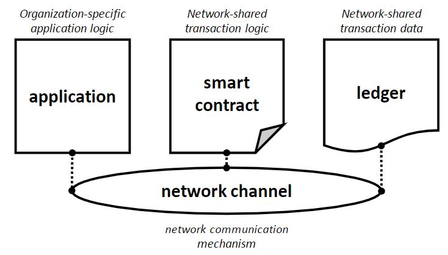
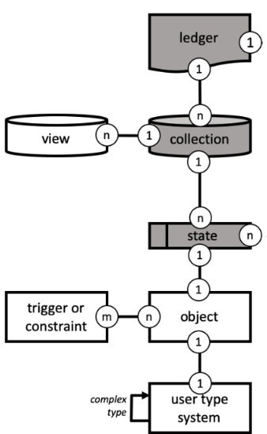

- Feature Name: Ledger_API
- Start Date: 2019-12-03
- RFC PR: (leave this empty)
- Fabric Issue: (leave this empty)

# Summary
[summary]: #summary

This feature is a continuation of the updates made in recent releases to the Fabric Programming Model. This RFC's aim is to clarify the abstractions used to work with ledger data in a contract. It's scope is restricted to what is today referred to as the 'ChaincodeStub API' specifically the APIs around states.

This is a cross-language RFC for Golang, JavaScript, TypeScript and Java.

# Motivation
[motivation]: #motivation

The updated Programming Model has introduced higher level abstractions to both the contract and the client SDKs. Many users have already written high-level utility or support code within their own applications. Abstractions help us think about and solve problems, improving usability, speed of development and performance.

Examples, such as the Commercial Paper tutorial, also take this approach. It simplifies the concepts and makes working with business-level data simpler. (c.f. https://jira.hyperledger.org/browse/FABCN-42)

This RFC (which is anticipated as the first in a series) will formalize the existing 'stub-api' into a conceptual architecture. A key aspect in all the programming model work is that the conceptual model is consistent between languages. The polyglot developer will therefore have minimal friction moving between languages.  Note that this a *conceptual* model; each implementation will use idiomatic language code, and where appropriate, specifics of the language to give the best developer experience.

The stub API is broadly consistent between languages. There are, however, variations and minor inconsistencies that cause confusion when looking across languages. Whilst not major, these differences are sufficient to cause a developer uncertainty in how an API should be used. Introducing a ledger formalizes and integrates existing concepts. 

To allow for functional differences between different but very similar operations the stubAPI has chosen an approach to have a 'broad-and-flat' approach to APIs. For example there are query APIs per type of collection, `getPrivateDataByRange` and `getStateByRange`, by apply modifiers to the function name the function is extended. The length of the resulting list of APIs is larger and should additional function become available will increase. A long list of APIs increases the difficulty of finding the API needed, especially without autocomplete-style tool support. By formalizing the APIs in the proposed structure makes an overall more sustainable model to support future changes.  

Where required, invalid operations can be detected and a 'fail-fast' approach used. Developers would therefore be fully aware of the limitations during basic testing.

Future RFCs will focus on the persistence of the business data; many of the same helper classes used today are based around the idea of serializing data, and move the knowledge of key creation into the business objects themselves. (c.f. https://jira.hyperledger.org/browse/FABCN-92)

# Guide-level explanation
[guide-level-explanation]: #guide-level-explanation

A complete solution using Fabric can be represented as follows:


A typical sequence is for an application to connect to a peer (the 'gateway' into the network channel), and obtain a reference to a smart contract. The Network-shared transaction logic in the Smart Contract is then be invoked by name with optional data arguments and return values. The data arguments can include transient data if needed. The logic in the Smart Contract will typical reference and update the shared transaction data, subject of course to exactly how the code is written.

The 'Ledger' is, therefore, a primary abstraction in a blockchain system, including in Hyperledger Fabric; this abstraction allows the concepts of states, world state, collections, transactions, blocks etc. to be tied together and formalised. 

Looking at the objects that make up this conceptual architecture, a full set of objects would have the following relationships. 



Note that this RFC is concerned with the ledger-api and the ledger,collection and state; the 'white' boxes will be subsequent RFCs.

## Ledger

A Ledger's current value is held in a set of collections. A single ledger is available to any given deployed contract, though other ledgers may be available within the Network Channel and can be accessed via other contracts

Of the collections that are reference by the ledger, there a single collection in the ledger that is public (the 'WorldState') and held by every organization in the Network Channel. A ledger may have 1 or more private collections that are available only in some organizations. Starting at Fabric v2.0 there will be an implicit private collection per organization.

## Collection

A collection is a set of states, with each state holding a business object or data. Each state being addressed by a key. Private collections are identified by name, and held within a set of policy-defined organizations.

Accessing any given collection is via the Ledger instance. 

```java
	Ledger = Ledger.getLedger(ctx)

	// predefined constant for the world state
	Collection worldState = Ledger.getCollection(Collection.WORLD);

	// Private Data collections are reference by name
	Collection privateData = Ledger.getCollection("PrivateSalesData");

	// Each organization will have an implicit private data collection created for them
	// this has a prefixed name
	Collection org1PrivateData = Ledger.getCollection(Collection.organizationCollection("orgsmspID"));

	// with a convience version of
	Collection org1PrivateData = Ledger.getOrganizationCollection("orgsmspID");

```

There are underlying technical restrictions on some operations. For example you cannot combine private data range queries and updates in a transaction.
Nor do private data collections support pagination. Should these not be supported, a 'not-supported' error/exception will be thrown.

As there are two essential types of collection - public and private - this is available via an enumerated value. Each languages approach to enumerations is syntactical different but conceptually similar

```
	COLLECTION_TYPE = {PUBLIC , PRIVATE}
```

## State

A state holds the value of a business object or data, addressed by a key. The format of this object or data is currently defined by the overall solution, and encoding the format of 'the value' of the state is the responsibility of the contract developer.

The state can also anchor the following functions
 - Access to individual states can be controlled by state-level endorsement policies, APIs are provided to assist in the construction and parsing of these policies. 
 - Access to the Private Data Hash - essential for private data scenarios.
 - Access to history details of the state, what transactions affect this state in the past
 - Creation of composite keys and general key handling helpers

## Example Interfaces

To see how the concepts above can be rendered in code we can walk-through an updated version of the Java Commercial Paper example.

### Putting data

The 'issue' method will create a new business object based on supplied data, and store this within the Ledger.

```java
	/**
	 * Issue commercial paper
	 */
	@Transaction(submit = true)
	public CommercialPaper issue(CommercialPaperContext ctx, String issuer, String paperNumber, String issueDateTime,
			String maturityDateTime, int faceValue) {

		// create an instance of the paper
		CommercialPaper paper = CommercialPaper.createInstance(issuer, paperNumber, issueDateTime, maturityDateTime,
				faceValue, issuer, "");

		// Smart contract, rather than paper, moves paper into ISSUED state
		paper.setIssued().setOwner(issuer);

		// want to put this into the public collection, 'world state'
		Collection collection = Ledger.getLedger(ctx).getCollection(Collection.WORLD);

		// put into the collection 
		String key = State.makeComposite(CommercialPaper.class.getName(), new String[] { paperNumber });
		collection.createState(key, CommercialPaper.serialize(paper));
		
    	return paper;
	}
```

Creation and setting properties on the Paper is domain specific code.
Access to the ledger is achieved via the `Ledger.getLedger(ctx)` - ctx being a reference to the transactional context this method/function is executing within. Access then to the 'world-state' or default collection is via `getCollection(...)`

A key is needed and the `State.makeComposite()` provides a helper function to create this key. `collection.createState(key,value)` stores the state. 

This is very similar to the current implementation in overall flow. The first main difference being the access to the collection. This permits a simpler approach to private data collections. For example if this paper was to be stored in a private collection the change that would be required is `getCollection("MyPrivateDataCollectionName")`  no other changes are needed. The collection abstracts away the different APIs.

The implicit organization collections can be accessed by supplying the name of the organization  `getOrganizationCollection("ORG1")`. Alternatively the collection name can be obtained via a helper function `Collection.getOrganizationName(mspid)`.

#### Update and Create

Previously a stub api of `putState` was used; issues have been raised referring to what is called 'blind writes'. Namely if a key is **put** without first being **get**  then the key will only be in the write set. This can have the effect that if two transactions do this the last one wins.

A solution presented in one of the [JIRA Issues](https://jira.hyperledger.org/browse/FAB-10480) was the create and update semantics.

- Create: if the key already exists fail, only put if the key does not exist.
- Update: if the key already exists put the the state, if it doesn't fail. 

### Getting data

Retrieval of state is follows a similar pattern. The key lines are

```java
	// get the state
	String key = State.makeComposite(CommercialPaper.class.getName(), new String[] { paperNumber });
	State paperState = collection.getState(key);

	// use domain specific code to deserialize the data
	CommercialPaper paper = CommercialPaper.deserialize(paperState.getValue());
```

### Deleting data

Deleting a state also follows a similar pattern.

```java
	// delete the state
	String key = State.makeComposite(CommercialPaper.class.getName(), new String[] { paperNumber });
	collection.deleteState(key);
```

### State Based Endorsement

Endorsement Policies can be defined at the Contract, State, and (in v2.0) the collection level. Control of the State endorsement is by the contract code invoking APIs on the State object.  (details of the syntax are defined in the main docs)[https://hyperledger-fabric.readthedocs.io/en/master/endorsement-policies.html#endorsement-policy-syntax]


```java
	// Create three principals
	Principal p1 = new Principal("Org1", Role.MEMBER);
	Principal p2 = new Principal("Org2", Role.MEMBER);
	Principal p3 = new Principal("Org3", Role.MEMBER);

	// create an Endorsment based on the required logic
	Endorsement sbe1 = Endorsement.build(
			Expression.and(
					Expression.or(p1,p2),
					p3
					)
			);
	paperState.setEndorsement(sbe1);
	
	
	// or the textual version can be parsed
	Endorsement sbe2 = Endorsement.build("AND( OR ('Org1.member','Org2.member'), 'Org3.member' )");
	paperState.setEndorsement(sbe2);
		
```

### Query

There are two broad approaches to querying data. Either by passing a query to be parsed by CouchDB (also called Rich Query), or by using the State keys.
Composite keys form a hierarchy that an be used for querying a range of states.

To unify the different approaches, the API has a single query method taking a configuration of the query to be performed (QueryHandler), that returns an iterable object of results.  This iterable will contain the results, and be iterated with the appropriate language idioms. Control of pagination and the request for more data is controlled within this iterable.

For key based query, the configuration can give any start and end keys, any pagination required. For rich query this can contain the suitably formatter query string. 

```Java
	String startKey =  State.makeComposite(CommercialPaper.class.getName(), new String[] { startPaper }) ;
	String endKey =  State.makeComposite(CommercialPaper.class.getName(), new String[] { endPaper }) ;

	// Define the query as being for a RANGE with a FROM and TO key		
	KeyQueryHandler keyQuery = KeyQueryHandler.RANGE;
	keyQuery.from( startKey ).to( endKey );

	// set a pagination size
	keyQuery.pageSize(200);
	
	// Obtain the iterable
	CollectionIterable<State> states = worldCollection.getStates(keyQuery);
	for (State s : states) {
		CommercialPaper paper = CommercialPaper.deserialize(s.getValue());
		totalValue += paper.getFaceValue();
	}
```

Different QueryHandlers can define variations of the query; some queries may not be supported on different collections. For example, private data collections and pagination.  This can be checked at runtime, and if not possible an exception can be thrown. 

The code could be proactive in checking this, for example

```Java
	// Define the query as being for a RANGE with a FROM and TO key		
	KeyQueryHandler keyQuery = KeyQueryHandler.RANGE;
	keyQuery.from( startKey ).to( endKey );

	// set a pagination size
	keyQuery.pageSize(200);

	privateCollection.validateQuery(keyQuery);  // throw UnsupportedQuery exception due to page size
```

### State History

The history of a state, it's value at a point time as a result of transaction can be queried as follows.

```Java
	// want to get this from the public collection, aka 'world state'
	Collection worldCollection = Ledger.getLedger(ctx).getDefaultCollection();	
	
	// get the state
	State paperState = worldCollection.getState(paperNumber);
	
	CollectionIterable<StateHistory> states = paperState.getHistory();
	for (StateHistory s : states) {
		// APIs available on StateHistory
		Instant time = s.getTimestamp();
		State stateInTime = s.getState();
		String txid = s.getTxId();
		boolean isDeleted = s.isDeleted();
	}
```

The state is obtained here using `getState` but could be via one another type of query. `getHistory` gives an iterable of multiple StateHistory objects. Iteration here follows the same patterns as for query. 

Details on the history can be obtained for whatever the contract requires.

# Reference-level explanation
[reference-level-explanation]: #reference-level-explanation

The following table lists, the conceptual target and function, how they are rendered in Java. The final column indicates the methods providing the function. 

| Target Object              | Function                          | Java Rendering                                                      | Existing Java Method                                                                                   |
| -------------------------- | --------------------------------- | ------------------------------------------------------------------- | ------------------------------------------------------------------------------------------------------ |
| Ledger                     | get-collection-default            | Collection getDefaultCollection()                                   |                                                                                                        |
|                            | get-collection-name               | Collection getCollection(String name)                               |                                                                                                        |
|                            | get-organization-collection       | Collection getOrganizationCollection(String mspid)                  |                                                                                                        |
|                            | bootstrap-ledger-api              | Ledger Ledger.getLedger(ctx)                                        |                                                                                                        |
|                            |                                   |                                                                     |                                                                                                        |
| Collection                 | get-state                         | State getState(String  key)                                         | getState(String key);                                                                                  |
|                            |                                   |                                                                     | getPrivateData(String collection, String key);                                                         |
|                            | update-state                      | State updateState(String key,byte[] value)                          |                                                                                                        |
|                            | create-state                      | State create(String key, byte[] value)                              | putState(String key, byte[] value);                                                                    |
|                            |                                   |                                                                     |                                                                                                        |
|                            |                                   |                                                                     | putPrivateData(String collection, String key, byte[] value);                                           |
|                            |                                   |                                                                     |                                                                                                        |
|                            | delete-state                      | void deleteState(String key)                                        | delState(String key);                                                                                  |
|                            |                                   |                                                                     | delPrivateData(String collection, String key);                                                         |
|                            | map-organization-collection-namne | String organizationCollectionName(String mspid)                     |                                                                                                        |
|                            | current-ledger-state-query        | Iterable<State> getStates(QueryHandler query)                       | getStateByRange(String startKey, String endKey);                                                       |
|                            |                                   |                                                                     |                                                                                                        |
|                            |                                   |                                                                     | getStateByRangeWithPagination(String startKey, String endKey, int pageSize, String bookmark);          |
|                            |                                   |                                                                     | getStateByPartialCompositeKey(String compositeKey);                                                    |
| Query                      | query-by-key-range                |                                                                     | getStateByPartialCompositeKey(String objectType, String... attributes);                                |
| (query handlers  determine | query-by-partial-key              |                                                                     | getStateByPartialCompositeKey(CompositeKey compositeKey);                                              |
| how the query is done)     | query-from-key                    |                                                                     | getStateByPartialCompositeKeyWithPagination(CompositeKey compositeKey, int pageSize, String bookmark); |
|                            | query-to-key                      |                                                                     | getPrivateDataByRange(String collection, String startKey, String endKey);                              |
|                            | query-selector                    |                                                                     | getPrivateDataByPartialCompositeKey(String collection, String compositeKey);                           |
|                            |                                   |                                                                     | getPrivateDataByPartialCompositeKey(String collection, CompositeKey compositeKey);                     |
|                            |                                   |                                                                     | getPrivateDataByPartialCompositeKey(String collection, String objectType, String... attributes);       |
|                            |                                   |                                                                     | getQueryResult(String query);                                                                          |
|                            |                                   |                                                                     | getPrivateDataQueryResult(String collection, String query);                                            |
|                            |                                   |                                                                     | getQueryResultWithPagination(String query, int pageSize, String bookmark);                             |
|                            |                                   |                                                                     |                                                                                                        |
| CollectionIterator         | next-state                        | Std java Collections Iteratables                                    |                                                                                                        |
| of State                   | has-next-state                    | Std java Collections Iteratables                                    |                                                                                                        |
|                            | close-iterable                    | Std java Collections Iteratables                                    |                                                                                                        |
|                            |                                   |                                                                     |                                                                                                        |
| CollectionIterator         | next-historic-state               | Std java Collections Iteratables                                    |                                                                                                        |
| of StateHistory            | has-next-historic-state           | Std java Collections Iteratables                                    |                                                                                                        |
|                            | close-iterable                    | Std java Collections Iteratables                                    |                                                                                                        |
|                            |                                   |                                                                     |                                                                                                        |
| State                      | create-composite-key              | `String createCompositeKey(String objectType, String.. Attributes)` | createCompositeKey(String objectType, String... attributes);                                           |
|                            | split-composite-key               | Array<String> getSplitKey(String compositeKey)                      | splitCompositeKey(String compositeKey);                                                                |
|                            | get-value                         | byte[] getValue()                                                   |                                                                                                        |
|                            | get-key                           | String getKey()                                                     |                                                                                                        |
|                            | get-key-level-endorsement         | Endorsement getEndorsement()                                        |                                                                                                        |
|                            |                                   |                                                                     |                                                                                                        |
|                            |                                   |                                                                     |                                                                                                        |
|                            | set-key-level-endorsement         | setEndorsement(Endorsement)                                         |                                                                                                        |
|                            |                                   |                                                                     |                                                                                                        |
|                            |                                   |                                                                     |                                                                                                        |
|                            | get-private-data-hash             | byte[] getHash();                                                   |                                                                                                        |
|                            |                                   |                                                                     |                                                                                                        |
|                            | get-historic-states-for-key       | Iterable<StateHistory> getHistory()                                 | getHistoryForKey(String key);                                                                          |
|                            |                                   |                                                                     |                                                                                                        |
| StateHistory               | get-state                         | State getState()                                                    |                                                                                                        |
|                            | get-tx                            | String getTxId()                                                    |                                                                                                        |
|                            | get-timestamp                     | Instant getTimestamp()                                              |                                                                                                        |
|                            | get-is-delete                     | boolean isDelete()                                                  |                                                                                                        |
|                            |                                   |                                                                     |                                                                                                        |

A prototype implementation of the interfaces is available in [github](https://github.com/mbwhite/fabric-chaincode-java/tree/ledger-api/fabric-chaincode-shim/src/main/java/org/hyperledger/fabric/ledger) (note this is a prototype repo, so there
may be minor variations)

We have reviewed the same interface approach within Golang, and Node.js (both JavaScript and TypeScript) to confirm that the approach is sound in those languages. 


## Relationship to the existing APIs

This is a compliment to the existing APIs, which may still be used without issue; they remain and are accessed in the same manner as previously.


# Drawbacks
[drawbacks]: #drawbacks

As discussed in the motivation, this is being proposed to bring consistent level of abstraction across the languages, and remove any variation in existing implementations.

# Rationale and alternatives
[alternatives]: #alternatives

This is the amalgamation of experience in the field having seen solutions be implemented and the challenges encountered.
We have chosen not to include the serialization of an object to and from the ledger; this will be the subject of a subsequent API.
Likewise, the 'transaction' APIs are not included. 

For reference some of the issues that can be resolved or highlight API differences

- Iteartor confusion: https://jira.hyperledger.org/browse/FABCN-222
- State-based Endorsement Policy: https://jira.hyperledger.org/browse/FABCN-304
- Put/Get State on JSON objs: https://jira.hyperledger.org/browse/FABCN-92
- Rich Query Improvement: https://jira.hyperledger.org/browse/FABCN-133
- GetStateByPartialCompositeKey with full keys https://jira.hyperledger.org/browse/FABCN-376
- Invoke Chaincode https://jira.hyperledger.org/browse/FABCN-111
- Blind Writes https://jira.hyperledger.org/browse/FAB-10480
- MSPId support https://jira.hyperledger.org/browse/FABCJ-276

# Prior art
[prior-art]: #prior-art

Significant experience and feedback has now been gained from user adoption of this programming model in Node and Java which have led to incremental improvements.

We know custom written code that as been used in different projects all of which has contributing to the thinking.

# Unresolved questions
[unresolved]: #unresolved-questions

None.