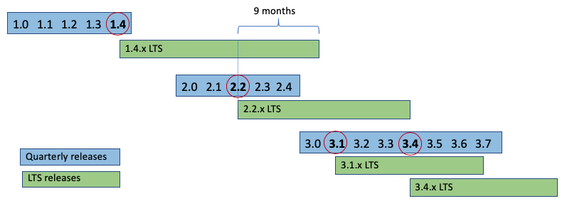

- Feature Name: Fabric LTS release strategy
- Start Date: 2020-03-18
- RFC PR:
- Fabric Component:
- Fabric Issue:

# Summary
[summary]: #summary

Define Long-term support (LTS) release strategy for Hyperledger Fabric

Long-term support definition from wikipedia.org:

> **Long-term support (LTS)** is a product lifecycle management policy in which a stable release of computer software is maintained for a longer period of time than the standard edition.

> **LTS** applies the tenets of reliability engineering to the software development process and software release life cycle. Long-term support extends the period of software maintenance; it also alters the type and frequency of software updates (patches) to reduce the risk, expense, and disruption of software deployment, while promoting the dependability of the software.

# Motivation
[motivation]: #motivation

Administrators of production deployments find LTS releases desirable as they provide confidence that a certain software release will be maintained for an extended period of time.

Specifically, for Hyperledger Fabric, administrators can expect the following of a LTS release:

- Stable and well-tested code
- API contract stability
- 3rd digit patch releases for bug and security fixes, delivered for an extended period of time on a regular cadence (or more frequently as needed)
- Minimal set of feature additions and other changes that can easily be applied, reducing the risk of functional regressions and bugs

Similarly, there are benefits to Hyperledger Fabric maintainers, code contributors, and the wider community:

- New features and other changes can quickly be applied to the main branch, and distributed to the user community for trial, without impacting production deployments.
- Community feedback on new features can be solicited and acted upon.
- Bug fixes only need to be backported to a small number of designated LTS releases.
- Extra tests (e.g. upgrade tests for non-subsequent versions) only need to be executed against a small number of designated LTS releases.

# Guide-level explanation
[guide-level-explanation]: #guide-level-explanation

## Release cadence

Hyperledger Fabric will continue the pattern of quarterly minor releases, e.g. v2.0, v2.1, v2.2, etc.

## LTS release cadence

Because a new major release typically has large new features that may not yet be tried by the user community, and because SDKs may lag in support of the new release, it is not expected that a new major release will immediately be designated as a LTS release, for example, v2.0 is not a LTS release.

Each major release will eventually have at least one minor release designated by the Fabric maintainers as the LTS release, e.g. v1.4 for v1.x, v2.2 for v2.x (all references to future versions are hypothetical).

After a LTS release is designated, quarterly releases will continue as normal. The Fabric maintainers will decide whether a next release is another minor release, or a new major release. There is no predefined timing for next major version. The decision is typically based on semantic versioning considerations, such as whether API changes are needed or older capabilities need to be removed. Other considerations may also apply, for example significant upgrade steps may motivate a shift to a new major version.

If a major release is not delivered for an extended period of time, the maintainers may designate a subsequent minor release as the next LTS release, for example if v3.1 is a LTS release and there is no need to increment to 4.0 for several quarters, the maintainers may decide to designate v3.4 as the next LTS release.

## LTS 3rd digit patch releases

For LTS releases, 3rd digit patch releases will be provided for bug and security fixes approximately every three months (may be more frequent if important fixes become available sooner, and may be deferred if there are no fixes to publish). Significant new features and other changes will not be included in 3rd digit patch releases, in order to ensure the stability of the LTS release and reduce the risk of functional regressions and bugs.

It is worth noting that the v1.4 LTS release did not follow the above principles. Had the v1.4 LTS release followed the above principles, the Raft ordering service feature would likely have been introduced in a v1.5 release, and Kafka to Raft migration in a v1.6 release. We mention only to illustrate the above principles.

## LTS release duration

Once a *subsequent* LTS release is designated, users can expect 3rd digit patch releases to address critical bugs on the *prior* LTS release for approximately 9 more months. The maintainers will determine which fixes should to be backported to the latest LTS release, versus which fixes need to be further backported to the prior LTS release. 3rd digit patch releases should be expected less frequently for prior LTS releases, since only critical fixes will be published. The overlap period is intended to provide users a time window to upgrade their nodes, and any channel capabilities (if required).

## LTS release diagram
The following diagram represents the LTS release cadence and duration using hypothetical Fabric releases:

## LTS to LTS compatibility

Features that are related to capabilities will remain available for two LTS releases, but may be removed in subsequent LTS releases.  For example, v1.x legacy chaincode management will be available through v2.2 (assuming v2.2 is a LTS release), but is expected to not be usable in the subsequent LTS release. This provides one full LTS cycle for channels to transition to new capabilities. For example, a production Fabric network may perform a rolling upgrade from v1.4.x nodes to v2.2.x nodes, then enable v2.x channel capabilities to take advantage of the new chaincode lifecycle, and then eventually upgrade to v3.x LTS nodes, where the legacy chaincode lifecycle may not be available.

## LTS and upgrade testing

The Fabric project expects to test single step upgrades (e.g. v2.0 to v2.1), and LTS to next-LTS upgrades (e.g. v1.4.x to v2.2). Other upgrade paths will not be tested and are not guaranteed to work.

# Prior art and alternatives
[prior-art]: #prior-art

While many open source projects provide LTS releases, there is no industry standard for LTS release approach. Projects use many different variants of LTS approaches to best suit their project's particular needs.

Given Fabric's time-based releases, major and minor release cadence, and desire to designate a minor release a LTS release after the associated major release has been available for some time, the [Node.js project's LTS model](https://nodejs.org/en/about/releases/) seems like a good fit generally.

However, the Node.js project only designates every other major release as a LTS release, which is not desirable for the Fabric project given the rapid innovation in the distributed ledger market. Additionally, the Node.js project provides maintenance for a fixed amount of time for each LTS release, while the Fabric maintainers prefer to set the duration based on an overlap period with the subsequent LTS release, again due to the rapid innovation in the distributed ledger market and need to be flexible with respect to major release, minor release, and LTS release timing.
